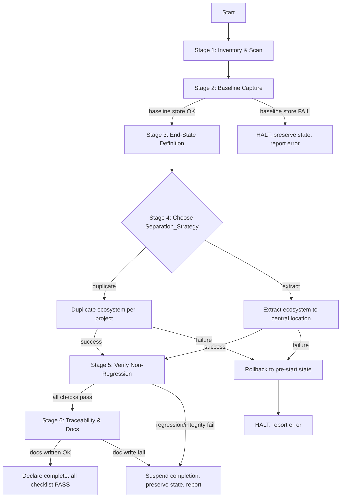
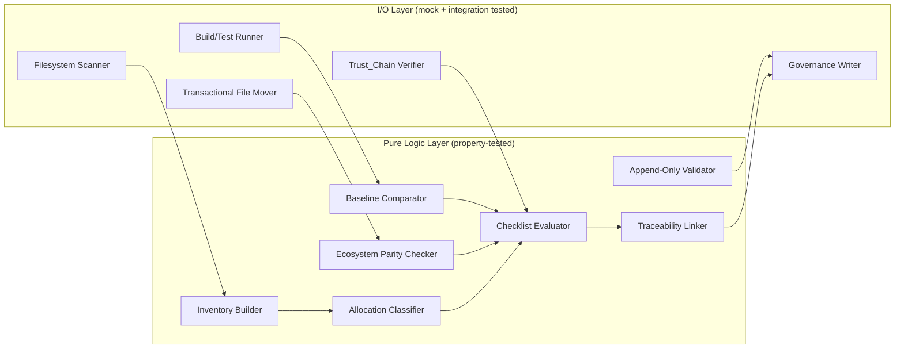
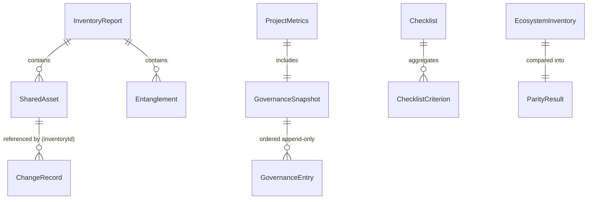

# Design Document: MONOLITH ⇄ TCCK Separation

## Overview

This design defines the **Separation_System** — a set of scripts, procedures, and governance
documents that decisively separates two large projects, **MONOLITH** (parametric CAD/CAM
cabinet system) and **TCCK** (Thai Cloud Kitchen + franchise ERP), into fully independent,
self-contained workspaces. The separation must complete **without regressing** either
project's build, tests, or governance chain, and must preserve MONOLITH's cryptographic
**Trust_Chain** (Ed25519 + SHA-256) and each project's **append-only Governance_Chain**.

The design is organized around six pipeline stages that map directly to the six requirements:

1. **Inventory & Scan** (R1) — discover every Shared_Asset and Entanglement.
2. **Baseline Capture** (R3, R5) — record build/test/governance state before any change.
3. **End-State Definition** (R2) — a binary pass/fail checklist that defines "done".
4. **Sub-Agent Ecosystem Handling** (R4) — duplicate-per-project OR extract-to-shared, with rollback.
5. **Safety & Non-Regression Verification** (R5) — compare post-state to baseline, verify Trust_Chain.
6. **Traceability & Documentation** (R6) — append-only decision log linking every change to inventory.

### Design Philosophy

- **Read-then-act with a safety gate.** Nothing mutates either workspace until the baseline is
  captured and stored successfully (R3.6). If the baseline cannot be stored, the system halts.
- **Transactional mutations.** Each ecosystem strategy executes as an all-or-nothing transaction.
  Partial failure triggers rollback to the pre-start state (R4.5, R4.6).
- **Binary completion.** Separation is "complete" **only** when every checklist criterion evaluates
  to PASS (R2.7). Any FAIL suspends the completion declaration (R5.6, R6.7).
- **Append-only governance.** Governance history is never edited or deleted; the system only appends
  (R5.7, R6.2).
- **Full traceability.** Every change record references exactly one Inventory_Report row (R6.4).

### Key Grounding Facts (from repository scan)

- MONOLITH workspace root: `c:\Users\thai3\OneDrive\Documents\MONOLITH\determined-williams (3)\determined-williams (2)\determined-williams`
- TCCK workspace root: `C:\Users\thai3\TCCK-All-Projects-Backup` (outside the current workspace — Inventory may be marked incomplete per R1.7).
- **Physical entanglement (confirmed):** an embedded TCCK app copy lives *inside* the MONOLITH
  workspace at `cp06-clean-cowork_dev-complete_20260616/cp06-clean-cowork/`. This is a concrete
  Shared_Asset/Entanglement the design must surface and resolve.
- **Trust_Chain surface (confirmed):** `src/crypto/ed25519.ts`, `src/crypto/sha256.ts`,
  `src/release/manifest/`, `src/release/keys/`, `src/release/policy/` — these produce and verify
  Ed25519 signatures and SHA-256 hashes that must continue to verify 100% post-separation (R5.5).
- **Sub-Agent Ecosystem (confirmed):** `.claude/` containing `commands/`, `prompts/` (incl.
  `phase6/`), `gates/`, `plugins/ralph-wiggum/`, `docs/`, plus governance files
  `.claude/context.md`, `.claude/decisions.md`, `.claude/progress.md`.

## Architecture

The Separation_System is a staged, gated pipeline. Each stage produces a typed artifact consumed
by the next, and stages 4+ are guarded so that any failure halts progression and preserves state.



### Component Layers

The system separates **pure decision/validation logic** (highly testable) from **side-effecting
I/O** (filesystem moves/copies, build/test invocation). This boundary is deliberate: the pure
layer is where property-based testing delivers the most value, while the I/O layer is covered by
mock-based and integration tests.



## Components and Interfaces

### 1. Filesystem Scanner (I/O)
Walks the MONOLITH and TCCK roots within the recorded scan scope, emitting raw file/reference
observations. Detects cross-project references (imports, file paths, config entries) and
governance-document mentions. Marks a root as inaccessible when it cannot be read (e.g., TCCK
outside the current workspace).

```typescript
interface ScanScope {
  monolithRoot: string;
  tcckRoot: string;
  recordedAt: string;          // ISO timestamp
  inaccessibleLocations: InaccessibleLocation[];
}
interface InaccessibleLocation { path: string; reason: string; }

interface Scanner {
  scan(scope: ScanScope): RawObservation[];
}
```

### 2. Inventory Builder (Pure)
Transforms raw observations into the typed `InventoryReport`. Assigns each Shared_Asset a stable
identifier, classifies entanglements into exactly one of three categories, flags ecosystem
membership (yes/no), and assigns an allocation (one of three values). Emits the "no items found"
record when nothing is detected, and marks the report incomplete when any location was inaccessible.

```typescript
type EntanglementCategory = 'SHARED_FILE_OR_DIR' | 'CROSS_PROJECT_REFERENCE' | 'GOVERNANCE_MENTION';
type Allocation = 'MONOLITH' | 'TCCK' | 'SHARED';
type Project = 'MONOLITH' | 'TCCK' | 'BOTH';

interface SharedAsset {
  id: string;                  // stable identifier, referenced by change records (R6.4)
  path: string;
  referencedBy: Project;       // R1.2
  isEcosystemMember: boolean;  // R1.4 (yes/no flag)
  allocation: Allocation;      // R1.5 (exactly one of three)
}
interface Entanglement {
  id: string;
  path: string;
  category: EntanglementCategory; // R1.3 (exactly one of three)
  targetProject: Project;
}
interface InventoryReport {
  scanScope: ScanScope;
  sharedAssets: SharedAsset[];
  entanglements: Entanglement[];
  isComplete: boolean;         // false if any location inaccessible (R1.7)
  emptyResult: boolean;        // true => "no items found" (R1.6)
}
interface InventoryBuilder {
  build(observations: RawObservation[], scope: ScanScope): InventoryReport;
}
```

### 3. Build/Test Runner (I/O)
Invokes each project's build and test commands and normalizes the result. Never throws on
build/test failure — an indeterminate outcome is recorded as `INDETERMINATE` so the pipeline can
continue (R3.5). Long-running commands are executed by the operator manually when needed; the
runner consumes their reported results.

### 4. Baseline / Result snapshots & Comparator (Pure)
`ProjectMetrics` is a single shared shape used for **both** the baseline and the post-separation
result, enabling field-by-field comparison (R3.4). The Comparator computes per-metric regression
verdicts.

```typescript
type BuildStatus = 'SUCCESS' | 'FAILURE' | 'IN_PROGRESS' | 'INDETERMINATE';

interface ProjectMetrics {
  project: 'MONOLITH' | 'TCCK';
  buildStatus: BuildStatus;    // R3.1
  errorCount: number;          // >= 0
  warningCount: number;        // >= 0
  testsPassed: number;         // non-negative integer (R3.2)
  testsFailed: number;         // non-negative integer (R3.2)
  governanceState: GovernanceSnapshot; // R3.3
  capturedAt: string;          // ISO timestamp
}
interface GovernanceSnapshot {
  project: 'MONOLITH' | 'TCCK';
  entries: GovernanceEntry[];  // ordered, append-only history
  contentHash: string;         // SHA-256 over concatenated entry hashes
}
interface GovernanceEntry { id: string; seq: number; createdAt: string; body: string; hash: string; }

interface RegressionVerdict {
  project: 'MONOLITH' | 'TCCK';
  regressed: boolean;
  regressedMetrics: string[];  // names of metrics that regressed (R5.6)
}
interface Comparator {
  compare(baseline: ProjectMetrics, result: ProjectMetrics): RegressionVerdict;
}
```

### 5. Ecosystem Strategy Executor (I/O) + Parity Checker (Pure)
Executes the chosen `Separation_Strategy` transactionally. The Parity Checker compares per-category
item counts (commands, prompts, gates, plugins) between source and result and confirms each item
is reachable from each project (R4.4).

```typescript
type SeparationStrategy = 'DUPLICATE' | 'EXTRACT_SHARED';

interface EcosystemInventory {
  commands: string[];
  prompts: string[];
  gates: string[];
  plugins: string[];
}
interface ParityResult {
  byCategory: Record<keyof EcosystemInventory, { sourceCount: number; resultCount: number; match: boolean }>;
  allReachable: boolean;       // every item reachable from each project (R4.4)
  passed: boolean;             // all categories match AND allReachable
}
interface EcosystemExecutor {
  // Transactional: returns Ok(result) or rolls back fully and returns Err(reason) (R4.5/R4.6)
  execute(strategy: SeparationStrategy, source: EcosystemInventory): Result<EcosystemResult, string>;
}
interface ParityChecker {
  check(source: EcosystemInventory, result: EcosystemInventory, reachability: ReachabilityMap): ParityResult;
}
```

For **DUPLICATE**: each project receives an independent copy under its own workspace; mutations to
one copy must not affect the other (R4.2 — verified by an isolation property).
For **EXTRACT_SHARED**: the ecosystem is placed at a single central location outside both projects'
internal directories, and both projects reference that same location (R4.3, R2.6).

### 6. Trust_Chain Verifier (I/O)
Re-runs MONOLITH's Ed25519 signature verification and SHA-256 hash verification over the release
manifest surface (`src/release/manifest`, `src/release/keys`, `src/release/policy`, `src/crypto`).
Returns a count of failed verifications, which must be 0 (R5.5).

```typescript
interface TrustChainReport { totalChecks: number; failedChecks: number; verified: boolean; }
```

### 7. Checklist Evaluator (Pure)
Aggregates all stage outputs into a binary pass/fail checklist. Separation is declared complete
**iff** every criterion is PASS (R2.7). Produces the per-criterion summary for R6.5.

```typescript
interface ChecklistCriterion { id: string; description: string; status: 'PASS' | 'FAIL'; detail?: string; }
interface Checklist { criteria: ChecklistCriterion[]; allPass: boolean; }
interface ChecklistEvaluator {
  evaluate(inputs: {
    monolithToTcckRefs: number;   // must be 0 (R2.1)
    tcckToMonolithRefs: number;   // must be 0 (R2.2)
    monolithRegression: RegressionVerdict;
    tcckRegression: RegressionVerdict;
    parity: ParityResult;
    trustChain: TrustChainReport;
    governanceValid: boolean;
    docsValid: boolean;
  }): Checklist;
}
```

### 8. Append-Only Validator & Traceability Linker (Pure)
The Append-Only Validator confirms a new governance snapshot preserves all prior entries unchanged
(same order, same hashes, same count) and only adds new entries (R5.7, R6.2). The Traceability
Linker confirms every change record references exactly one existing Inventory_Report row, flagging
unmatched records (R6.4, R6.8).

```typescript
type ChangeAction = 'MOVE' | 'COPY' | 'MODIFY';
interface ChangeRecord {
  inventoryId: string;         // must reference one InventoryReport row (R6.4)
  action: ChangeAction;
  source: string;
  destination: string;
  timestamp: string;
  reason: string;
}
interface AppendOnlyValidator { isValidAppend(prev: GovernanceSnapshot, next: GovernanceSnapshot): boolean; }
interface TraceabilityLinker {
  link(records: ChangeRecord[], inventory: InventoryReport): { matched: ChangeRecord[]; unmatched: ChangeRecord[] };
}
```

### 9. Governance Writer (I/O)
Appends decision records to each project's Governance_Chain (`.claude/decisions.md` etc. for
MONOLITH; `_CURRENT-STATE.md`, `DECISIONS.md`, `CLAUDE.md` for TCCK), updates TCCK's
`_CURRENT-STATE.md` to reflect separated status (R6.3), and writes the separation documentation. A
write failure suspends completion (R6.6).

## Data Models

The central data models are defined above as TypeScript interfaces. Their relationships:



Key model invariants:
- `ProjectMetrics` is the single shared shape for baseline and post-result (R3.4).
- `errorCount`, `warningCount`, `testsPassed`, `testsFailed` are non-negative integers (R3.2).
- Every `Entanglement.category` is exactly one of three values (R1.3).
- Every `SharedAsset.allocation` is exactly one of three values (R1.5).
- `GovernanceSnapshot.entries` is an append-only ordered list keyed by monotonically increasing `seq`.

## Correctness Properties

*A property is a characteristic or behavior that should hold true across all valid executions of a
system — essentially, a formal statement about what the system should do. Properties serve as the
bridge between human-readable specifications and machine-verifiable correctness guarantees.*

The Separation_System's **pure logic layer** is well suited to property-based testing: the
inventory builder, comparator, checklist evaluator, append-only validator, parity checker, and
traceability linker are deterministic functions with universal invariants over a large input space.
The cryptographic Trust_Chain verification (R5.5) and filesystem side effects are covered by
integration and mock-based tests instead (see Testing Strategy). The following nine consolidated
properties were derived from the prework analysis after eliminating redundancy.

### Property 1: Inventory well-formedness

*For any* set of raw scan observations and scan scope, every Shared_Asset in the resulting
Inventory_Report has a non-empty path, a `referencedBy` value in {MONOLITH, TCCK, BOTH}, a boolean
`isEcosystemMember` flag, and an `allocation` in exactly {MONOLITH, TCCK, SHARED}; every
Entanglement has a `category` that is exactly one of {SHARED_FILE_OR_DIR, CROSS_PROJECT_REFERENCE,
GOVERNANCE_MENTION}; when the observation set is empty the report has `emptyResult = true` while
still recording the scope; and the report has `isComplete = false` if and only if the scope contains
at least one inaccessible location (each of which is listed with a reason).

**Validates: Requirements 1.2, 1.3, 1.4, 1.5, 1.6, 1.7**

### Property 2: Zero cross-project references at end-state

*For any* pair of cross-project reference counts (MONOLITH→TCCK and TCCK→MONOLITH) and any residual
reference list, the separation is considered complete with respect to references if and only if both
counts equal 0; whenever a count is non-zero the corresponding checklist criterion is FAIL and every
residual reference is reported with its path and target project.

**Validates: Requirements 2.1, 2.2, 2.3**

### Property 3: Metrics are field-by-field comparable and counts are non-negative integers

*For any* normalized `ProjectMetrics` produced from raw runner output, `errorCount`,
`warningCount`, `testsPassed`, and `testsFailed` are non-negative integers and `buildStatus` is one
of {SUCCESS, FAILURE, IN_PROGRESS, INDETERMINATE}; and *for any* baseline and result both of type
`ProjectMetrics`, the comparator inspects the identical field set and produces a well-formed
`RegressionVerdict` (never throwing), so baseline and post-result are always comparable field by
field.

**Validates: Requirements 3.2, 3.4, 3.5**

### Property 4: Per-project non-regression verdict

*For any* project and any (baseline, result) pair of `ProjectMetrics`, the non-regression criterion
passes if and only if the result has `buildStatus = SUCCESS`, `errorCount = 0`,
`warningCount ≤ baseline.warningCount`, `testsPassed ≥ baseline.testsPassed`, and
`testsFailed = 0`; and whenever it does not pass, `regressedMetrics` lists exactly the metrics that
degraded and completion is suppressed.

**Validates: Requirements 5.2, 5.3, 5.4, 5.6**

### Property 5: Append-only governance preservation

*For any* prior `GovernanceSnapshot` and any candidate next snapshot, `isValidAppend` returns true if
and only if the next snapshot contains all prior entries unchanged (same order, same `seq`, same
hashes, same count) followed by zero or more new entries; any deletion, modification, or reordering
of a prior entry makes it return false.

**Validates: Requirements 5.7, 6.2**

### Property 6: Strategy failure atomic rollback

*For any* chosen Separation_Strategy (DUPLICATE or EXTRACT_SHARED) and *for any* failure injected at
any point during ecosystem handling, the workspace is restored exactly to its pre-start state with
no partial copies or partial extraction remaining, and the failure reason is reported.

**Validates: Requirements 4.5, 4.6**

### Property 7: Duplicate isolation

*For any* source Sub_Agent_Ecosystem, after the DUPLICATE strategy produces per-project copies, *for
any* edit applied to one project's copy, the other project's copy remains byte-for-byte unchanged.

**Validates: Requirements 4.2**

### Property 8: Ecosystem parity and reachability

*For any* source Sub_Agent_Ecosystem, after either strategy completes successfully, the per-category
item counts (commands, prompts, gates, plugins) in the result equal the source counts and every item
is reachable from each project; and whenever parity or reachability fails, the parity check reports
failure and the checklist suppresses completion.

**Validates: Requirements 4.4, 4.7**

### Property 9: Checklist conjunction with full reporting

*For any* list of checklist criteria, `allPass` is true if and only if every criterion has status
PASS; the produced summary contains a verdict for every criterion (none omitted); and whenever at
least one criterion is FAIL, every failing criterion is reported and the separation is marked
incomplete.

**Validates: Requirements 2.7, 4.7, 6.5, 6.7**

### Property 10: Traceability linkage

*For any* Inventory_Report and *for any* set of change records, every change record whose
`inventoryId` matches an existing inventory row is linked to exactly one row, and every change record
whose `inventoryId` does not match any row is flagged as unmatched and reported; additionally every
emitted change record for a move/copy carries non-empty action, source, destination, timestamp, and
reason fields.

**Validates: Requirements 6.1, 6.4, 6.8**

## Error Handling

The pipeline uses explicit gates so that errors never leave a workspace in a partially-mutated
state. Errors are grouped by stage:

| Stage | Failure | Handling | Requirement |
|-------|---------|----------|-------------|
| Scan | Location inaccessible (e.g., TCCK outside workspace) | Mark Inventory_Report incomplete; record reason + location; continue inventory of accessible parts | R1.7 |
| Baseline | build/test status undeterminable | Record `INDETERMINATE`; continue | R3.5 |
| Baseline | Baseline storage fails | **HALT before any mutation**; preserve both projects; report error | R3.6 |
| Ecosystem (DUPLICATE) | Insufficient permissions / disk space | **Rollback** to pre-start; no partial copies; report reason | R4.5 |
| Ecosystem (EXTRACT) | Cannot create central location or references | **Rollback** to pre-start; no partial extraction; report reason | R4.6 |
| Ecosystem | Post-handling parity/completeness fails | Report; **suspend completion declaration** | R4.7 |
| Verify | Any project regressed vs baseline | Report project + each regressed metric; **suspend completion**; preserve state | R5.6 |
| Verify | Trust_Chain has ≥1 failed verification | Report; **suspend completion** (`failedChecks ≠ 0`) | R5.5 |
| Docs | Governance/doc write fails | **Suspend completion**; report each unwritten item | R6.6 |
| Docs | Change record unmatched to inventory | Flag `unmatched`; report for review | R6.8 |
| Checklist | Any criterion FAIL | Report each failing criterion; mark separation incomplete | R6.7 |

**Transactional model.** Ecosystem mutations are staged to a temporary area and committed only on
full success; on any failure the staged area is discarded and the workspace is left at its pre-start
state. This is what Property 6 verifies. The completion declaration is a single gate downstream of
every check — it fires only when the checklist's `allPass` is true (Property 9).

## Testing Strategy

### Dual approach
- **Property-based tests** validate the universal invariants of the pure logic layer (Properties
  1–10 above).
- **Unit tests** cover specific examples, structural end-state conditions, and error paths that do
  not vary meaningfully with input.
- **Integration tests** cover the cryptographic Trust_Chain verification and real filesystem
  behavior, which are not appropriate for property-based testing.

### Property-based testing
- Library: **fast-check** (TypeScript), the established PBT library for this stack. We will not
  implement property testing from scratch.
- Each property test runs a **minimum of 100 iterations**.
- Each property test is tagged with a comment referencing its design property, in the format:
  `// Feature: monolith-tcck-separation, Property {number}: {property_text}`
- Each of the 10 correctness properties is implemented by a **single** property-based test.
- Generators: custom `fast-check` arbitraries for `RawObservation[]`, `ScanScope` (with random
  inaccessible-location sets), `ProjectMetrics` (non-negative integer counts, all `BuildStatus`
  values incl. `INDETERMINATE`), `GovernanceSnapshot` (ordered append-only chains plus tampered
  variants for negative cases), `EcosystemInventory`, `ChecklistCriterion[]`, and `ChangeRecord[]`
  (with both valid and invalid `inventoryId`s). Filesystem effects for Properties 6, 7, 8 use an
  in-memory mock filesystem so 100+ iterations stay cheap.

### Unit tests (examples, structure, error paths)
- Scan scope records both roots + timestamp (1.1); build/governance baseline capture shape (3.1,
  3.3); separate documentation and governance chains exist (2.4, 2.5); central shared location is
  outside both roots and referenced by both (2.6, 4.3); both strategies are selectable (4.1);
  strategy/timestamp/reason recorded (4.8); `_CURRENT-STATE.md` updated to separated status (6.3);
  baseline-store failure halts with no mutation (3.6); doc-write failure suspends completion (6.6).

### Integration tests
- **Trust_Chain (R5.5):** run real Ed25519 signature verification and SHA-256 hash verification over
  MONOLITH's release surface (`src/crypto/ed25519.ts`, `src/crypto/sha256.ts`,
  `src/release/manifest`, `src/release/keys`, `src/release/policy`); assert `failedChecks = 0`. 1–3
  representative bundles, not 100 iterations.
- **End-to-end smoke:** run the full pipeline against a small fixture workspace for each strategy and
  confirm the checklist reaches `allPass` and the embedded-app entanglement
  (`cp06-clean-cowork_dev-complete_20260616/`) is resolved.
- **Build/test baseline runners:** verify the runner normalizes real `npm`/`vitest` output into
  `ProjectMetrics`. Long-running build/test commands are executed by the operator manually and their
  reported results fed to the runner; tests use the `--run` (single-execution) mode rather than watch
  mode.

### Coverage of non-testable criteria
Criteria describing organizational structure or one-time setup (e.g., 2.4, 2.5, 4.1, 4.8) are
covered by example/structural unit tests rather than properties, consistent with the prework
classification.
