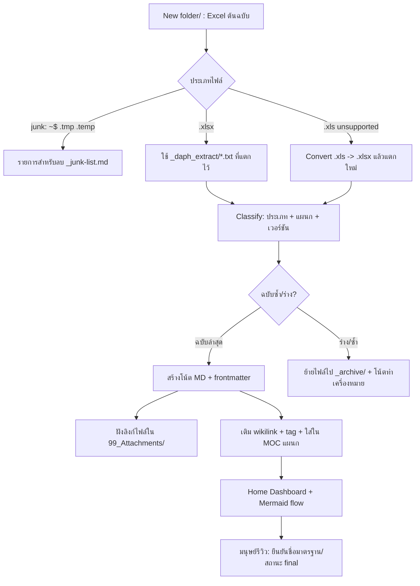
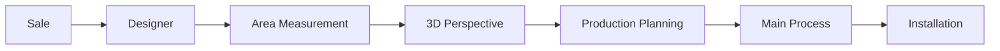

# Design Document

## Overview

เอกสารนี้ออกแบบวิธีเปลี่ยนกองไฟล์ Excel ของ DAPH Decor (ใน `New folder/`) ให้เป็น
**Obsidian Second Brain** โดยอิงแนวทาง "governed knowledge vault" ที่เวิร์กสเปซนี้ใช้อยู่แล้ว
(ดู `docs/OBSIDIAN_SECOND_BRAIN_HARDWARE_TH.md` และ `furniture-hardware-vault/`) แต่ปรับ
น้ำหนัก governance ให้พอดีกับโดเมน QMS (SOS/JES/PFMEA/Control Plan/Templates) ซึ่งเป็น
"เอกสารกระบวนการ" ไม่ใช่ "ค่าคงที่เชิงวิศวกรรมที่ป้อนเข้าโค้ด"

หลักการสำคัญ: **ไม่แตะไฟล์ Excel ต้นฉบับ** — สร้างชั้น Markdown ครอบทับ + ฝังลิงก์กลับไฟล์เดิม
โดยใช้เนื้อหาที่ถูกแตกไว้แล้วใน `_daph_extract/` เป็นแหล่งสร้างโน้ตอัตโนมัติ

### สิ่งที่มีอยู่แล้วและนำมาใช้ได้ทันที

- `_daph_extract/_INDEX.json` — mapping ไฟล์ Excel → ไฟล์ text ที่แตกแล้ว (จำนวน sheet/ขนาด)
- `_daph_extract/*.xlsx.txt` — เนื้อหา `.xlsx` ทุกไฟล์ถูกแตกเป็น text เรียบร้อย ใช้สร้างโน้ตได้
- convention vault อ้างอิง: โครงเลขนำหน้าโฟลเดอร์ + frontmatter + MOC + templates + validation

### ข้อจำกัดที่ค้นพบ (ต้องออกแบบรองรับ)

- ไฟล์ `.xls` (รูปแบบเก่า) **แตกไม่ได้** — อยู่ใน `_INDEX.json > xls_unsupported`
  ครอบคลุม **Process Control Plan ทุกแผนก (9 ไฟล์)** และ **Citadines checklist**
- ชื่อไฟล์มี comma, ช่องว่างซ้ำ, อักขระไม่เหมาะกับ wikilink (เช่น `DAPH PFMEA, INSTALLATION,P'oil.xlsx`)
- มีไฟล์ซ้ำ/ฉบับร่าง: `Draft`, `(1)`, `(Revise 1)`, ชื่อบุคคล (`P'oil`, `P'Mean`)
- ไฟล์ junk: `~$1.SOS DAPH Draft.xlsx` (Excel lock file)

## Architecture

### Flow ระดับสูง (ingest → normalize → generate → review)



### โครงสร้าง Vault

```
daph-second-brain/
  00_Inbox/             ← ไฟล์ใหม่ที่ยังไม่จัด / โน้ตรอจัดประเภท
  01_Dashboard/
    Home.md             ← MOC หลัก + process flow (Mermaid)
    _junk-list.md       ← รายการไฟล์ junk สำหรับลบ (ผู้ใช้ยืนยันก่อนลบ)
    _rename-proposals.md← เสนอชื่อมาตรฐานใหม่ (รอผู้ใช้ยืนยัน)
  02_Departments/       ← MOC ต่อแผนก เรียงตาม flow งาน
    1-Sale.md
    2-Designer.md
    3-Area-Measurement.md
    4-3D-Perspective.md
    5-Production-Planning.md
    6-Main-Process.md
    7-Installation.md
  03_QMS/               ← โน้ต 1 ใบต่อ 1 เอกสาร จัดกลุ่มตามประเภท
    SOS/
    JES/
    PFMEA/
    Control-Plan/
  04_Templates/
    project-template.md ← เปิดงานลูกค้าใหม่
    note-templates/     ← template โน้ตแต่ละประเภท (Templater)
    Glossary.md         ← คำย่อ SOS/JES/PFMEA/RPN/Control Plan
  05_Projects/          ← งานลูกค้ารายโปรเจกต์ (เช่น Citadines)
  99_Attachments/       ← ไฟล์ Excel ต้นฉบับ จัดกลุ่มตามประเภท
    SOS/  JES/  PFMEA/  Control-Plan/  Templates/
    _archive/           ← ฉบับร่าง/ซ้ำที่ถูก supersede
```

หมายเหตุการวางตำแหน่ง (ยืนยันให้ self-contained ในเวิร์กสเปซเดียว):
vault สร้างที่ `daph-second-brain/` ภายในเวิร์กสเปซ `determined-williams/` เท่านั้น
แหล่งข้อมูล: เนื้อหาที่แตกแล้วอยู่ที่ `_daph_extract/` (ในเวิร์กสเปซ) ส่วน Excel ต้นฉบับอยู่ที่
`../New folder/` (ระดับ parent) — กระบวนการจะ **คัดลอก** ต้นฉบับเข้ามาไว้ใน
`daph-second-brain/99_Attachments/` เพื่อให้ vault สมบูรณ์ในตัวและพัฒนาต่อจากเวิร์กสเปซนี้ที่เดียว
การคัดลอก (ไม่ใช่ย้าย/แก้ไข) รักษา Property 1 (non-destructive) ไว้

## Components and Interfaces

### 1. File Classifier (Requirement 1.2, 1.3, 1.4)

หน้าที่: อ่านรายการไฟล์ + `_INDEX.json` แล้วจำแนกแต่ละไฟล์

- **doc_type**: ตัดสินจากชื่อไฟล์ — `SOS` | `JES` | `PFMEA` | `Control Plan` | `Template` | `Project`
- **department**: แม็พจากชื่อ — Sale / Designer / Area Measurement / 3D Perspective /
  Production Planning / Main Process / Installation / (ทั่วไป = ไม่ระบุแผนก)
- **junk detection (R1.4)**: ถือเป็น junk ทั้งหมดโดยไม่ขึ้นกับรูปแบบชื่อ เมื่อ
  ลงท้าย `.tmp` / `.temp` **หรือ** ขึ้นต้น `~$` → ใส่ `01_Dashboard/_junk-list.md` (ไม่ลบทันที)
- **version/duplicate (R1.3)**: ตรวจ token `Draft`, `(1)`, `(Revise N)`, ชื่อบุคคล (`P'oil`,`P'Mean`)
  → จัด base document เดียวกัน เลือกฉบับล่าสุดเป็น primary ที่เหลือไป `_archive/`

ตารางจำแนกตัวอย่าง (อิงไฟล์จริง):

| ไฟล์ | doc_type | department | สถานะ |
|---|---|---|---|
| `1.SOS DAPH.xlsx` | SOS | ทั่วไป | primary |
| `1.SOS DAPH Draft.xlsx` | SOS | ทั่วไป | archive (draft) |
| `DAPH PFMEA, Sale.xlsx` | PFMEA | Sale | primary |
| `DAPH PFMEA, Main Process (Revise 1).xlsx` | PFMEA | Main Process | primary (ล่าสุด) |
| `DAPH PFMEA, Main Process.xlsx` | PFMEA | Main Process | archive (เก่ากว่า) |
| `DAPH PFMEA, Producting Planning(1).xlsx` | PFMEA | Production Planning | archive (สำเนา) |
| `DAPH Process control plan,Sale.xls` | Control Plan | Sale | primary (.xls → ต้อง convert) |
| `~$1.SOS DAPH Draft.xlsx` | — | — | junk → ลบ |
| `Template Feasibility By Daph decor send 251019.xlsx` | Template | — | primary |
| `Citadines Arch ID KDR cklst.xls` | Project | — | primary (.xls) |

### 2. XLS Converter (รองรับข้อจำกัด .xls)

เนื่องจาก `.xls` แตกไม่ได้ ออกแบบ 2 ทางเลือก (ตัดสินใจตอน Tasks):

- **ทางหลัก (แนะนำ):** convert `.xls → .xlsx` (เช่น LibreOffice headless `soffice --convert-to xlsx`
  หรือไลบรารีอ่าน .xls) แล้วแตกซ้ำเข้า `_daph_extract/` → ได้โน้ตเนื้อหาเต็มเหมือน .xlsx
- **ทางสำรอง:** สร้างโน้ตแบบ **link-only** — frontmatter + ลิงก์ไฟล์ + สรุปจากชื่อ/แผนก
  แล้วทำเครื่องหมาย `content_extracted: false` ให้มนุษย์เติมเนื้อหาภายหลัง

### 3. Note Generator (Requirement 2)

หน้าที่: สร้างโน้ต Markdown 1 ใบต่อ 1 เอกสาร จาก `_daph_extract/*.txt`

- ดึงหัวเรื่องจาก text (เช่น PFMEA: `Process:`, `Process Owner:`, `Revision Date:`;
  SOS: ชื่อ sheet = ขั้นตอน, `Doc no.` เช่น `SOS 001`)
- เขียน body: สรุปวัตถุประสงค์ + ตารางสาระสำคัญ (เช่น PFMEA = process step/failure mode/RPN;
  SOS = ลำดับ SEQ/description/duration) — เป็นเวอร์ชันอ่านง่าย ไม่ใช่ copy ทั้งชีต
- ฝัง embed/link ไฟล์ต้นฉบับ: `![[99_Attachments/PFMEA/DAPH-PFMEA-Sale.xlsx]]` (R2.2)
- ใส่ wikilink ไปแผนก/เอกสารที่เกี่ยว เช่น SOS อ้าง `[[JES-001]]`, PFMEA Sale อ้าง `[[1-Sale]]` (R2.3)

### 4. MOC / Dashboard Builder (Requirement 3)

- `01_Dashboard/Home.md`: process flow (Mermaid) ตาม flow งาน + ลิงก์ไปทุกแผนก + ลิงก์ template/glossary
- `02_Departments/<n>-<dept>.md`: รวมลิงก์เอกสารทุกประเภทของแผนกนั้น (SOS/JES/PFMEA/Control Plan)



### 5. Tag & Naming Convention (Requirement 1.5, 4)

- **Tag taxonomy:**
  - แผนก: `#แผนก/sale` `#แผนก/designer` `#แผนก/area-measurement` `#แผนก/3d` `#แผนก/production-planning` `#แผนก/main-process` `#แผนก/installation`
  - ประเภท: `#เอกสาร/sos` `#เอกสาร/jes` `#เอกสาร/pfmea` `#เอกสาร/control-plan` `#เอกสาร/template`
  - สถานะ: `#สถานะ/final` `#สถานะ/draft` `#สถานะ/archive`
- **Naming (R1.5):** เสนอชื่อมาตรฐานใน `_rename-proposals.md` (ไม่ลบของเดิม):
  ลบ comma/ช่องว่างซ้ำ, ใช้รูป `<DocType>-<Department>.xlsx` เช่น
  `DAPH PFMEA, INSTALLATION,P'oil.xlsx` → `PFMEA-Installation.xlsx` (หมายเหตุชื่อผู้จัดทำในโน้ต)

### 6. Templates & Glossary (Requirement 5)

- `04_Templates/project-template.md`: frontmatter โปรเจกต์ + ช่องลูกค้า/สถานที่/ทีม + checklist ตาม flow งาน
- `04_Templates/Glossary.md`: นิยาม SOS, JES, PFMEA, RPN, Control Plan, MOC, Vault
- `note-templates/`: template ต่อประเภทโน้ต (sos/jes/pfmea/control-plan)

## Data Models

### Frontmatter schema ของโน้ตเอกสาร (ปรับจาก convention เดิมให้พอดี QMS)

```yaml
---
note_type: pfmea            # sos | jes | pfmea | control_plan | template | project | moc | glossary
department: sale            # sale | designer | area-measurement | 3d | production-planning | main-process | installation | null
doc_no: null                # เช่น "SOS 001" ถ้ามี
status: final               # draft | final | archive
source_file: "DAPH PFMEA, Sale.xlsx"      # ชื่อไฟล์ต้นฉบับ (เก็บของจริงไว้ trace)
attachment: "99_Attachments/PFMEA/PFMEA-Sale.xlsx"
content_extracted: true     # false = .xls ที่ยัง convert ไม่ได้ ต้องเติมเนื้อหาเอง
revision: "Oct 2020 Rev 00" # ถ้ามีในเอกสาร
related: ["[[1-Sale]]"]     # wikilink แผนก/เอกสารที่เกี่ยว
tags: ["แผนก/sale", "เอกสาร/pfmea", "สถานะ/final"]
---
```

### โครง `_INDEX` ของกระบวนการ (audit/รายงาน)

ผลการจำแนกบันทึกเป็นตารางใน `01_Dashboard/Home.md` (หรือไฟล์รายงานแยก) เพื่อ trace ว่า
ไฟล์ไหน → โน้ตไหน, ไฟล์ไหนเป็น junk/archive, ไฟล์ .xls ใดยัง convert ไม่ได้

## Error Handling

- **`.xls` convert ไม่สำเร็จ** → fallback เป็น link-only note + `content_extracted: false`
  + เพิ่มเข้ารายการ "ต้องเติมเนื้อหา" ใน Home (ไม่ทำให้กระบวนการล้ม)
- **ชื่อไฟล์ชนกันหลัง normalize** → เติม suffix แผนก/เวอร์ชัน + log ใน `_rename-proposals.md`
- **junk/archive ไม่ลบอัตโนมัติ** → เก็บเป็นรายการให้ผู้ใช้ยืนยันก่อนเสมอ (R1.4, R1.5)
- **เนื้อหา extract ว่าง/ไม่ครบ** → ยังสร้างโน้ตโครงพร้อม frontmatter + ลิงก์ไฟล์ แล้ว flag ให้รีวิว

## Correctness Properties

สมบัติที่ต้องเป็นจริงเสมอ ไม่ว่ารายการไฟล์อินพุตจะเป็นอย่างไร (ใช้เป็นฐานของ property-based test):

### Property 1: Non-destructive invariant

หลังรันกระบวนการ ไฟล์ต้นฉบับทุกไฟล์ใน `New folder/` ต้องยังมีเนื้อหาไบต์เท่าเดิม (ไม่ถูกแก้ไข)
— การย้าย/ลบเกิดเฉพาะหลังผู้ใช้ยืนยันเท่านั้น

**Validates: Requirements 1.4, 1.5**

### Property 2: Total classification

ทุกไฟล์อินพุตต้องถูกจัดเข้าหมวดใดหมวดหนึ่งเสมอ (primary | archive | junk | project)
ไม่มีไฟล์ตกหล่นหรือถูกจัดซ้ำสองหมวด

**Validates: Requirements 1.2, 1.3, 1.4**

### Property 3: Junk ⇒ never primary (R1.4)

ไฟล์ที่ลงท้าย `.tmp`/`.temp` หรือขึ้นต้น `~$` ต้องถูกจัดเป็น junk เสมอ และต้องไม่ถูกสร้าง
เป็นโน้ต primary ไม่ว่าชื่อส่วนอื่นจะเป็นอะไร

**Validates: Requirements 1.4**

### Property 4: One primary per base document (R1.3)

สำหรับเอกสารฐานเดียวกัน (doc_type + department) ต้องมี primary ได้ไม่เกิน 1 ฉบับ ที่เหลือเป็น archive

**Validates: Requirements 1.3**

### Property 5: Note ⇔ attachment link (R2.2)

โน้ตทุกใบที่ถูกสร้างต้องมีลิงก์ชี้ไฟล์ต้นฉบับใน `99_Attachments/` ที่มีอยู่จริงเสมอ (ไม่มีลิงก์ค้าง)

**Validates: Requirements 2.1, 2.2**

### Property 6: Link integrity (R2.3, R3.2)

wikilink ทุกตัวต้องชี้ไปโน้ต/แผนกที่มีอยู่จริง และ Home ต้องลิงก์ครบทั้ง 7 แผนกตาม flow งาน

**Validates: Requirements 2.3, 3.2, 3.3**

### Property 7: Idempotency

การรันกระบวนการซ้ำด้วยอินพุตเดิมต้องให้ผลลัพธ์ vault เหมือนเดิม (ไม่สร้างโน้ตซ้ำ ไม่ทับการแก้ไขของมนุษย์)

**Validates: Requirements 1.1, 2.1**

### Property 8: Reversible naming (R1.5)

ทุกข้อเสนอชื่อใหม่ต้อง map กลับไปชื่อไฟล์เดิมได้ (เก็บ `source_file` ไว้) — ไม่มีการเปลี่ยนชื่อจริง
จนกว่าผู้ใช้ยืนยัน

**Validates: Requirements 1.5**

## Testing Strategy

- **Classifier unit checks:** ชุดชื่อไฟล์ตัวอย่าง → ตรวจ doc_type/department/version/junk ถูกต้อง
  (รวมเคสยาก: `P'oil`, `Producting Planning(1)`, `~$...`, comma ซ้อน)
- **Junk detection (R1.4):** ยืนยันว่า `.tmp`/`.temp`/`~$` ถูกจับเป็น junk ทุกกรณีไม่ว่าชื่ออื่นจะเป็นอะไร
- **Note generation:** ตรวจว่าทุกไฟล์ primary มีโน้ต 1 ใบ + มี attachment link + frontmatter ครบ field
- **Link integrity:** ไม่มี wikilink ค้าง (ชี้ไปโน้ต/แผนกที่ไม่มีจริง), Home ลิงก์ครบ 7 แผนก
- **Idempotency:** รันซ้ำแล้วไม่สร้างโน้ตซ้ำ/ไม่ทับการแก้ไขของมนุษย์ (เช็คก่อนเขียนทับ)
- **Non-destructive:** ยืนยันไฟล์ต้นฉบับไม่ถูกแก้ไขเนื้อหา และไม่มีการลบไฟล์โดยไม่ผ่านรายการยืนยัน
