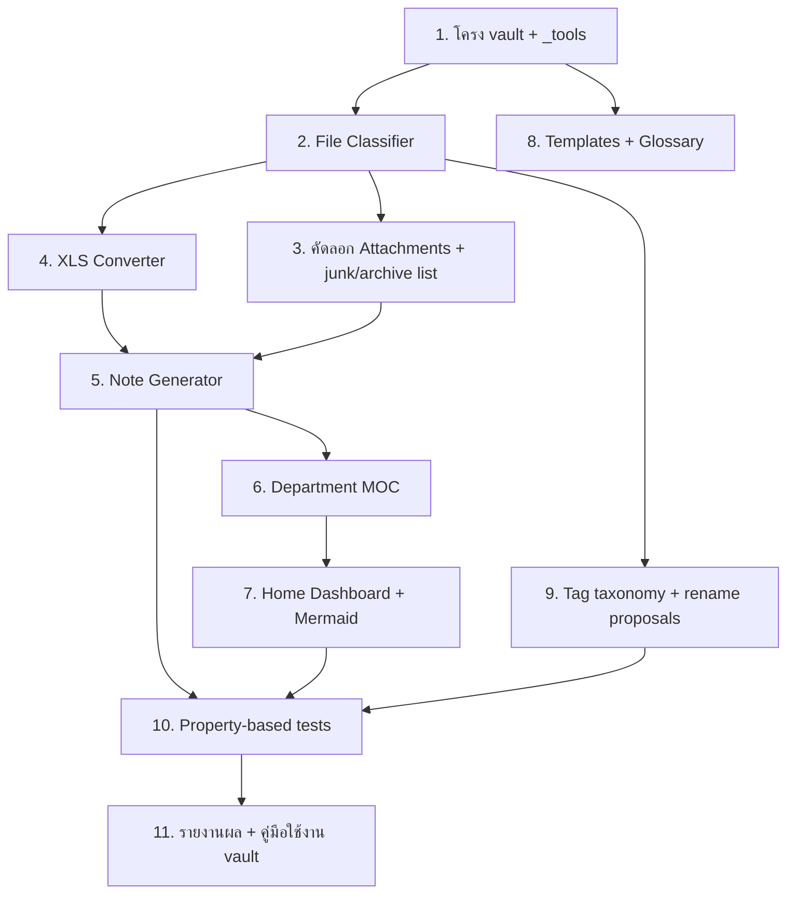

# Implementation Plan

## Overview

ทุก path อ้างอิงจากรากเวิร์กสเปซ `determined-williams/` — vault สร้างที่ `daph-second-brain/`
แหล่งเนื้อหา: `_daph_extract/` (ในเวิร์กสเปซ) · Excel ต้นฉบับ: `../New folder/` (คัดลอกเข้ามา)
สคริปต์เครื่องมือเขียนด้วย Node.js (วางที่ `daph-second-brain/_tools/`) เพื่อให้รันซ้ำได้และ idempotent

## Task Dependency Graph



```json
{
  "waves": [
    { "wave": 1, "tasks": ["1"] },
    { "wave": 2, "tasks": ["2", "8"] },
    { "wave": 3, "tasks": ["3", "4", "9"] },
    { "wave": 4, "tasks": ["5"] },
    { "wave": 5, "tasks": ["6"] },
    { "wave": 6, "tasks": ["7"] },
    { "wave": 7, "tasks": ["10"] },
    { "wave": 8, "tasks": ["11"] }
  ]
}
```

## Tasks

- [ ] 1. ตั้งโครง vault และเครื่องมือพื้นฐาน
  - สร้างโครงโฟลเดอร์ `daph-second-brain/` ครบตาม design (00_Inbox, 01_Dashboard, 02_Departments, 03_QMS/{SOS,JES,PFMEA,Control-Plan}, 04_Templates/note-templates, 05_Projects, 99_Attachments/{SOS,JES,PFMEA,Control-Plan,Templates,_archive})
  - สร้าง `daph-second-brain/_tools/` พร้อม `package.json` (Node, type module) และ test runner (เช่น vitest + fast-check สำหรับ property test)
  - เพิ่มไฟล์ `.gitkeep` ในโฟลเดอร์ว่าง และ `README.md` สั้น ๆ อธิบายจุดเริ่ม (`01_Dashboard/Home.md`)
  - _Requirements: 1.1_

- [ ] 2. สร้าง File Classifier
  - [ ] 2.1 อ่านอินพุตและจำแนกประเภท/แผนก/เวอร์ชัน
    - เขียนโมดูล `classifier.js` อ่านรายชื่อจาก `../New folder/` + `_daph_extract/_INDEX.json`
    - ตรวจ doc_type (SOS|JES|PFMEA|Control Plan|Template|Project) และ department จาก token ในชื่อไฟล์
    - ตรวจ junk (`.tmp`/`.temp`/ขึ้นต้น `~$`) และ version token (`Draft`,`(1)`,`(Revise N)`,ชื่อบุคคล `P'oil`,`P'Mean`)
    - คืนผลเป็น object รายไฟล์: `{ source_file, doc_type, department, category(primary|archive|junk|project), base_key }`
    - _Requirements: 1.2, 1.3, 1.4_
  - [ ] 2.2 เลือก primary และจัด archive ต่อ base document
    - จัดกลุ่มตาม `base_key` (doc_type+department) แล้วเลือก primary 1 ฉบับ (เกณฑ์: มี Revise/ไม่มี Draft/ใหม่สุด)
    - ฉบับที่เหลือ mark เป็น archive
    - _Requirements: 1.3_

- [ ] 3. คัดลอกไฟล์เข้า Attachments + สร้างรายการ junk/archive
  - คัดลอก (ไม่ย้าย/ไม่แก้ไข) ไฟล์ primary + archive จาก `../New folder/` เข้า `99_Attachments/<group>/` (archive → `99_Attachments/_archive/`)
  - สร้าง `01_Dashboard/_junk-list.md` ลงรายการไฟล์ junk (รอผู้ใช้ยืนยันก่อนลบ — ไม่ลบอัตโนมัติ)
  - ตรวจ checksum/ขนาดว่าไฟล์ต้นฉบับใน `../New folder/` ไม่ถูกแก้ไข (Property 1)
  - _Requirements: 1.2, 1.4_

- [ ] 4. สร้าง XLS Converter สำหรับไฟล์ `.xls` ที่แตกไม่ได้
  - แปลง `.xls` (Process Control Plan 9 ไฟล์ + Citadines) → `.xlsx` แล้วแตกเป็น text เข้า `_daph_extract/`
  - ทางหลัก: LibreOffice headless (`soffice --headless --convert-to xlsx`) หรือไลบรารีอ่าน .xls ใน Node
  - ถ้า convert ไม่สำเร็จ: ตั้ง flag `content_extracted: false` สำหรับไฟล์นั้น (ใช้ใน Task 5 ทำ link-only)
  - _Requirements: 1.2, 2.1_

- [ ] 5. สร้าง Note Generator (1 โน้ตต่อ 1 เอกสาร)
  - [ ] 5.1 Parser ดึงสาระจาก `_daph_extract/*.txt`
    - PFMEA: ดึง `Process`, `Process Owner`, `Revision Date` + แถวสาระ (process step/failure mode/RPN)
    - SOS: ดึงชื่อ sheet เป็นขั้นตอน + `Doc no.` (เช่น SOS 001) + ลำดับ SEQ/description
    - JES/Control Plan/Template: ดึงหัวเรื่อง + สรุปย่อ
    - _Requirements: 2.1_
  - [ ] 5.2 เขียนโน้ต Markdown + frontmatter + ลิงก์ไฟล์
    - เขียนโน้ตเข้า `03_QMS/<group>/` พร้อม frontmatter ตาม schema (note_type, department, status, source_file, attachment, content_extracted, tags)
    - ฝัง embed/link ไฟล์ต้นฉบับใน `99_Attachments/` (`![[...]]`) — ตรวจว่าไฟล์ปลายทางมีจริง
    - กรณี `content_extracted: false` → โน้ตแบบ link-only + ส่วน "รอเติมเนื้อหา"
    - idempotent: ถ้าโน้ตมีอยู่และมีการแก้ของมนุษย์ ห้ามทับ (เทียบ marker/region)
    - _Requirements: 2.1, 2.2_
  - [ ] 5.3 เติม wikilink ความสัมพันธ์
    - ใส่ลิงก์ไปแผนก (`[[<n>-<dept>]]`) และเอกสารที่เกี่ยว (เช่น SOS → `[[JES-00x]]`)
    - _Requirements: 2.3_

- [ ] 6. สร้าง Department MOC (7 แผนก)
  - สร้าง `02_Departments/<n>-<dept>.md` ทั้ง 7 แผนกตาม flow งาน
  - แต่ละไฟล์รวมลิงก์เอกสารทุกประเภทของแผนกนั้น (SOS/JES/PFMEA/Control Plan) แบบ auto จากผล classifier
  - _Requirements: 3.2, 2.3_

- [ ] 7. สร้าง Home Dashboard + process flow
  - สร้าง `01_Dashboard/Home.md`: Mermaid flow (Sale→Designer→Area Measurement→3D→Production Planning→Main Process→Installation) + ลิงก์ครบ 7 แผนก + ลิงก์ Templates/Glossary/junk-list/rename-proposals
  - เพิ่มตารางสรุปผลการจำแนก (ไฟล์→โน้ต, junk, archive, .xls ที่ยัง convert ไม่ได้)
  - _Requirements: 3.1, 3.2, 3.3_

- [ ] 8. สร้าง Templates และ Glossary
  - `04_Templates/project-template.md`: frontmatter โปรเจกต์ + ช่องลูกค้า/สถานที่/ทีม + checklist ตาม flow งาน (เริ่มจากเคส Citadines)
  - `04_Templates/Glossary.md`: นิยาม SOS/JES/PFMEA/RPN/Control Plan/MOC/Vault
  - `04_Templates/note-templates/`: template ต่อประเภทโน้ต (sos/jes/pfmea/control-plan)
  - _Requirements: 5.1, 5.2_

- [ ] 9. สร้าง Tag taxonomy และข้อเสนอชื่อมาตรฐาน
  - กำหนดและใส่ tag มาตรฐาน (แผนก/ประเภท/สถานะ) ในทุกโน้ต
  - สร้าง `01_Dashboard/_rename-proposals.md` เสนอชื่อมาตรฐานใหม่ (map ชื่อเดิม→ชื่อใหม่) โดยไม่เปลี่ยนชื่อจริงจนผู้ใช้ยืนยัน
  - _Requirements: 4.1, 4.2, 1.5_

- [ ] 10. เขียน property-based tests
  - ใช้ fast-check ทดสอบ Property 1–8 จาก design กับชุดชื่อไฟล์สุ่ม + ชุดไฟล์จริง
  - ครอบคลุม: non-destructive, total classification, junk⇒never primary, ≤1 primary/base, note⇔attachment link, link integrity, idempotency, reversible naming
  - รันชุดทดสอบให้ผ่านทั้งหมด
  - _Requirements: 1.3, 1.4, 1.5, 2.1, 2.2, 2.3, 3.2, 3.3_

- [ ] 11. รายงานผลและคู่มือใช้งาน vault
  - สร้าง `daph-second-brain/VAULT-GUIDE.md`: วิธีเปิดใน Obsidian, การเพิ่มเอกสารใหม่, การยืนยันลบ junk/เปลี่ยนชื่อ
  - สรุปสิ่งที่ยังต้องทำด้วยมือ (เช่น .xls ที่ convert ไม่สำเร็จ, การยืนยัน rename) ใน Home
  - _Requirements: 3.1, 5.2_

## Notes

- ทุกอย่าง self-contained ในเวิร์กสเปซ `determined-williams/` และพัฒนาต่อจากที่นี่ที่เดียว
- ไม่ลบ junk และไม่เปลี่ยนชื่อไฟล์จริง จนกว่าผู้ใช้จะยืนยันรายการใน `_junk-list.md` / `_rename-proposals.md`
- ไฟล์ Excel ต้นฉบับใน `../New folder/` ถูก **คัดลอก** เข้า vault เท่านั้น ไม่แก้ไข/ไม่ย้าย (Property 1)
- Task 4 (XLS Converter) ต้องมี LibreOffice หรือไลบรารีอ่าน .xls — ถ้าสภาพแวดล้อมไม่มี ให้ fallback เป็น link-only แล้ว flag ไว้
- waves แสดงงานที่รันขนานกันได้: Wave 2 = Task 2 + 8, Wave 3 = Task 3 + 4 + 9
