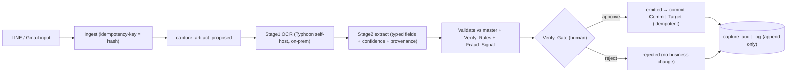
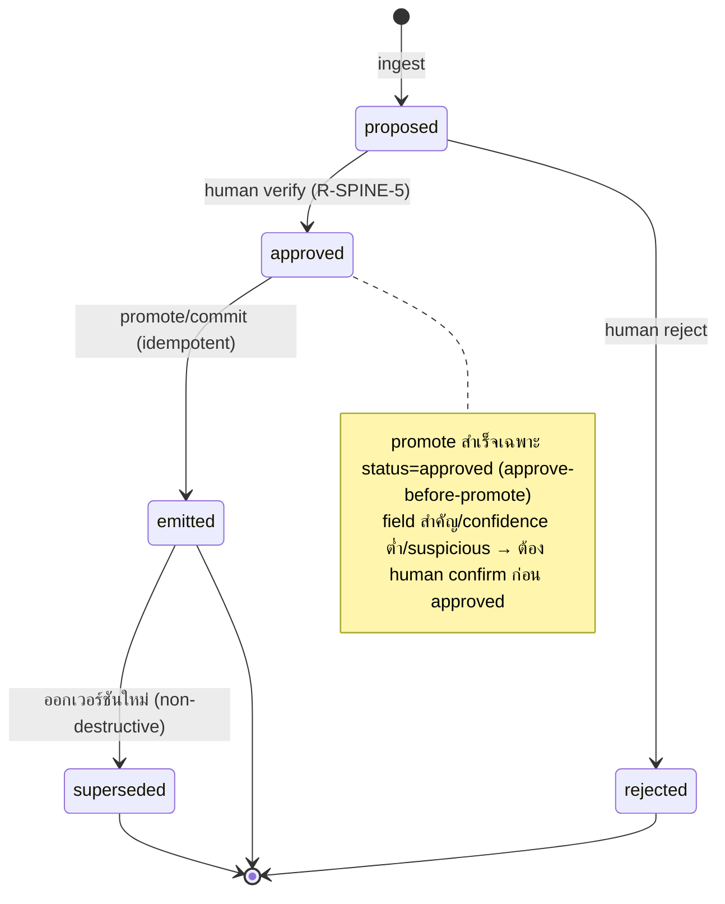

# Design Document — Capture Spine (Monolith, Phase 2)

## Overview

Capture Spine เป็น pipeline วงปิดระดับองค์กรที่แปลง input ดิบ (ภาพ/เอกสาร/ข้อความผ่าน LINE/Gmail) → record มีโครงสร้างที่ **มนุษย์ verify แล้ว** → commit เข้า business-layer + append-only audit โดย **ไม่เรียกออกนอกองค์กร** (OCR/LLM self-host) = PDPA-by-architecture

หลักการ:
1. **Lifecycle ลอก TCCK `agent_artifact`** (proven): `proposed → approved/rejected → emitted → superseded` — no-commit-until-emitted
2. **Human verify invariant (R-SPINE-5):** ไม่ commit จนกว่ามนุษย์ที่มีสิทธิ์ (C12) verify; field สำคัญ/confidence ต่ำ/suspicious → บังคับ confirm
3. **On-prem boundary (R-SPINE-2/8):** Stage1 OCR (Typhoon) + Stage2 extract อยู่ใน infra DAPH ทั้งหมด — ไม่มี outbound นอก org
4. **Fail-safe ไม่เดา (R-SPINE-7):** สกัดไม่ได้ → ไม่เติม placeholder; governance/audit/storage ไม่พร้อม → block
5. **Reuse-not-fork:** C12 (identity/RLS/`resolve_actor`) · workflow-copilot (human verify/approval/SLA) · MCP governance (D2/audit/rate-limit/idempotency R15-19) · line-oa (LINE ingest/customer identity)
6. **Config-driven per-department (R-SPINE-11):** capture_type ใหม่ = config {field schema, verify_rules, commit_target} ไม่แก้ core

---

## Architecture

### Pipeline (ingest → commit)



### Lifecycle state machine (ลอก TCCK agent_artifact)



### Trust boundaries
- **On-prem invariant:** Stage1/Stage2 endpoints รันใน infra DAPH เท่านั้น — smoke test ยืนยัน no outbound (R-SPINE-8, Property 8)
- **No client write:** ทุก mutation ผ่าน SECURITY DEFINER RPC + `resolve_actor()` (R-SPINE-10)
- **No-commit-until-emitted:** business-layer เปลี่ยนเฉพาะเมื่อ emitted (Property 1)
- **PII:** redact ออกจาก audit + data minimization (R-SPINE-8)
- **Capture failure-audit:** ใช้ caller-driven separate transaction pattern เดียวกับ workflow-copilot §1 (Edge catch → log failure) — ไม่ใช้ dblink/pg_background

### Reuse map (ไม่ fork)
| ความสามารถ | reuse จาก | สถานะ |
|---|---|---|
| identity / RLS / resolve_actor | C12 (`line-oa-commerce`) | ✅ deploy-verified (ADR-016 CLOSED) |
| customer identity (LINE) | `line_oa_customer_identity` | ✅ |
| human verify / approval / SLA / escalation | `monolith-workflow-copilot` (Phase 1) | 🔴 build ก่อน |
| D2 / audit / rate-limit / idempotency / provenance (R15-19) | `monolith-mcp-layer` | ⬜ Phase 2 |
| capture lifecycle (proposed→emitted) | TCCK `agent_artifact` | ✅ proven (ยกโครง) |
| autonomy execute / escalation_record (auto-approve low-risk) | TCCK D2 | ⬜ ยกเมื่อมี baseline (OQ-CS-2) |
| Typhoon OCR self-host | infra GPU/vLLM | 🟡 setup + license (OQ-CS-3) |

---

## Components and Interfaces

### Edge Functions (Deno/TS — on-prem)
- **`capture-ingest`** — รับ LINE/Gmail webhook → verify → `resolve_actor` → คำนวณ idempotency-key (hash เนื้อหา) → `rpc_capture_ingest` (สร้าง proposed); เก็บ raw_uri on-prem
- **`capture-ocr-extract`** — เรียก Typhoon OCR (Stage1, in-infra) → Stage2 extract typed fields + confidence + provenance → `rpc_capture_set_extraction`; **no outbound นอก org**; ถ้า throw → catch → `rpc_capture_log_failure` (tx แยก, best-effort audit)
- **`capture-cleanup`** (optional) — sweep stuck proposed (ตาม SLA workflow-copilot)

### SECURITY DEFINER RPCs (write path เดียว — reuse C12)
ทุกตัว: `SECURITY DEFINER`, `resolve_actor()`, re-check role, เขียน `capture_audit_log`, scrub PII/secret

- **`rpc_capture_ingest(capture_type, source, raw_uri, idempotency_key)`** — สร้าง proposed; idempotent (R-SPINE-1, 12)
- **`rpc_capture_set_extraction(id, ocr_text, fields, confidence, ai_provider, model_version, fraud_signals)`** — บันทึก Stage1/Stage2 output + validate master (unverified mark) + รัน verify_rules + fraud_signal; **ไม่เติม placeholder** (R-SPINE-3, 4, 7; R-FRAUD-1)
- **`rpc_capture_verify(id, decision, edits?)`** — มนุษย์ verify/approve/reject; บังคับ confirm เมื่อ field สำคัญ/confidence ต่ำ/suspicious (R-SPINE-5); approve-before-promote
- **`rpc_capture_promote(id)`** — emitted + commit Commit_Target (idempotent) + link entity; สำเร็จเฉพาะ status=approved (R-SPINE-6)
- **`rpc_capture_log_failure(...)`** — append failure-audit อย่างเดียว (tx แยก, ไม่แตะ business; ไม่ใช้ dblink/pg_background)
- **`rpc_capture_feedback(id, is_false_positive)`** — บันทึก false-positive → ปรับ signal (R-FRAUD-3)

### Verify_Rule structure (seed จาก PFMEA — CAPTURE_VERIFY_RULES_SEED)
```
verify_rule = { checkpoint (=PFMEA requirement), guards_against (=failureMode),
                method (=control), pfmea_ref (sourceFile+sourceStep), priority (RPN|SEV) }
```
- priority: computed RPN ก่อน (Cutting 280 → Edging/Assembly 168 → CNC 144 → Laminate 112 → Packing 84) แล้ว severity_only (SEV9 Sale → SEV8) + requiresHumanReview (R-VERIFY-2)
- ทุก rule ผูก `pfmea_ref` trace กลับ Knowledge_Export ได้ (Property 11)
- ⚠️ Office/Sale rows มี column เหลื่อม + merged-cell หาย → normalize ก่อน seed (Factory/Installation สะอาดกว่า)

---

## Data Models

ทุกตาราง: เปิด RLS; `SELECT` policy `TO authenticated USING (public.is_governance_role() OR public.has_site_access(site_code))`; ไม่มี client write policy

### `capture_artifact`
- `id uuid PRIMARY KEY`
- `capture_type text NOT NULL REFERENCES capture_type_config`
- `status text NOT NULL CHECK (status IN ('proposed','approved','rejected','emitted','superseded'))`
- `source text NOT NULL CHECK (source IN ('line','email','app'))`
- `principal text NOT NULL` — `resolve_actor()` (text, email-based)
- `site_code text NULL`
- `raw_uri text NOT NULL` — on-prem storage
- `ocr_text text NULL`, `ai_payload jsonb NOT NULL DEFAULT '{}'`, `confidence jsonb NOT NULL DEFAULT '{}'`
- `ai_provider text NULL`, `model_version text NULL` — provenance (Property 5)
- `fraud_signals jsonb NOT NULL DEFAULT '[]'`, `is_suspicious boolean NOT NULL DEFAULT false`
- `linked_entity_type text NULL`, `linked_entity_id uuid NULL`
- `supersedes_id uuid NULL REFERENCES capture_artifact(id)` — non-destructive supersede chain (Req 5.4, fix J1); partial-unique (one chain)
- `reviewed_by text NULL`, `reviewed_at timestamptz NULL`, `review_notes text NULL`
- `idempotency_key text NOT NULL UNIQUE` — hash เนื้อหา (R-SPINE-12)
- `created_at timestamptz NOT NULL DEFAULT timezone('utc',now())`
- CHECK `(reviewed_at IS NULL) = (reviewed_by IS NULL)` — verify ครบคู่
- (R-SPINE-1, 3, 5, 6)

### `capture_type_config` (config-driven, row-extensible — R-SPINE-11)
- `capture_type text PRIMARY KEY`
- `field_schema jsonb NOT NULL` — typed fields ต่อชนิด
- `verify_rules jsonb NOT NULL` — array ของ verify_rule (seed PFMEA)
- `commit_target text NOT NULL` — ledger / SiteSurveyZone / actual_purchase_price / Released_Spec / ...
- `critical_fields text[] NOT NULL DEFAULT '{}'` — field สำคัญที่บังคับ human confirm (R-SPINE-5)
- (R-SPINE-11, R-VERIFY-1)

### `fraud_signal_config` (config — R-FRAUD)
- `signal_key text PRIMARY KEY`, `rule jsonb NOT NULL`, `active boolean NOT NULL DEFAULT true`
- seed: VAT mismatch / vendor not in master / total anomaly / duplicate doc (R-FRAUD-1, 4)

### `capture_audit_log` (append-only)
- `id uuid PRIMARY KEY`, `capture_artifact_id uuid NULL`, `capture_type text NULL`
- `event_type text NOT NULL` — ingest / ocr / extract / verify / emit / commit / reject / failure / feedback
- `actor uuid NOT NULL` → `actor text NOT NULL` — `resolve_actor()` (text), `prev_status text NULL`, `next_status text NULL`
- `at timestamptz NOT NULL DEFAULT timezone('utc',now())`
- trigger `trg_capture_audit_immutable` raise บน UPDATE/DELETE; `REVOKE UPDATE, DELETE` (R-SPINE-9, Property 7)

### Per-department instances (config — ไม่ rebuild)
| capture_type | Stage2 fields | critical verify | commit_target |
|---|---|---|---|
| expense_document | vendor/total/vat/wht/category | ตัวเลขภาษี + suspicious | ledger |
| site_survey | dimension/MEP/material | ขนาดสำคัญ + MEP + photo | SiteSurveyZone |
| material_receipt | material/qty/price + PO match | ราคา + ตรงสเปค | actual_purchase_price |
| qc_capture | station/defect/qty | defect critical (Factory RPN) | QC log |
| installation_proof | checklist/before-after/signature | งานครบ + เซ็นรับ + lock vdo | Work_Item complete |
| delivery_pod | order/สภาพ/ผู้รับ/เวลา | ของครบ/ไม่เสียหาย | delivery + POD |
| spec_draft | function/Bible code/dimension | gate ยืนยันแบบ | Released_Spec |
| cowork_* (L1) | supply/sales/member/incident/maintenance | per-type | ledger/sales_log/registry/incident_log/maintenance_log |

---

## Correctness Properties

อ้างอิง Property 1–11 ใน requirements.md — ทำ property-based test (fast-check) + pgTAP

### Property 1: ไม่มีการเปลี่ยน business-layer ก่อน emitted
*For any* Capture_Artifact การเปลี่ยน Commit_Target/business-layer SHALL เกิดเฉพาะเมื่อ status = emitted (no-commit-until-emitted)
**Validates: Requirements 4.1, 5.1, 5.2**

### Property 2: field สำคัญ / suspicious → บังคับ human confirm
*For any* artifact ที่มี critical field / confidence < threshold / is_suspicious การ emit SHALL ถูกบล็อกจนกว่ามนุษย์ confirm
**Validates: Requirements 4.2, 10.2**

### Property 3: Idempotent ingest
*For any* input ที่ idempotency_key เดิม การ ingest ซ้ำ SHALL ไม่สร้าง artifact ใหม่ และคืน artifact เดิม
**Validates: Requirements 1.2**

### Property 4: Fail-safe ไม่เดาค่า
*For any* การสกัดไม่สำเร็จ/ขาดข้อมูล ระบบ SHALL ไม่เติมค่าเดา; governance/audit/storage ไม่พร้อม → block
**Validates: Requirements 6.1, 6.2**

### Property 5: Provenance ครบ
*For any* artifact ที่ผ่าน Stage2 SHALL มี ai_provider + model_version + per-field confidence
**Validates: Requirements 2.2**

### Property 6: Terminal immutability
*For any* artifact ที่ถึง emitted/superseded สถานะ SHALL ไม่ถูกแก้ย้อนหลัง (แก้ = artifact ใหม่ + supersede)
**Validates: Requirements 5.4**

### Property 7: Audit completeness (ไม่มี PII)
*For any* transition SHALL มี capture_audit_log หนึ่งรายการครบ field โดยไม่มี PII/secret; audit reject UPDATE/DELETE
**Validates: Requirements 7.1, 7.2, 7.3**

### Property 8: On-prem ไม่มี cross-border
*For any* OCR/extraction SHALL ไม่มี outbound call ออกนอก org (smoke test ยืนยัน)
**Validates: Requirements 2.1, 2.3**

### Property 9: Extensible โดยไม่แก้ core
*For any* capture_type ใหม่ที่เพิ่มผ่าน config ระบบ SHALL ทำงานได้โดยไม่แก้ state machine/core
**Validates: Requirements 9.1, 9.2**

### Property 10: Suspicious ไม่ auto-emit
*For any* artifact suspicious การ emit SHALL ไม่เกิดอัตโนมัติ — ต้องผ่าน human review
**Validates: Requirements 10.1, 10.2**

### Property 11: ทุก Verify_Rule trace pfmea_ref
*For any* Verify_Rule ที่ active SHALL มี pfmea_ref trace กลับ PFMEA ได้ และ priority เรียงตามความเสี่ยง (computed RPN ก่อน severity_only)
**Validates: Requirements 11.2, 11.3**

---

## Error Handling

- **Ingest ซ้ำ (R-SPINE-12):** idempotency_key ชน → คืน artifact เดิม ไม่สร้างซ้ำ
- **Extraction fail (R-SPINE-7):** ไม่เติม placeholder → ส่งให้คนกรอก; capture-ocr-extract throw → Edge catch → `rpc_capture_log_failure` (tx แยก, best-effort)
- **Master ไม่พบ (R-SPINE-4):** mark unverified ไม่ block (ให้คนตัดสิน)
- **Suspicious (R-FRAUD-2):** ไม่ auto-emit; บังคับ human review (ไม่ auto-reject — กัน false positive)
- **Promote ก่อน approve (R-SPINE-6):** reject (approve-before-promote)
- **Governance/audit/storage ไม่พร้อม (R-SPINE-7):** block (no silent commit)
- **PII/secret:** scrub ทุกเส้นทาง audit; redact ก่อนเก็บ (R-SPINE-8)

## Testing Strategy

1. **fast-check (PBT)** — pure logic: state machine transitions, idempotency, verify_rule eval/priority, fraud_signal eval, fail-safe no-guess, confidence/critical-field gating (mock OCR/Supabase)
2. **pgTAP / DB-harness** — RLS reuse C12, capture_audit_log append-only immutability, idempotency_key unique, `supabase db reset` เขียว (deploy-verified — CLI/Docker พร้อม)
3. **Smoke (on-prem boundary)** — Property 8: ไม่มี outbound call นอก org ใน capture path (R-SPINE-8)
4. **Integration** — ingest → OCR → extract → verify → promote → commit (per capture_type)
5. แต่ละ Property 1–11 → property test ตัวเดียว tag `// Feature: capture-spine, Property N: ...`

## Dependencies & Open Questions

- **DEP-1 (Phase 1):** human verify/approval/SLA จาก `monolith-workflow-copilot` ต้องเสร็จก่อน
- **DEP-2:** D2/audit/rate-limit/idempotency (R15-19) จาก `monolith-mcp-layer`
- **DEP-3:** C12 + `line_oa_customer_identity` (deploy-verified)
- **DEP-4:** verify_rules seed จาก `_knowledge-export.json` pfmeaRiskRows (Cutting 280 ฯลฯ)
- **OQ-CS-1:** แผนกแรก = บัญชี (ROI) หรือ ติดตั้ง (compliance) — capture_type เป็น config ไม่บล็อก
- **OQ-CS-2:** auto-approve (ยก TCCK D2 L2) เปิดเมื่อมี baseline accuracy จาก data จริง — Phase นี้ human-verify เป็นหลัก
- **OQ-CS-3:** Typhoon GPU/VRAM on-prem + license เชิงพาณิชย์ (ทนาย) — enabler ของ R-SPINE-2/8
- **OQ-VR-1:** normalize column เหลื่อม + merged-cell ที่ `pfmea-parser.ts` ก่อน seed (Factory/Installation พร้อมกว่า)
- **DISCLAIMER:** anti-fraud (R-FRAUD) + เอกสารการเงิน/ภาษี — ต้องผ่านทนาย/ผู้สอบบัญชีไทยก่อน production
