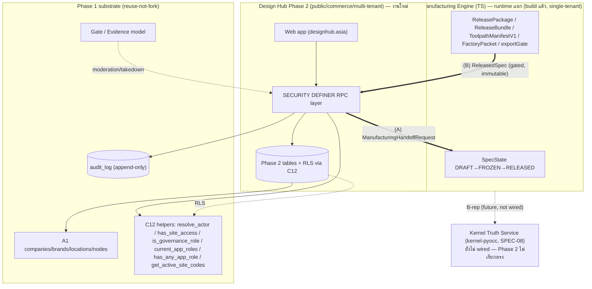
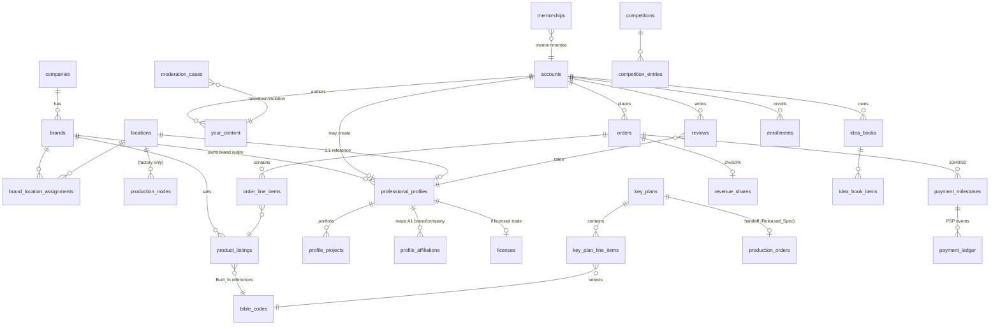

# Design Document — Design Hub Platform (Phase 2)

## Overview

เอกสารนี้คือการออกแบบทางเทคนิคของ **Design Hub Platform — Phase 2** ซึ่งเป็นชั้นสาธารณะ (public · multi-sided marketplace · learning center · community) ที่วางทับบน substrate ที่ส่งมอบแล้วใน Phase 1 (A1 enterprise-structure-topology + C12 security-access-federation + Gate/Evidence/Audit) และเชื่อมกับ **CAM/Manufacturing Engine (TS)** ที่ build แล้วใน workspace `iimos-workspace` ผ่านสัญญา **Released_Spec / Gate** เพียงทางเดียว

หลักการออกแบบ (จาก requirements + dossier ที่ตรวจสอบกับโค้ดจริง):

1. **Reuse-not-fork (ADR-002, ADR-016):** ทุกโมดูล Phase 2 build บน C12 helper เดิม **ห้าม** นิยาม/fork auth model ใหม่ — Phase 2 เพียง **ขยาย** ด้วย External_Actor_Role class
2. **Released_Spec = projection/view ของ types จริง** ไม่ใช่ schema ใหม่ — map จาก `SpecState`/`FrozenSnapshot`/`GateReport`/`ReleasePackage`/`ReleaseBundle`/`ToolpathManifestV1`/`exportGate` ที่มีอยู่ใน `src/` (ดู §6) Phase 2 เติมเฉพาะสิ่งที่ engine ไม่มี = **multi-tenant identity (brandId/siteCode) + RPC + RLS**
3. **Separation of runtime (Req 9.5):** Phase 2 **ไม่คำนวณ geometry** เอง และ **ไม่เรียก Kernel Truth Service (kernel-pyocc)** ตรง — เชื่อม CAM Engine ผ่าน Released_Spec contract เท่านั้น
4. **DB-first security:** ทุก mutation ผ่าน SECURITY DEFINER RPC → RLS via C12 → append-only audit ผ่าน `public.resolve_actor()`
5. **Verify-before-build:** ทุก migration ต้อง `supabase db reset` เขียวจริง (deploy-verified) — ปิด OPEN GATE ADR-016
6. **Property-based testing:** round-trip Bible (PBT-1), contract G1–G9, cross-table INV-1..8

### Naming (canonical — บังคับ)
เลิกใช้คำ "north-star-foundation" ทุกที่ ใช้ชื่อจริง 2 ชั้นที่ต้องไม่สับสน:
- **CAM/Manufacturing Engine (TS)** = runtime ที่ emit Released_Spec จริงในปัจจุบัน (build แล้วใน `src/`)
- **Kernel Truth Service (kernel-pyocc, SPEC-08)** = B-rep solid kernel อนาคต ยังไม่ wired (ดู A-5) — Phase 2 ไม่พึ่งพา

---

## Architecture

### Context diagram (ขอบเขต + ทิศทาง)



### Layering / ลำดับการพึ่งพา (migration order)
ตาม PHASE2_ERD_RLS_MATRIX §6:

```
C12 foundation (00000000000000_c12_foundation.sql — มีแล้ว, OPEN GATE deploy)
  └─ A1 substrate (companies/brands/locations/nodes)        ← WO-1 (blocker จริง)
       └─ identity (accounts/professional_profiles/...)     ← WO-2
            └─ marketplace (bible_codes/product_listings/orders)
                 └─ design→mfg (key_plans/production_orders + Released_Spec) ← WO-4
                      └─ content (your_content/idea_books/reviews)
                           └─ learning (mentorships/workshops/competitions/bookings)
                                └─ trust/payment/governance (moderation/consents/dsar/payment/revenue_shares)
```

### Runtime boundary (สำคัญที่สุด)
- Phase 2 เป็น **เจ้าของ DB ของชั้น public/commerce** เท่านั้น
- CAM Engine (TS) เป็นเจ้าของ SpecState/Gate/manufacturingOutputs — Phase 2 **เก็บเป็น reference + checksum (opaque)** ห้าม parse/แก้ geometry (G5/Req 9.5)
- การข้าม boundary ทำผ่าน **2 RPC เท่านั้น**: `rpc_request_manufacturing` (A) และ `rpc_consume_released_spec` (B)

---

## Components and Interfaces

### C-1 Identity & Profile (Req 1, 2, 3)
- `accounts` ผูก `auth.users.id` (Req 1.7) — ไม่เก็บรหัสผ่านเอง ใช้ Supabase Auth (email + OAuth Facebook/Google)
- registration gate: อายุ ≥ 13 (Req 1.2), email unique (Req 1.4), ToS/Privacy acceptance ก่อน activate (Req 1.5/1.6)
- `professional_profiles` 1:1 กับ A1 `locations` (INV-1/Req 3.2) — สร้างผ่าน `rpc_create_professional_profile` ที่ตรวจ verification + license validity (Req 3.3)
- การอนุมัติ profile → grant `professional_owner` scoped ตาม Brand realm ของ location ผ่าน C12 Access_Grant (Req 4.4) — **ไม่แตะ logic C12**

### C-2 External_Actor_Role (C12 extension, Req 4, 17)
- เพิ่ม role keys `general_user`, `professional_owner`, `professional_member` ที่ **additive** ต่อ governance/branch roles เดิม (Req 4.1)
- grant/revoke ผ่าน C12 Access_Grant + project เข้า JWT `app_metadata.roles` ผ่าน App_Metadata_Projection เดิม (Req 4.2)
- **ห้าม** redefine/fork helper เดิม 6 ตัว (Req 4.3) — design ตรวจสอบว่าทุก RLS predicate เรียก `has_any_app_role()`/`has_site_access()`/`is_governance_role()` เท่านั้น
- App_Role registry = **WO-0 decision #2** (row-extensible vs enum/CHECK) → ดู Open Questions OQ-2

### C-3 Marketplace (Req 5, 6)
- `product_listings` 6 หมวด (Built_In/Furniture/Prop/Curtain/Wallpaper/Appliances) — enum CHECK
- Built_In → ผูก `bible_codes` + pricing size×function (Req 5.3) ไม่ใช่ราคาคงที่เดียว
- Prohibited_Products_Policy check ก่อน publish (Req 5.4/5.5)
- query catalog: filter category/price/brand/text + offset pagination (default 20, max 100) + total_count (Req 5.6)
- `orders`/`order_line_items` — ทุก line ผูก `vendor_seller_id` ผู้รับผิด/indemnification (INV-3/Req 6.2); แสดงผู้รับผิดก่อน confirm (Req 6.4)

### C-4 Bible_Code (reuse WO-3) + Adapter
- **Reuse** `tools/bible-code` (`parseBibleCode`/`formatBibleCode`/`ParsedSpec`) — DONE + PBT P1–P4 + golden vectors **ห้ามเขียนใหม่**
- `bible_codes` table = master ที่เก็บ `code` + parsed fields; validate ด้วย parser เดียวกันก่อนบันทึก (Req 8, 9.1)
- **Adapter ใหม่** `ParsedSpec → DesignerIntentPDF` (ช่องว่างจริงที่เหลือ — ดู §7)

### C-5 Key Plan & Released_Spec handoff (Req 9, WO-4)
- `key_plans` + `key_plan_line_items` — validate Bible grammar ก่อนบันทึก line (Req 9.1), audit ทุกการแก้ (Req 9.2)
- handoff ผ่าน `rpc_request_manufacturing` → CAM Engine; consume ผ่าน `rpc_consume_released_spec` เมื่อ `specState=RELEASED ∧ gate.ok=true` เท่านั้น (G1/Req 9.3/9.4)
- Released_Spec = projection (ดู §6); ระหว่าง DB-side ยังไม่พร้อม → ใช้ **stub** ที่คืน RELEASED spec (Req 9 = OPEN GATE)

### C-6 UGC / Content (Req 10, 13)
- `your_content` public-by-default (Req 10.1), owner คงสิทธิ์ + แก้/ลบได้ (Req 10.2/10.4), attest ownership (Req 10.3)
- `idea_books`/`idea_book_items`; `reviews` = Your_Content + aggregate rating (Req 13.3)
- moderation โดยแพลตฟอร์ม → record audit (Req 10.5/13.4) ผ่าน Gate/Evidence

### C-7 Learning Center (Req 15, 16)
- `mentorships`/`workshops`/`enrollments`/`competitions`/`competition_entries`/`coworking_bookings`
- competition entry หลัง due → reject (Req 16.3); booking ชน confirmed slot → reject (Req 16.5)
- overlap กับ Knowledge context → **อ้างอิง** `daph-obsidian-second-brain` ไม่ duplicate (Req 15.6)

### C-8 Trust / Payment / Governance / PDPA (Req 7, 11, 12, 14)
- `moderation_cases` ผ่าน Gate/Evidence; remove = `visibility=removed` + retain record (INV-6/Req 12.4)
- `revenue_shares` basis {design_sharing 2% / design_from_scratch 50%}; undetermined → withhold + human review (INV-5/Req 7.5)
- `payment_milestones` 10/40/50; M2(40%) release ผูก `Released_Spec.gate.ok=true` (INV-4/WO-6)
- `consents`/`dsar_requests` (PDPA, SLA 30 วัน); under-13 detected → remove registration data (Req 14.8)
- **Disclaimer:** payment/tax/IP (WO-5/6/7) ต้องผ่านทนาย/ผู้สอบบัญชีไทยก่อน production — ระบุใน tasks.md ทุก task ที่เกี่ยว

---

## Data Models

### Enums (canonical)

| Enum | ค่า | อ้างอิง |
|---|---|---|
| `account_status` | active · disabled_temporary · disabled_permanent | Req 2 |
| `profile_type` | design_firm · contractor · designer · vendor_seller | Req 3.1 |
| `external_actor_role` | general_user · professional_owner · professional_member | Req 4.1 |
| `product_category` | Built_In · Furniture · Prop · Curtain · Wallpaper · Appliances | Req 5.1 |
| `furniture_type` | Counter · Cabinet · Wardrobe (DKC·DC·DWD) | Req 8 / BIBLE_CODE_GRAMMAR_SPEC |
| `order_status` | placed · confirmed · in_production · fulfilled · cancelled | Req 6.1 |
| `spec_state` (mirror) | DRAFT · FROZEN · RELEASED | src/spec/types.ts |
| `revenue_basis` | design_sharing · design_from_scratch | Req 7.4 |
| `content_visibility` | public · removed | Req 10 / 12.4 |
| `dsar_type` | access · rectify · erase · restrict · portability | Req 14.6 |
| `location_type` (A1/DAPH) | design_studio · factory · installation_site · warehouse · showroom | A1_DAPH_ADAPTATION_SPEC §3 |
| `production_node_type` (A1/DAPH) | laminate_hpl · cutting · edging · cnc · assembly · packing | A1_DAPH_ADAPTATION_SPEC §4 |

### ERD



### Table constraints ที่สำคัญ (ย่อ — เต็มอยู่ใน migration tasks)

| Table | constraint |
|---|---|
| `accounts` | `auth_user_id` FK `auth.users`; `email` unique; CHECK declared age ≥ 13; `accepted_tos_at` NOT NULL ก่อน active |
| `professional_profiles` | UNIQUE(`location_id`) WHERE active (INV-1); FK `brand_id`,`location_id`→A1; licensed → license valid |
| `product_listings` | category ∈ enum; Built_In → `bible_code_id` NOT NULL; ≥1 image |
| `bible_codes` | `code` unique; parsed fields ตรวจด้วย WO-3 parser |
| `key_plan_line_items` | `bible_code` ผ่าน grammar ก่อน insert (trigger/RPC) |
| `order_line_items` | `vendor_seller_id` NOT NULL (INV-3) |
| `revenue_shares` | basis ∈ enum หรือ NULL→flagged review (INV-5) |
| `moderation_cases` | remove → visibility=removed, record คงอยู่ (INV-6) |
| `audit_log` | reject UPDATE/DELETE (INV-8/Req 17.7) — trigger BEFORE UPDATE/DELETE RAISE |

---

## Security model (RLS + RPC)

### หลักการ (Req 17)
1. ทุกตาราง RLS `TO authenticated` ที่ reuse `has_any_app_role()` / `has_site_access()` / `is_governance_role()` (Req 17.1)
2. ทุก mutation ผ่าน **SECURITY DEFINER RPC** ที่ re-check role + `resolve_actor()` ภายใน (ไม่เชื่อ client-supplied actor) (Req 17.2)
3. brand/site isolation ผ่าน A1 realm (Req 17.3); governance = cross-brand read (Req 17.4)
4. sensitive change → append-only audit (entity_type/entity_id/action_type/performed_by/performed_at) (Req 17.6)

### RLS Access Matrix
อ้างอิง PHASE2_ERD_RLS_MATRIX §4 (entity × role: PUB/GU/PM/PO/GOV/SEC/SYS) — เป็น source of truth ของ policy ต่อ entity ใช้ตอนเขียน migration

### RPC สำคัญ (SECURITY DEFINER, reuse C12)
| RPC | หน้าที่ | invariant |
|---|---|---|
| `rpc_register_account` | สร้าง account + ToS gate + age gate | Req 1.2/1.5 |
| `rpc_create_professional_profile` | สร้าง profile 1:1 location + verify | INV-1 |
| `rpc_grant_external_role` | grant/revoke ผ่าน C12 Access_Grant | Req 4.2/4.3 (ไม่ fork) |
| `rpc_create_listing` | publish listing + prohibited check | Req 5.4 |
| `rpc_place_order` | สร้าง order + vendor liability | INV-3 |
| `rpc_request_manufacturing(p_key_plan_id, p_idempotency_key)` → uuid | validate Bible grammar + audit + enqueue handoff | G4/G9 |
| `rpc_consume_released_spec(p_released_spec_id, p_order_id)` → jsonb | enforce G1 (gate) + G7 (checksum) → ผูก order → audit | G1/G6/G7 |
| `rpc_compute_revenue_share` | คำนวณ 2%/50% หรือ withhold | INV-5 |
| `rpc_submit_takedown` / `rpc_decide_moderation` | Gate/Evidence + audit | Req 12 |

---

## §6 — Released_Spec Projection (map จาก types จริง)

Released_Spec **ไม่ใช่ schema ใหม่** แต่เป็น **projection/envelope** ที่ห่อ artifact จริงของ CAM Engine แล้วเติม multi-tenant identity Phase 2 ต้องเก็บ `manufacturingOutputs` เป็น **opaque reference + checksum** เท่านั้น

| Released_Spec field (contract v1.0.0) | type จริงในโค้ด | ที่อยู่ | บทบาท Phase 2 |
|---|---|---|---|
| `state.specState` | `SpecState = 'DRAFT'｜'FROZEN'｜'RELEASED'` | `src/spec/types.ts` | อ่าน (gate G1) |
| `state.gate.ok` / `decision` | `GateReport` (blockers/warnings/info/metrics) + `exportGate.v1` | `src/spec/types.ts`, `src/core/manufacturing/export/` | อ่าน (gate G1) |
| `state.gate.decidedBy` | `ReleasePackage.releasedBy` / `ApprovalSignature.approverId` | `src/spec/types.ts`, `release/types.ts` | audit (resolve_actor ฝั่ง Phase 2) |
| `integrity.specChecksum` | `FrozenSnapshot.canonicalHash` + `ToolpathManifestV1.chain.manifestHash.hex` | `src/spec/types.ts`, `manifest/toolpathManifest.v1.ts` | verify G7 |
| `integrity.signature` | `ToolpathManifestV1.signature` (ED25519) / `ReleaseBundle.approvals` | `manifest/...`, `release/types.ts` | verify G7 |
| `manufacturingOutputs.bom/cutlist/artifacts` | `ToolpathManifestV1.toolpath.files[]` + `manufacturingTruth` + `ReleaseBundle.files[]` | `manifest/...`, `release/types.ts` | **opaque ref + checksum (G5)** |
| `manufacturingOutputs.nesting.yieldPercent` | `GateReport.metrics` / `ManifestManufacturingTruth.nestingPlan` | `src/spec/types.ts` | reference (KPI) |
| `designIntent.lineItems[].parsedSpec` | `ParsedSpec` (WO-3) | `tools/bible-code/src/bible-code.ts` | provenance |
| `identity.brandId/siteCode/tenantId` | **ไม่มีใน engine (single-tenant)** | — | **Phase 2 เติม (งานใหม่)** |

> **นัย:** engine ปัจจุบันเป็น single-tenant (ไม่มี brand/site/RLS) — ตรงกับ contract banner ✅ งาน DB ของ Phase 2 = wrap + เติม identity + RPC + RLS ไม่ใช่สร้าง state machine ใหม่

### Stub policy (OPEN GATE — Req 9)
ระหว่าง DB-side Released_Spec (projection table + RPC) ยังไม่ deploy-verified:
- `rpc_consume_released_spec` ใช้ **stub** ที่คืน spec ที่ `specState=RELEASED ∧ gate.ok=true` (เพื่อทดสอบ contract G1/G6/G7 ได้)
- mark Req 9 = **OPEN GATE** จนกว่า (ก) projection table พร้อม (ข) `supabase db reset` เขียว (ค) integration กับ CAM Engine จริง

---

## §6.1 — Panel Material Spec (วัสดุแผ่น/ความหนา — มิติแยกจาก Bible_Code)

ตาม Req A-6 + ผลสำรวจผู้ผลิต 8 แหล่งใน `_daph_extract/MATERIAL_CATALOG_REFERENCE.md` — ความหนา/ชนิดวัสดุ **ไม่อยู่ใน Bible_Code** แต่เป็น material spec เลือกที่ระดับ Key_Plan line / order

### Data model — `material_catalog` (row-extensible, ไม่ใช่ enum)
```
material_catalog (Phase 2 table):
  id                uuid
  material_type     PARTICLE|MDF|HDF|THIN_MDF|FLAME_RETARDANT|PVC_FOAM|PLYWOOD|HARDBOARD|OSB|WPC|ENGINEERED_VENEER|BLOCKBOARD|FILM_FACED_PLYWOOD|ACOUSTIC_PANEL
  moisture_grade    STANDARD|MR|HMR_V313
  thickness_mm      numeric          -- validate เทียบ (material_type × moisture_grade)
  emission_grade    SUPER_E0|E0|E1|E2|SE0|CARB_P2_EPA|F_FOUR_STAR|NA
  surface_finish    RAW|MELAMINE|SYNCHRONOUS|HPL|PERFECT_SILK|MELLOW_MATTE|NA
  veneer_face       NONE|TEAK_NATURAL|TEAK_ITALIAN|WHITE_OAK|ASH|BEECH|RED_OAK|MAPLE|BIRCH|RUBBERWOOD|WALNUT|ALDER|CHERRY|MAHOGANY|ENGINEERED_EV
  glue_grade        NA|MR|WBP_MARINE|ENF      -- เฉพาะ plywood
  cert_standard     text[]                     -- TIS_178_2549|TIS_192_2549|V313|ASTM_E84|EN_13501_1|FSC|ISO_9001
  sheet_size_mm     text                       -- '1220x2440'|'1230x2450'|'1830x2440'|'2440x1220'
  supplier          text
  is_active         boolean
  -- ราคา per-brand แยกตาราง (WO-0 Q3)
```

### กฎสำคัญ
1. **Validate ความหนาต่อ (material_type × moisture_grade)** — แต่ละเกรดมีชุด/ช่วงความหนาต่างกัน (เช่น MDF 1.7–40 vs HMR 4–25 vs HDF-HMR 12–30) ไม่ใช่ enum รวมเดียว
2. **sheet_size → nesting (G5):** Released_Spec ต้องส่ง `material.sheet_size_mm` เข้า nipping/nesting ของ CAM Engine — `manufacturingOutputs.nesting.yieldPercent` ขึ้นกับ sheet size ที่เลือก **ห้าม fix ค่าเดียว**
3. **PVC_FOAM / WPC** = ทางเลือกกันน้ำ (ครัว/ห้องน้ำ/outdoor) — flag ใน UI เป็น "waterproof option"
4. **FLAME_RETARDANT** ผูก `cert_standard` (ASTM E84 Class A / EN 13501-1) — สำหรับงานอาคารสาธารณะ

### Released_Spec field เพิ่ม
| Released_Spec field | map | บทบาท Phase 2 |
|---|---|---|
| `materialSpec.{materialType,thicknessMm,moistureGrade,emissionGrade,surfaceFinish,veneerFace,sheetSize}` | `material_catalog` (Phase 2) | designer เลือกตอน key_plan → ส่งเข้า handoff → CAM Engine ใช้กำหนด nesting/cutlist |

> **นัย:** material spec เป็น **input ของ Phase 2 → CAM Engine** (ผ่าน `rpc_request_manufacturing`) ไม่ใช่ output ที่ projection เก็บ opaque — ต่างจาก `manufacturingOutputs` ที่เป็น opaque ref/checksum

---

## §7 — Bible → DesignIntent Adapter (3C, งานเล็ก)

แมป `ParsedSpec` (จาก `tools/bible-code`) → `DesignerIntentPDF` (`src/core/designerIntent/types.ts`) แล้วป้อนเข้า `evaluateIntent()` ที่มีอยู่ — **ไม่แตะ rule engine**

### Mapping table

| ParsedSpec | DesignerIntentPDF | กฎ |
|---|---|---|
| `widthMm/heightMm/depthMm` | `dimensions.{width,height,depth}` | ตรง 1:1 (mm) |
| `furnitureType = Counter` | `cabinetType = 'BASE'` | DKC = base counter |
| `furnitureType = Cabinet` | `cabinetType = 'WALL'` | DC (H 600–1200, hung) — **OQ-A4a ยืนยัน** |
| `furnitureType = Wardrobe` | `cabinetType = 'TALL'` | DWD (H2400) |
| option `S` × count | `shelf = { enabled:true, count, supportType:'ADJUSTABLE' }` | Shelve |
| option `D` × count | `drawer = { enabled:true, drawerCount:count }` | Drawer (ALTO) |
| option `M` × count | **ยังไม่มี field** → `divider.enabled` + note "microwave opening" | **OQ-A4b — DesignerIntentPDF ไม่มี appliance slot** |
| option `L` / `R` | `cabinetType='CORNER'` + `compositionDirection = LEFT_TO_RIGHT｜RIGHT_TO_LEFT` | L/R = L-shape open left/right | 

### Open mapping questions (อย่าเดา — ต้องยืนยันกับ owner/CAM team)
- **OQ-A4a:** Cabinet(DC)→`WALL` หรือ `TALL`? ขึ้นกับว่า DC เป็นตู้แขวนหรือตู้ตั้งพื้น — ตรวจจาก catalog/CAM team
- **OQ-A4b:** `M` (Microwave) ไม่มี field ตรงใน `DesignerIntentPDF` — ต้องเพิ่ม field หรือ map เป็น opening/divider? (ยังไม่ตัดสินใน adapter — ทำ explicit unmapped + warning ไว้ก่อน)
- adapter จะ **คืน Result** (`{ ok, intent }｜{ ok:false, unmapped[] }`) ไม่ silently drop option ที่ map ไม่ได้

---

## Correctness Properties

แต่ละ property คือกฎที่ต้องพิสูจน์ด้วย Property-Based Test (fast-check) หรือ pgTAP อ้างอิง contract invariants (G1–G9, RELEASED_SPEC_CONTRACT §7) และ cross-table invariants (INV-1..8, PHASE2_ERD_RLS_MATRIX §5)

### Property 1: Bible round-trip
FOR ALL valid Bible_Code strings, parse → format → parse SHALL produce an equivalent specification.
- **Validates: Requirements 8.7**
- อ้างอิง: G4 · PBT-1
- พิสูจน์โดย: fast-check (✅ DONE ที่ `tools/bible-code`, P1)

### Property 2: Gate-absolute consumption
IF `state.specState ≠ RELEASED` OR `state.gate.ok ≠ true`, THEN `rpc_consume_released_spec` SHALL reject และคืน error "production requires a released spec".
- **Validates: Requirements 9.4**
- อ้างอิง: G1 · INV-4 · PBT-2
- พิสูจน์โดย: fast-check บน projection + stub Released_Spec

### Property 3: Released_Spec immutability (append-only)
FOR ALL RELEASED specs, การแก้ใด ๆ SHALL สร้าง record ใหม่ `specVersion+1` + `supersedes` และ SHALL NOT แก้ค่าของ version เดิม (byte-identical).
- **Validates: Requirements 9.3**
- อ้างอิง: G2 · ADR-006 · PBT-3
- พิสูจน์โดย: fast-check

### Property 4: Integrity checksum
FOR ALL specs, IF payload ถูกแก้แม้ 1 ไบต์, THEN การ verify `integrity.specChecksum` SHALL fail และ consume SHALL reject.
- **Validates: Requirements 9.6**
- อ้างอิง: G7 · PBT-4
- พิสูจน์โดย: fast-check (mutate-one-byte)

### Property 5: Multi-tenant brand isolation
FOR ALL actors ที่ไม่มี site access ต่อ brand B, query ข้อมูลของ brand B SHALL คืนว่าง/denied (ยกเว้น governance role).
- **Validates: Requirements 17.3**
- อ้างอิง: G8 · INV-7 · PBT-5
- พิสูจน์โดย: pgTAP RLS isolation (brand A ↔ brand B)

### Property 6: Grammar gate before FROZEN
FOR ALL specs, IF มี `bibleCode` ผิด range/step/token, THEN spec SHALL NOT ถึงสถานะ FROZEN และ SHALL reject พร้อมระบุ token ผิด.
- **Validates: Requirements 9.1, 8.8**
- อ้างอิง: G4 · PBT-6
- พิสูจน์โดย: fast-check (reuse WO-3 parser)

### Property 7: Separate-runtime (no geometry recompute)
THE Design_Hub_Platform SHALL NOT recompute `manufacturingOutputs` และ SHALL เก็บเป็น opaque reference + checksum เท่านั้น.
- **Validates: Requirements 9.5**
- อ้างอิง: G5
- พิสูจน์โดย: contract test (projection เก็บ ref/checksum; ไม่มี geometry call)

### Property 8: Provenance & append-only audit
WHEN consume ReleasedSpec หรือเกิด sensitive change, THE system SHALL record `releasedSpecId` + gate confirmation + audit entry (performed_by ผ่าน `resolve_actor()`), และ `audit_log` SHALL reject UPDATE/DELETE.
- **Validates: Requirements 9.6, 17.6, 17.7**
- อ้างอิง: G6 · INV-8
- พิสูจน์โดย: pgTAP (audit append-only) + RPC test

### Property 9: Idempotent handoff
FOR ALL handoff ที่ใช้ `idempotencyKey` เดิม, THE system SHALL NOT สร้างงานผลิตซ้ำ (คืน requestId เดิม).
- **Validates: Requirements 9.3**
- อ้างอิง: G9
- พิสูจน์โดย: fast-check (duplicate-key)

### Property 10: One profile per location
THERE SHALL be at most one active Professional_Profile ต่อ 1 active A1 location.
- **Validates: Requirements 3.2**
- อ้างอิง: INV-1
- พิสูจน์โดย: pgTAP (unique constraint + RPC reject)

### Property 11: Account disable cascade
WHEN an account ถูก disable, THE system SHALL revoke external_actor grants + ซ่อน Your_Content จาก public แต่ SHALL คง comments ที่เขียนก่อน disable.
- **Validates: Requirements 2.4, 2.5**
- อ้างอิง: INV-2
- พิสูจน์โดย: RPC test

### Property 12: Vendor liability per line item
FOR ALL order line items, SHALL มี `vendor_seller_id` ผู้รับผิด/indemnification.
- **Validates: Requirements 6.2**
- อ้างอิง: INV-3
- พิสูจน์โดย: pgTAP (NOT NULL + RPC)

### Property 13: Revenue-share fail-safe
IF share basis ระบุไม่ได้, THEN THE system SHALL withhold การคำนวณ + flag human review (ไม่คำนวณค่า default).
- **Validates: Requirements 7.5**
- อ้างอิง: INV-5
- พิสูจน์โดย: RPC test

### Property 14: Non-destructive moderation
WHEN moderation decision = remove, THE system SHALL set `visibility=removed` และ SHALL retain record เดิมโดยไม่ลบ.
- **Validates: Requirements 12.4**
- อ้างอิง: INV-6
- พิสูจน์โดย: pgTAP/RPC test

---

## Error Handling

- **Validation errors (RPC):** RAISE EXCEPTION พร้อมรหัส/ข้อความชัดเจน (เช่น grammar error ระบุ token ผิด, age < 13, duplicate email, license expired) — client แปลเป็น HTTP 4xx
- **Gate failures (G1/G7):** `rpc_consume_released_spec` RAISE เมื่อ gate ไม่ผ่าน/checksum mismatch → **ไม่ผูก order** (atomic)
- **Permission denied (RLS):** mutation ไม่มี role → reject + "permission denied" (Req 17.5)
- **Idempotency (G9):** handoff ซ้ำ key เดิม → คืน requestId เดิม ไม่สร้างซ้ำ
- **Non-destructive:** moderation/disable = สถานะเปลี่ยน (removed/disabled) ไม่ลบ record (INV-6); audit append-only (INV-8)
- **Adapter unmapped options:** คืน Result `{ ok:false, unmapped[] }` + warning ไม่ silently drop

---

## Testing Strategy

1. **Reuse PBT ที่มี:** `tools/bible-code` (P1–P4) = PBT-1 + G4 grammar evidence แล้ว
2. **pgTAP บน Supabase:** ทุก migration → `supabase db reset` เขียว (deploy-verified, ปิด OPEN GATE) ครอบ INV-1..8 + RLS isolation (PBT-5/G8)
3. **fast-check (TS):** contract G1/G2/G3/G7/G9 บน projection + stub Released_Spec (PBT-2/3/4)
4. **RLS isolation tests:** brand A ↔ brand B (INV-7); governance cross-brand (Req 17.4); audit append-only reject UPDATE/DELETE (INV-8)
5. **Adapter tests:** `ParsedSpec → DesignerIntentPDF → evaluateIntent()` ไม่ throw + round-trip dimension; unmapped options → Result error
6. **Disclaimer:** legal/tax/payment tests (WO-5/6/7) = สร้างโครง แต่ mark "pending ทนาย/ผู้สอบบัญชีไทย" ก่อน production

---

## Open Questions & Gates (ต้องตอบก่อน/ระหว่าง build)

### OPEN GATEs (deploy-verification — verify-before-build)
- **GATE-1 (ADR-016) — CLOSED ✓:** C12 foundation + line_oa `supabase db reset` เขียวแล้ว (deploy-verified ในเครื่องนี้; supabase CLI 2.108.0 + Docker; helper C12 6 ตัว callable, `get_active_site_codes()` → `BKK-HQ-01`). migration ใหม่ของ Phase 2 ต้อง reset เขียวก่อนถือ task done
- **GATE-2 (Req 9):** Released_Spec DB-side (projection + RPC) → ใช้ stub จนกว่าพร้อม + integrate CAM Engine จริง

### WO-0 Owner decisions (block migration เนื้อจริง)
- **OQ-1:** รหัส Site_Code จริง DAPH (studio/factory/install) + แผนขยายสาขา → กระทบ A2 `get_active_site_codes()` flip
- **OQ-2:** App_Role registry = row-extensible หรือ enum/CHECK (External_Actor_Role) — กระทบ C-2
- **OQ-3:** ตารางราคา/CPQ rule ต่อแบรนด์ (Built_In pricing size×function)
- **OQ-4:** Released_Spec schema final + ยืนยัน DXF R12 / construction profile กับ CAM team
- **OQ-5:** Bible grammar = catalog SKU เท่านั้น หรือ custom size ระหว่างขั้น (A-4)
- **OQ-6:** Co-Development Project = Phase 2 หรือ 3
- **OQ-7:** PSP (Opn/2C2P/Stripe) + merchant-of-record (WO-6)

### Adapter mapping questions
- **OQ-A4a:** Cabinet(DC) → `WALL` หรือ `TALL`
- **OQ-A4b:** option `M` (Microwave) ไม่มี field ใน `DesignerIntentPDF` — เพิ่ม field หรือ map เป็น opening

### Material questions (จาก A-6 — material model resolved, เหลือ data detail)
- **B-1b:** ความหนา default + ตัวเลือกต่อ "ชิ้นส่วนตู้" (carcass body / back panel / door / shelf / drawer) — ขึ้นกับ construction profile (OQ-4, สัมภาษณ์ช่าง) → ระหว่างนี้ใส่ default 18mm carcass / 4–6mm back แบบ configurable
- **B-2:** ช่วง Bible_Code custom (W/D/H min/max/step ต่อ furniture type) ตาม WO-0 Q5 ("custom ได้") — กระทบ round-trip property (Property 1) จึงต้องระบุช่วงก่อนเขียน validator → ระหว่างนี้คง grammar เดิม (Counter/Cabinet 300–1200 step 50) + mark custom เป็น OPEN
- **หมายเหตุ:** `material_catalog` (§6.1) เป็น row-extensible เพิ่มชนิด/ความหนาได้โดยไม่แก้ schema — B-1b/B-2 เป็น data/validation detail ไม่ block substrate (T1–T3)

### Legal/tax (ต้องผ่านทนาย/ผู้สอบบัญชีไทย — disclaimer ใน tasks)
PSP+Guarantee Fund (Escrow/Payment Systems Act), DPA platform↔brand (PDPA) + cross-border, VAT 7%/WHT 3% + merchant-of-record, seller verification liability, DSDMA refund, TISI/FDA (Appliances)

### A-5 (IP/SPOF risk)
Kernel Truth Service (kernel-pyocc) untracked/unbuilt — **ไม่ block Phase 2** (เชื่อม Released_Spec จาก CAM Engine TS เท่านั้น) แต่บันทึกความเสี่ยง IP/SPOF ไว้
