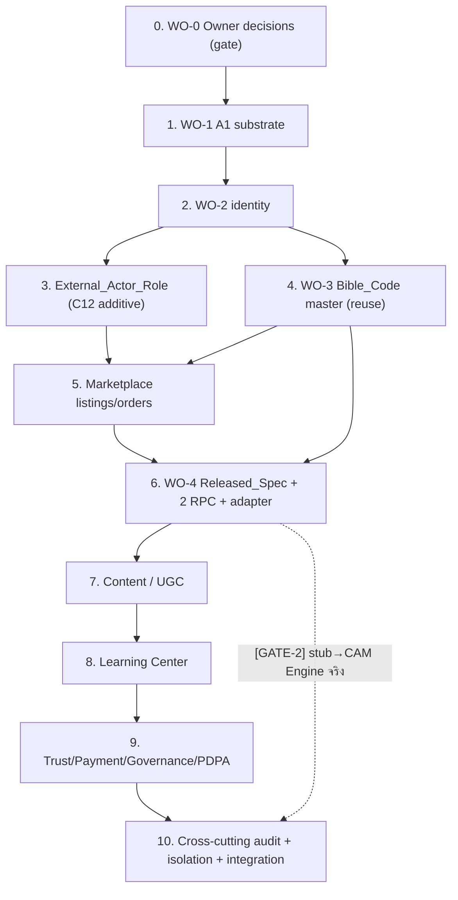

# Implementation Plan — Design Hub Platform (Phase 2)

## Overview

แผน implement Phase 2 (public/commerce/multi-tenant) วางทับ substrate Phase 1 + เชื่อม CAM/Manufacturing Engine (TS) ผ่าน Released_Spec contract ลำดับ DB-first → SECURITY DEFINER RPC → RLS via C12 → append-only audit → PBT/pgTAP ตามลำดับ migration: A1 substrate → identity → marketplace → design→mfg → content → learning → trust/payment/governance

> **Discipline (ห้ามผิด):**
> - **Verify-before-build:** ทุก migration ต้อง `supabase db reset` เขียวจริงก่อนถือว่าเสร็จ — **supabase CLI 2.108.0 + Docker พร้อมใช้ในเครื่องนี้** (C12+line_oa เขียวแล้ว verified) → `[OPEN GATE-1]` = migration ใหม่ของ task นี้ต้อง reset เขียวก่อน mark done
> - **Reuse-not-fork C12:** ใช้ helper เดิม 6 ตัว (`resolve_actor` / `has_site_access` / `is_governance_role` / `current_app_roles` / `has_any_app_role` / `get_active_site_codes`) ห้าม fork/redefine
> - **ทุก mutation:** SECURITY DEFINER RPC → re-check role ภายใน → `resolve_actor()` → append-only audit → PBT/pgTAP
> - **Boundary:** Phase 2 ห้ามคำนวณ geometry / ห้ามเรียก Kernel Truth Service (kernel-pyocc, SPEC-08) ตรง — ข้าม boundary ผ่าน `rpc_request_manufacturing` (A) + `rpc_consume_released_spec` (B) เท่านั้น
> - **Naming:** ใช้ "CAM/Manufacturing Engine (TS)" vs "Kernel Truth Service (kernel-pyocc, SPEC-08)" — ห้ามใช้คำ "north-star-foundation"
>
> **OPEN GATEs:**
> - **GATE-1:** migration ใหม่ของ Phase 2 ต้องรัน `supabase db reset` เขียวก่อนถือ task done (CLI/Docker พร้อมในเครื่องนี้; C12+line_oa substrate เขียวแล้ว verified)
> - **GATE-2:** Released_Spec DB-side ใช้ **stub** (คืน `specState=RELEASED ∧ gate.ok=true`) จนกว่าจะ integrate CAM/Manufacturing Engine (TS) จริง
>
> **⚠️ ApprovalSignature ชื่อซ้ำ 2 ตัว — อย่าหยิบผิด field (ใช้ตอนเขียน `rpc_consume_released_spec`):**
> - (a) `src/spec/types.ts` → `{ signerUserId, signedAt, signature? }` — **ไม่มี** `approverId`
> - (b) `src/core/manufacturing/release/types.ts` → `{ approverId, role, signedAtIso, message, signature, keyId }`
> - `decidedBy` ให้ map กับ **`ReleasePackage.releasedBy`** (จาก `spec/types.ts`) **หรือ** **`ApprovalSignature.approverId` จาก `release/types.ts` (b)** เท่านั้น — ระบุชื่อไฟล์ในคอมเมนต์ RPC ทุกครั้ง

## Task Dependency Graph



- **Critical path:** 0 → 1 → 2 → 3/4 → 5 → 6 → 10
- **ขนานได้:** task 3 (roles) กับ task 4 (bible reuse) หลัง task 2; task 4 ส่วน reuse parser ทำได้ทันที (WO-3 DONE)
- **GATE-1** บนทุก task ที่มี migration; **GATE-2** บน task 6.6 → ปิดที่ task 10.3

```json
{
  "waves": [
    { "wave": 1, "tasks": ["0"], "rationale": "Owner decisions gate — block migration เนื้อจริง" },
    { "wave": 2, "tasks": ["1"], "rationale": "A1 substrate — blocker ของทุกชั้น" },
    { "wave": 3, "tasks": ["2"], "rationale": "identity บน A1" },
    { "wave": 4, "tasks": ["3", "4"], "rationale": "External_Actor_Role และ Bible_Code master ขนานกันได้หลัง identity" },
    { "wave": 5, "tasks": ["5"], "rationale": "marketplace ต้องการ roles + bible_codes" },
    { "wave": 6, "tasks": ["6"], "rationale": "Released_Spec + RPC + adapter ต้องการ bible + marketplace" },
    { "wave": 7, "tasks": ["7"], "rationale": "content/UGC" },
    { "wave": 8, "tasks": ["8"], "rationale": "learning center" },
    { "wave": 9, "tasks": ["9"], "rationale": "trust/payment/governance/PDPA" },
    { "wave": 10, "tasks": ["10"], "rationale": "cross-cutting audit + isolation + integration (ปิด GATE-2)" }
  ]
}
```

## Tasks

- [ ] 0. WO-0 — Owner decisions gate (รอ owner; block migration เนื้อจริง)
  - รวบรวมคำตอบ OQ-1..7 ก่อนลง migration ที่มีค่าจริง — task นี้ไม่ใช่ coding แต่เป็น **prerequisite gate**
  - OQ-1: รหัส Site_Code จริง DAPH (design_studio / factory / installation_site) + แผนขยายสาขา → กระทบ task 1.3 (`get_active_site_codes` flip)
  - OQ-2: App_Role registry = row-extensible หรือ enum/CHECK (External_Actor_Role) → กระทบ task 3.2
  - OQ-3: ตารางราคา/CPQ rule ต่อแบรนด์ (Built_In pricing size×function) → กระทบ task 5.1
  - OQ-4: Released_Spec schema final + ยืนยัน DXF R12 / construction profile กับ CAM team → กระทบ task 6.1
  - OQ-5: Bible grammar = catalog SKU เท่านั้น หรือ custom size ระหว่างขั้น → กระทบ task 4.2
  - OQ-6: Co-Development Project = Phase 2 หรือ 3 (scope)
  - OQ-7: PSP (Opn/2C2P/Stripe) + merchant-of-record → กระทบ task 9.2
  - OQ-A4a/A4b: Cabinet(DC)→WALL/TALL? · option `M`(Microwave) ไม่มี field ใน `DesignerIntentPDF` → กระทบ task 6.3
  - _Requirements: ทุกข้อ (prerequisite)_

- [ ] 1. WO-1 — A1 substrate migration (blocker จริงของทุกชั้น)
  - [ ] 1.1 สร้าง migration `companies` / `brands` / `locations` / `brand_location_assignments` / `production_nodes` (reuse โครงสร้าง A1; vocabulary DAPH)
    - `location_type` enum = design_studio · factory · installation_site · warehouse · showroom (A1_DAPH_ADAPTATION_SPEC §3)
    - `production_node_type` enum = laminate_hpl · cutting · edging · cnc · assembly · packing (§4); node สร้างได้เฉพาะ `location_type=factory`
    - DAPH = anchor brand; พันธมิตรที่โต = brand row เพิ่ม
    - _Requirements: 17.3_
  - [ ] 1.2 RLS `TO authenticated` บนตาราง A1 reuse `has_site_access()` / `is_governance_role()` (governance=cross-brand, branch=site-scoped); ห้าม fork helper
    - _Requirements: 17.1, 17.4 (Property 5)_
  - [ ] 1.3 Flip `public.get_active_site_codes()` จาก placeholder → query `locations` ที่ `is_active=true` (คง return signature เดิม คอลัมน์เดียว — ADR-016 contract preserved)
    - ขึ้นกับ OQ-1 (Site_Code จริง); ถ้ายังไม่ได้ → คง placeholder `BKK-HQ-01` + comment "รอ OQ-1"
    - _Requirements: 17.3_
  - [ ] 1.4 pgTAP: node เฉพาะ factory (reject studio/install) · Topology_Completeness (factory ครบ 6=100%) · brand isolation (A ไม่เห็น location B ยกเว้น governance)
    - **[OPEN GATE-1]** ต้อง `supabase db reset` เขียวจริง
    - _Requirements: 17.3 (Property 5)_

- [ ] 2. WO-2 (identity) — accounts + profile + verification
  - [ ] 2.1 migration `accounts` (FK `auth.users.id`; `account_status` enum; `email` unique; CHECK age≥13; `accepted_tos_at`)
    - _Requirements: 1.1, 1.4, 1.7_
  - [ ] 2.2 `rpc_register_account` (SECURITY DEFINER): age gate (<13 reject), ToS/Privacy gate, OAuth path (Facebook/Google), audit ผ่าน `resolve_actor()`
    - _Requirements: 1.2, 1.3, 1.5, 1.6_
  - [ ] 2.3 `rpc_disable_account` / `rpc_reactivate_account`: temporary/permanent, ซ่อน Your_Content จาก public, **คง comments ก่อน disable**, revoke external_actor grants ผ่าน C12
    - _Requirements: 2.1, 2.2, 2.3, 2.4, 2.5, 2.6 (Property 11)_
  - [ ] 2.4 migration `professional_profiles` / `profile_projects` / `profile_affiliations` / `licenses` (UNIQUE active location · FK brand/location A1)
    - _Requirements: 3.1, 3.5, 3.6_
  - [ ] 2.5 `rpc_create_professional_profile`: 1:1 location (reject ถ้าซ้ำ), authorized-person verification, license validity (reject expired), business category
    - _Requirements: 3.2, 3.3, 3.4, 3.7 (Property 10)_
  - [ ] 2.6 RLS ทุกตาราง identity reuse C12 helper; pgTAP INV-1 + verification
    - **[OPEN GATE-1]** `supabase db reset` เขียว
    - _Requirements: 3.2, 17.1, 17.2 (Property 10)_

- [ ] 3. WO-2 (C-2) — External_Actor_Role (additive บน C12, ห้าม fork)
  - [ ] 3.1 นิยาม role keys `general_user` / `professional_owner` / `professional_member` ที่ **additive** ต่อ governance/branch roles เดิม (ตาม OQ-2: row-extensible หรือ enum/CHECK)
    - _Requirements: 4.1_
  - [ ] 3.2 `rpc_grant_external_role` / `rpc_revoke_external_role`: grant/revoke ผ่าน **C12 Access_Grant เดิม** + project เข้า JWT `app_metadata.roles` ผ่าน App_Metadata_Projection เดิม
    - **ห้าม** redefine/fork helper 6 ตัว — เพิ่ม grant เท่านั้น
    - approve profile → grant `professional_owner` scoped ตาม Brand realm ของ location (Req 4.4)
    - _Requirements: 4.2, 4.3, 4.4_
  - [ ] 3.3 pgTAP: professional_owner เห็น Vendor/Seller/Advertiser/Site_Designer; general_user เห็น public เท่านั้น; ยืนยันไม่มีการแก้ logic helper เดิม
    - **[OPEN GATE-1]** `supabase db reset` เขียว
    - _Requirements: 4.5, 4.6_

- [ ] 4. WO-3 (reuse) — Bible_Code master (ห้ามเขียน parser ใหม่)
  - [ ] 4.1 migration `bible_codes` (code unique · furniture_type enum · w/d/h · options[])
    - _Requirements: 8.1_
  - [ ] 4.2 server-side validation: **reuse** `parseBibleCode` จาก `tools/bible-code/src/bible-code.ts` ก่อน insert/update — reject code ผิด range/step/token พร้อมระบุ token (DONE PBT P1–P4)
    - ขึ้นกับ OQ-5 (catalog SKU เท่านั้น vs custom size)
    - _Requirements: 8.2, 8.3, 8.4, 8.5, 8.6, 8.7, 8.8 (Property 1, Property 6)_
  - [ ] 4.3 expose bible_code เป็น Product_Catalog item (Built_In) + manufacturing seed; RLS reuse C12
    - **[OPEN GATE-1]** `supabase db reset` เขียว
    - _Requirements: 8.9, 17.1_

- [ ] 5. Marketplace — listings + orders (ก่อน design→mfg ตาม migration order)
  - [ ] 5.1 migration `product_listings` (6 category enum · title 1–200 · price · images[] · `bible_code_id?`); Built_In → pricing size×function (OQ-3)
    - _Requirements: 5.1, 5.3_
  - [ ] 5.2 `rpc_create_listing`: validate Prohibited_Products_Policy ก่อน publish (reject + ระบุ clause), `listing_owner` ผ่าน `resolve_actor()`
    - _Requirements: 5.2, 5.4, 5.5_
  - [ ] 5.3 catalog query: filter category/price/brand/text + offset pagination (default 20, max 100) + total_count
    - _Requirements: 5.6_
  - [ ] 5.4 migration `orders` / `order_line_items` + `rpc_place_order`: ทุก line ผูก `vendor_seller_id` (NOT NULL), แสดงผู้รับผิดก่อน confirm, route claim → vendor + audit
    - _Requirements: 6.1, 6.2, 6.3, 6.4, 6.5 (Property 12)_
  - [ ] 5.5 RLS Wbrand (vendor ลงขายใน brand ตัวเอง) + buyer เห็น order ตัวเอง; pgTAP INV-3
    - **[OPEN GATE-1]** `supabase db reset` เขียว
    - _Requirements: 17.1, 17.2, 17.3 (Property 5, Property 12)_

- [ ] 6. WO-4 — Released_Spec projection + 2 RPC (stub) + Key Plan + Adapter §7
  - [ ] 6.1 migration `key_plans` / `key_plan_line_items` / `production_orders` + Released_Spec **projection table** (identity.brandId/siteCode/tenantId + ref ไป artifact CAM Engine)
    - projection map จาก types จริง (design §6): `state.specState`↔`SpecState`, `state.gate`↔`GateReport`/`exportGate.v1`, `integrity.specChecksum`↔`FrozenSnapshot.canonicalHash`+`ToolpathManifestV1.chain.manifestHash`
    - `manufacturingOutputs` = **opaque ref + checksum เท่านั้น** (ห้ามเก็บ geometry)
    - _Requirements: 9.2, 9.5 (Property 7)_
  - [ ] 6.2 migration `material_catalog` (row-extensible ตาม design §6.1 — **ห้าม** enum hardcode ชนิดวัสดุ/ความหนา; ตรง WO-0 OQ-2)
    - columns: `material_type` · `moisture_grade` · `thickness_mm` · `emission_grade` · `surface_finish` · `veneer_face` · `glue_grade` · `cert_standard[]` · `sheet_size_mm` · `supplier` · `is_active`
    - seed data จาก `_daph_extract/MATERIAL_CATALOG_REFERENCE.md` (Panel Plus / Agro / PTK / Dongstar / Birchwood / SGB — verified 8 ผู้ผลิต)
    - material spec = **แยกจาก Bible_Code** (Bible เข้ารหัสเฉพาะรูปทรง — design §6.1); per-brand pricing = แยกตาราง (WO-0 OQ-3) ไม่อยู่ใน material_catalog
    - RLS reuse C12: อ่าน public; เขียนผ่าน governance role (`is_governance_role()`)
    - _Requirements: A-6, 8.9_
  - [ ] 6.3 validate thickness ต่อ (`material_type` × `moisture_grade`) + เพิ่ม field `materialSpec.*` ใน Released_Spec projection (input Phase 2 → CAM Engine, ไม่ใช่ opaque output)
    - ส่ง `material.sheet_size_mm` เข้า `rpc_request_manufacturing` → CAM Engine nesting (**G5** — sheet_size หลายค่า `1220x2440/1230x2450/1830x2440/2440x1220` กระทบ nesting yield **ห้าม fix ค่าเดียว**)
    - B-1b (ความหนาต่อชิ้นส่วน) + B-2 (Bible custom range) = OPEN data-detail → ใส่ default 18mm carcass / 4–6mm back แบบ configurable, คง Bible grammar เดิม + mark custom OPEN (ไม่ block substrate)
    - **[OPEN GATE-1]** `supabase db reset` เขียว
    - _Requirements: 9.3, 9.5 (Property 7)_
  - [ ] 6.4 validate Bible grammar ก่อนบันทึก key_plan line (reuse WO-3 parser); audit ทุกการแก้ key_plan
    - _Requirements: 9.1, 9.2 (Property 6)_
  - [ ] 6.5 `rpc_request_manufacturing(p_key_plan_id, p_idempotency_key) → uuid` (A): re-check role, `resolve_actor()`, validate Bible grammar, แนบ `materialSpec` (รวม `sheet_size_mm`), audit, enqueue; idempotent ด้วย key เดิม
    - _Requirements: 9.3, 9.5 (Property 9, Property 6, Property 7)_
  - [ ] 6.6 `rpc_consume_released_spec(p_released_spec_id, p_order_id) → jsonb` (B): enforce **G1** (reject ถ้า `specState≠RELEASED ∨ gate.ok≠true`) + **G7** (verify checksum) → ผูก order → audit; fail → ไม่ผูก order (atomic)
    - **⚠️ `decidedBy`:** map `ReleasePackage.releasedBy` (`src/spec/types.ts`) **หรือ** `ApprovalSignature.approverId` (`src/core/manufacturing/release/types.ts` ตัว b) — ระบุไฟล์ในคอมเมนต์; **ห้าม**หยิบ `ApprovalSignature` จาก `spec/types.ts` (ไม่มี `approverId`)
    - **[GATE-2]** ใช้ stub ที่คืน RELEASED spec จนกว่า integrate CAM Engine จริง
    - _Requirements: 9.3, 9.4, 9.6 (Property 2, Property 4, Property 8)_
  - [ ] 6.7 §7 Adapter `ParsedSpec → DesignerIntentPDF` (งานเล็ก, ไม่แตะ rule engine): map furnitureType→cabinetType · S/D/M/L/R+count→shelf/door/drawer/corner · dimensions; ป้อนเข้า `evaluateIntent()` ที่มีอยู่
    - คืน Result `{ ok, intent } | { ok:false, unmapped[] }` — **ห้าม** silently drop option (OQ-A4a/A4b: Cabinet→WALL/TALL, `M`=microwave ยังไม่มี field)
    - _Requirements: 8.9, 9.5_
  - [ ] 6.8 PBT/pgTAP: G1 gate-guard (Property 2) · G7 checksum mutate-1-byte (Property 4) · G2 immutability version+supersedes (Property 3) · G9 idempotency (Property 9) · material thickness validation · adapter round-trip + unmapped
    - **[OPEN GATE-1]** `supabase db reset` เขียว
    - _Requirements: 9.3, 9.4, 9.6 (Property 2, Property 3, Property 4, Property 9)_

- [ ] 7. Content / UGC (Req 10, 13)
  - [ ] 7.1 migration `your_content` (visibility public/removed) / `idea_books` / `idea_book_items` / `reviews`
    - _Requirements: 10.1, 10.6, 13.1, 13.2_
  - [ ] 7.2 `rpc_publish_content`: public-by-default, owner ผ่าน `resolve_actor()`, attest ownership; owner edit/remove ได้
    - _Requirements: 10.2, 10.3, 10.4_
  - [ ] 7.3 `rpc_moderate_content`: platform แก้/reject non-compliant → audit (non-destructive)
    - _Requirements: 10.5, 13.4 (Property 14)_
  - [ ] 7.4 aggregate rating ต่อ profile จาก active reviews; RLS public-by-default + owner control; pgTAP
    - **[OPEN GATE-1]** `supabase db reset` เขียว
    - _Requirements: 13.3, 17.1_

- [ ] 8. Learning Center (Req 15, 16)
  - [ ] 8.1 migration `mentorships` / `workshops` / `enrollments` / `competitions` / `competition_entries` / `coworking_bookings`
    - _Requirements: 15.1, 15.2, 15.3, 16.1_
  - [ ] 8.2 RPC: enrollment record · competition entry (reject หลัง `submission_period_due`) · booking (reject ชน confirmed slot)
    - _Requirements: 15.3, 16.2, 16.3, 16.4, 16.5_
  - [ ] 8.3 Learning content ที่ overlap Knowledge → **อ้างอิง** `daph-obsidian-second-brain` ไม่ duplicate; RLS + pgTAP
    - **[OPEN GATE-1]** `supabase db reset` เขียว
    - _Requirements: 15.4, 15.5, 15.6_

- [ ] 9. Trust / Payment / Governance / PDPA (Req 7, 11, 12, 14)
  - [ ] 9.1 migration `moderation_cases` / `revenue_shares` + `rpc_submit_takedown` / `rpc_decide_moderation` (Gate/Evidence) · remove=visibility=removed retain record · decision audit ผ่าน `resolve_actor()`
    - _Requirements: 11.1, 11.2, 11.3, 11.4, 12.1, 12.2, 12.3, 12.4, 12.5, 12.6 (Property 14)_
  - [ ] 9.2 `rpc_compute_revenue_share`: design_sharing 2% / design_from_scratch 50%; basis ระบุไม่ได้ → withhold + human review (ไม่คำนวณ default)
    - **⚠️ DISCLAIMER:** payment/revenue flow ต้องผ่าน **ทนาย/ผู้สอบบัญชีไทย** ก่อน production (WO-6/7; PSP=OQ-7)
    - _Requirements: 7.1, 7.2, 7.3, 7.4, 7.5 (Property 13)_
  - [ ] 9.3 migration `payment_milestones` / `payment_ledger` / `guarantee_fund_claims`: M2(40%) release ผูก `Released_Spec.gate.ok=true`
    - **⚠️ DISCLAIMER:** PSP + Guarantee Fund (Escrow/Payment Systems Act) · VAT 7%/WHT 3% · merchant-of-record → **pending ทนาย/ผู้สอบบัญชีไทย**
    - _Requirements: 6.1 (INV-4, Property 2)_
  - [ ] 9.4 migration `consents` / `dsar_requests` (PDPA): consent ราย purpose · DSAR SLA 30 วัน · opt-out cookies · under-13 detected → remove registration data · retention
    - **⚠️ DISCLAIMER:** DPA platform↔brand (PDPA) + cross-border → **pending ทนายไทย**
    - _Requirements: 14.1, 14.2, 14.3, 14.4, 14.5, 14.6, 14.7, 14.8, 14.9_
  - [ ] 9.5 Feedback channel + Acceptable_Use_Policy enforcement (restrict offending access + audit)
    - _Requirements: 11.5_
  - [ ] 9.6 RLS + pgTAP: moderation INV-6 · revenue INV-5 · payment INV-4
    - **[OPEN GATE-1]** `supabase db reset` เขียว
    - _Requirements: 7.5, 12.4 (Property 13, Property 14)_

- [ ] 10. Cross-cutting — append-only audit + isolation test suite + integration gate
  - [ ] 10.1 `audit_log` append-only (trigger reject UPDATE/DELETE); ยืนยันทุก sensitive change เขียน entry (entity_type/entity_id/action_type/performed_by via `resolve_actor()`/performed_at)
    - _Requirements: 17.6, 17.7 (Property 8)_
  - [ ] 10.2 RLS isolation test suite ครบทุก entity (brand A↔B INV-7; governance cross-brand; permission-denied บน mutation ไม่มี role)
    - _Requirements: 17.3, 17.4, 17.5 (Property 5)_
  - [ ] 10.3 **[GATE-2 ปิด]** integration: เปลี่ยน stub Released_Spec → CAM/Manufacturing Engine (TS) จริง ผ่าน Released_Spec contract; ยืนยัน G1/G5/G6/G7 end-to-end
    - **[OPEN GATE-1 + GATE-2]** ต้อง `supabase db reset` เขียว + CAM Engine integration จริง
    - _Requirements: 9.3, 9.4, 9.5, 9.6 (Property 2, Property 7, Property 8)_

## Notes

- **OPEN GATE-1 (deploy-verify):** **supabase CLI 2.108.0 + Docker พร้อมในเครื่องนี้** — C12+line_oa substrate `supabase db reset` เขียวแล้ว (deploy-verified). ทุก task ที่มี migration ใหม่ของ Phase 2 ต้องรัน `supabase db reset` เขียวก่อน mark done (ไม่ใช่ข้อจำกัด environment อีกต่อไป — แค่ migration เหล่านี้ยังไม่ถูกเขียน/รัน)
- **OPEN GATE-2 (Released_Spec integration):** task 6.6 ใช้ stub; การเชื่อม CAM/Manufacturing Engine (TS) จริงทำที่ task 10.3 — Req 9 ถือเป็น OPEN GATE จนกว่าจะปิด
- **ApprovalSignature ซ้ำชื่อ:** ดู Overview — ใช้ `release/types.ts` (b) หรือ `ReleasePackage.releasedBy` เท่านั้น; ระบุไฟล์ในคอมเมนต์ทุกครั้ง
- **Legal/tax disclaimer:** task 9.2/9.3/9.4 (payment/tax/IP/PDPA) ต้องผ่านทนาย/ผู้สอบบัญชีไทยก่อน production
- **Reuse evidence:** task 4 ใช้ `tools/bible-code` (WO-3 DONE, PBT P1–P4) — ห้ามเขียน parser ใหม่
- **A-5 (IP/SPOF):** Kernel Truth Service (kernel-pyocc) untracked/unbuilt — ไม่ block Phase 2 แต่บันทึกความเสี่ยงไว้; Phase 2 พึ่ง Released_Spec จาก CAM Engine (TS) เท่านั้น
- Property อ้างถึง Correctness Properties ใน design.md (Property 1–14 = G1–G9 + INV-1..8)

> **มติ grill-me (owner ก, 16 ก.ค. 2026 — ADR-069):** **เลื่อนทั้งโปรเจกต์อย่างชัดแจ้ง** — WO-0 และทุก phase แขวนจนกว่า (1) S17 ปิด (2) มี 2-sided signal จริง (waitlist/LOI) (3) legal review เสร็จ — สอดคล้อง exec research (P2, 12–24 เดือน) · ห้ามนับเป็นงานค้างใน backlog scan จนกว่า trigger ครบ
