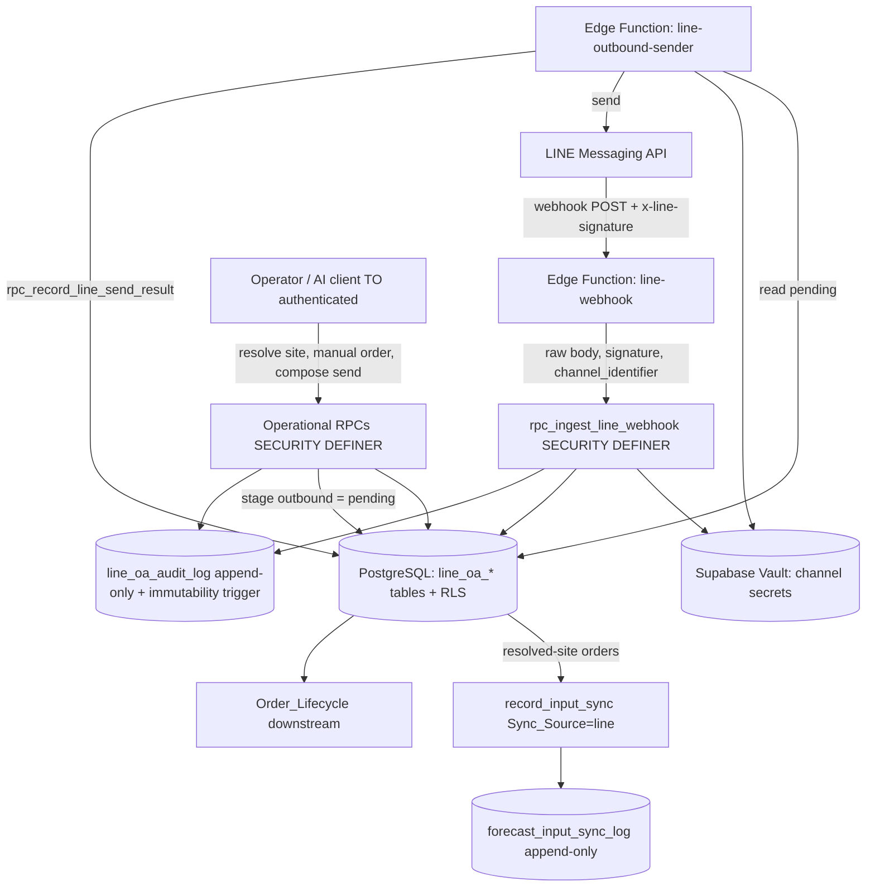
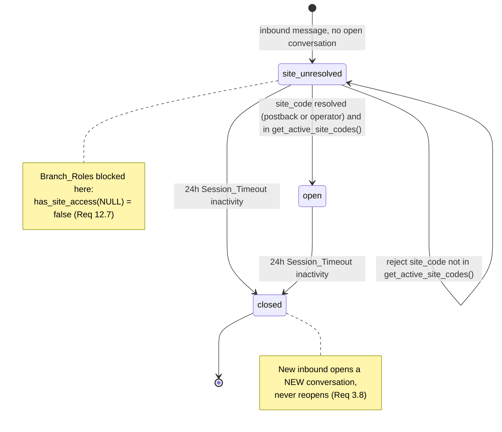
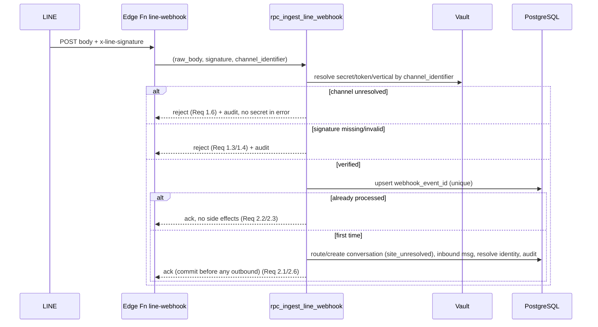

# Design Document — LINE OA Commerce (Module B5)

## Overview

LINE OA Commerce is a **dual-vertical shared SaaS module** on the existing Supabase/PostgreSQL platform. One implementation serves both **MONOLITH** (furniture / interior design) and **TCCK** (Thai Curry Cloud Kitchen / food). Every conversation, order, and identity record carries a `vertical_context`, and all vertical-specific behavior (order fields, brand voice, templates) sits behind **adapters / extension points** — never forked code.

The module owns the **integration layer** around LINE's bought messaging surface: webhook ingestion with mandatory signature verification, idempotent processing, stateful conversation routing under a centralized-per-vertical topology, customer-identity resolution with a hard no-auto-merge guardrail (R-03), order intake normalization into the canonical Order_Lifecycle shape, brand-voiced template-bound outbound messaging, forecasting sync via the existing `record_input_sync` contract, D2 autonomy governance over AI actions, and an immutable audit trail.

The design reuses shipped platform primitives **without redefining them**:

- **A1 topology** — `public.get_active_site_codes()` is the *only* source of valid Site_Codes (Req 3.6, 8.6, 10.4).
- **C12 security federation** — `public.current_app_roles()`, `public.has_any_app_role(text[])`, `public.has_site_access(text)`, `public.is_governance_role()`, `public.resolve_actor()`. RLS gated `TO authenticated`; all writes through SECURITY DEFINER RPCs; no `service_role` from the client (Req 12).
- **Forecasting pipeline** — `record_input_sync` with `Sync_Source='line'` writing to the append-only `forecast_input_sync_log` (Req 10).
- **D2 Autonomy Ladder** — governs every AI action (Req 11).

### Design Decisions (resolving the open questions)

**Decision 1 — Secret storage: Supabase Vault (recommended).**
`Channel_Secret` and `Channel_Access_Token` are stored in **Supabase Vault** (`vault.secrets`), and `line_oa_channels` holds only the Vault secret *references* (UUIDs / names), never the plaintext.
- *Why:* Vault provides authenticated-encryption at rest with keys managed outside the table, decryption is only available to SECURITY DEFINER functions running with the right grants, and secrets never appear in table dumps, logs, replication streams, or `EXPLAIN` output. This directly satisfies Req 1.5 / 4.6 / 13.3 ("never in code, logs, or error messages").
- *Tradeoff vs encrypted columns:* encrypted columns (e.g. `pgcrypto` + a key in a GUC) keep everything in one table and are simpler to query, but the encryption key tends to leak into connection settings, migrations, or env vars, and rotation is manual. Vault centralizes key custody and rotation. We accept a small amount of extra indirection (a reference lookup) in exchange for materially stronger secret hygiene.
- Secret values are resolved **dynamically per `Channel_Identifier`** inside SECURITY DEFINER RPCs at the moment of use and are never returned to callers.

**Decision 2 — Outbound HTTP runtime: Supabase Edge Function worker (recommended).**
PL/pgSQL RPCs cannot make outbound HTTPS to the LINE Messaging API directly without `pg_net`. We split responsibilities at a clear boundary:
- The DB-side RPC `rpc_send_line_outbound` performs **all validation and persistence** (role/site re-check, template/active check, free-text rejection, slot substitution, brand-voice 200-char enforcement, reply-token-vs-push decision) and writes a `line_oa_outbound_messages` row in status `pending` plus an audit entry. It does **not** call LINE.
- A **Supabase Edge Function** (`line-outbound-sender`, Deno/TypeScript) is the only component that performs outbound HTTPS. It resolves the `Channel_Access_Token` from Vault, calls the LINE Messaging API, then calls a DB-side status-update RPC (`rpc_record_line_send_result`) to mark the row `sent` or `failed` with `error_detail`.
- The Edge Function is the natural home for **inbound** HTTP too: it terminates the public webhook, reads the raw body + `x-line-signature`, and forwards them into `rpc_ingest_line_webhook` (which performs the cryptographic verification using the Vault-resolved secret). Keeping verification *inside* the RPC keeps the secret in the database trust boundary.
- *Why Edge Function over a separate Node/worker service:* it lives inside the Supabase project (shared auth, shared deploy, shared secrets access, no extra infra to operate), and it preserves the rule "no `service_role` from the client" because the client never talks to LINE — only the server-side function does.
- *Tradeoff vs `pg_net`:* `pg_net` would let the DB fire HTTP directly, collapsing the boundary, but it makes outbound calls a side effect of a transaction (hard to retry cleanly, hard to keep tokens out of DB logs, and couples send latency to the transaction). The staged `pending → sent/failed` model gives us idempotent retries and clean strict-consistency semantics (Req 2.6): persistence commits first, the external call happens only afterward, and a persistence failure means the `pending` row never exists, so no send occurs.

**Decision 3 — Vertical behavior behind adapters (recommended and required by Req intro / 8.3 / 9.4 / 5.2).**
Three adapter seams isolate vertical differences over one shared implementation:
- **Order adapter** (`order_adapter(vertical_context)`): used by `Order_Intake_Normalization` to map a vertical-specific raw order (furniture line items / dimensions vs food menu items / modifiers) into the canonical Order_Lifecycle shape.
- **Brand-voice resolver** (`brand_voice(vertical_context)`): returns the vertical's `Brand_Voice_Guideline` (tone + the 200-char-per-segment ceiling).
- **Template scope** (`vertical_context` column on `line_oa_message_templates`): templates are filtered to the conversation's vertical.
These are *data-driven / dispatch* extension points selected by `vertical_context`, not branched code paths. Adding a third vertical is configuration + one adapter registration, not a fork.

## Architecture

### Component layers

### Trust boundaries and the write path

- **No client write paths.** Tables have RLS `SELECT` policies gated `TO authenticated` and **no** client `INSERT/UPDATE/DELETE` policies. Every mutation goes through a SECURITY DEFINER RPC that re-checks the caller's role *inside* the function and resolves the actor via `public.resolve_actor()` (Req 12.4, 12.5).
- **Secret boundary.** Only SECURITY DEFINER RPCs and the Edge Functions (server-side) can resolve Vault secrets. Secrets never cross to the client and are scrubbed from all logs/errors/audit (Req 1.5, 4.6, 13.3).
- **Strict consistency boundary (Req 2.6).** Inbound persistence commits *before* any external side effect is possible. Outbound sends are a separate, post-commit step driven off a persisted `pending` row, so a failed persistence yields zero external effects.

### Centralized-per-vertical topology (Req topology, 1.1, 3.1)

One LINE Official Account per vertical channel serves all branches of that vertical. The webhook payload carries no Site_Code, so:
- `Vertical_Context` is resolved from the receiving `Channel_Identifier`.
- A conversation starts `site_unresolved` and resolves its `site_code` later via a `Postback_Data_Contract` postback or operator assignment, validated against `public.get_active_site_codes()`.

### Conversation state machine (Req 3, 12.7)

### Inbound ingestion sequence (Req 1, 2, 3, 6, 13)

## Components and Interfaces

### Edge Functions (server-side HTTP boundary — Decision 2)

- **`line-webhook`** — public endpoint. Reads raw request body and `x-line-signature`, derives `channel_identifier` from the route/destination, calls `rpc_ingest_line_webhook`. Returns 200 on accept/duplicate-ack, 4xx on rejection. Performs no business logic and holds no secrets itself.
- **`line-outbound-sender`** — worker. Claims `pending` rows from `line_oa_outbound_messages`, resolves the `Channel_Access_Token` from Vault, calls the LINE Messaging API (reply or push), then calls `rpc_record_line_send_result`. Scrubs token from all logs (Req 4.6).

### SECURITY DEFINER RPCs (the only write path — Req 12.5)

All RPCs: `SECURITY DEFINER`, `TO authenticated` execute grant where caller-facing, resolve actor via `public.resolve_actor()`, re-check role inside the function, write `line_oa_audit_log`, and scrub secrets.

- **`rpc_ingest_line_webhook(raw_body bytea/text, signature text, channel_identifier text)`** (Req 1, 2, 3, 6, 13)
  - Resolve `channel_secret`, `channel_access_token` ref, `vertical_context` from `channel_identifier`. If unresolvable → reject + audit, no secret exposure (Req 1.6).
  - Verify `LINE_Signature` = HMAC-SHA256(channel_secret, raw_body), base64. Missing → reject (1.3); mismatch → reject (1.4). Constant-time compare.
  - Extract `webhook_event_id`; `INSERT ... ON CONFLICT (webhook_event_id) DO NOTHING`. If conflict → ack, no side effects (Req 2.2–2.5).
  - Route to open conversation for `(line_user_id, vertical_context)` or create new `site_unresolved` (Req 3.1–3.2, 3.8). Persist inbound message. Resolve `CustomerIdentity` (Req 6). Audit receipt (Req 1.7, 13.1).
  - **Strict consistency:** all persistence in one transaction; commit precedes any send (Req 2.6).

- **`rpc_resolve_conversation_site(conversation_id uuid, site_code text, source enum('postback','manual'))`** (Req 3.4–3.6, 12.7)
  - Re-check role + `has_site_access(site_code)`. Validate `site_code ∈ public.get_active_site_codes()`; else error "unknown or inactive" (Req 3.6). On success set status `open`, store `site_code`, audit.

- **`rpc_send_line_outbound(conversation_id uuid, template_key text, slots jsonb)`** (Req 4, 5, 9, 11)
  - Re-check role + `has_site_access(conversation.site_code)`; reject Branch_Roles on `site_unresolved` (Req 12.7).
  - Classify D2 `Autonomy_Tier` **before** any approve/withhold decision (Req 11.1–11.2); fail-safe **block** if approval mechanism unavailable for a gated tier (Req 11.5).
  - Resolve template by `(template_key, vertical_context)`; reject if inactive/absent (Req 5.5) or vertical mismatch (Req 5.2).
  - Reject any content not bound to an active template (free-text / structured-but-unbound) (Req 5.4, 5.7). Substitute named slots only (Req 5.3).
  - Apply brand voice for `vertical_context`; reject any segment > 200 chars (Req 9.2–9.4).
  - Decide reply-token vs push; if token unavailable/expired → push (Req 4.5). Insert outbound row `pending` (the Edge Function performs the actual send and sets `sent`/`failed`). Record template id + slot values (Req 5.6) and audit (Req 11.7, 13.1).

- **`rpc_record_line_send_result(outbound_id uuid, status enum('sent','failed'), error_detail text)`** (Req 4.3–4.4, 4.6)
  - Called by the sender Edge Function. Sets delivery status; on failure stores `error_detail` and does **not** mark delivered. Scrubs token.

- **`rpc_evaluate_identity_merge_candidate(line_user_id text, vertical_context text, candidate_customer_id uuid)`** (Req 7)
  - Compute `match_confidence` (0.0–1.0). Below threshold (default 0.90) → do not propose link (Req 7.2). For any contemplated cross-channel merge: set `manual_review_required = true`, **block all auto-merge regardless of confidence including 0.99** (Req 7.3–7.6). Record candidate + confidence + outcome in audit (Req 7.7).

- **`rpc_create_line_order(conversation_id uuid, source enum('postback','manual'), raw_order jsonb, webhook_event_id text NULL)`** (Req 8)
  - Stamp `origin_channel_id='line_oa'` + conversation `vertical_context` (Req 8.1–8.2, 8.8). Idempotent on `webhook_event_id` (Req 8.7).
  - Apply `Order_Intake_Normalization` via `order_adapter(vertical_context)`; reject if canonical output invalid/empty (Req 8.4).
  - Require resolved `site_code` ∈ `get_active_site_codes()` before submitting to Order_Lifecycle (Req 8.5–8.6). Persist + audit.

- **`rpc_sync_line_forecast(site_code text)`** (Req 10)
  - For orders with a resolved `site_code`, invoke `record_input_sync(Sync_Source='line', ...)`; exclude orders lacking a resolved `site_code` (Req 10.5). Never modifies the forecasting contract (Req 10.2). Records failure via the existing pipeline while preserving last good sync (Req 10.3).

- **`rpc_query_line_audit(filters)`** (Req 13.4) — read helper honoring RLS; supports filtering by `event_type`, `vertical_context`, `site_code`, `performed_by`, and a `performed_at` range, returning only permitted rows.

### Adapter / extension points (Decision 3)

| Seam | Selector | Used by | Requirements |
|------|----------|---------|--------------|
| `order_adapter` | `vertical_context` | `Order_Intake_Normalization` in `rpc_create_line_order` | 8.3, intro |
| `brand_voice` | `vertical_context` | brand-voice enforcement in `rpc_send_line_outbound` | 9.1, 9.4 |
| template scope | `line_oa_message_templates.vertical_context` | template resolution | 5.2 |

## Data Models

All tables: RLS enabled; `SELECT` policy `TO authenticated USING (public.is_governance_role() OR public.has_site_access(site_code))`; no client write policies. Tables that can be `site_unresolved` carry a nullable `site_code` so that `has_site_access(NULL) = false` naturally blocks Branch_Roles (Req 12.7, 12.1–12.3).

### `line_oa_channels`
- `channel_identifier text PRIMARY KEY`
- `vertical_context text NOT NULL`
- `channel_secret_ref` — Vault reference (not plaintext)
- `channel_access_token_ref` — Vault reference (not plaintext)
- `is_active boolean NOT NULL DEFAULT true`
- (Req 1.1, 1.5; Decision 1)

### `line_oa_conversations`
- `id uuid PRIMARY KEY`
- `line_user_id text NOT NULL`
- `vertical_context text NOT NULL`
- `site_code text NULL` — FK-validated against `get_active_site_codes()` at resolution time
- `status enum('site_unresolved','open','closed') NOT NULL`
- `last_activity_at timestamptz NOT NULL`
- **Partial unique index:** at most one non-closed conversation per `(line_user_id, vertical_context)` → `UNIQUE (line_user_id, vertical_context) WHERE status <> 'closed'` (Req 3.1–3.2, 3.8)
- (Req 3, 12.1, 12.7)

### `line_oa_inbound_messages`
- `id uuid PRIMARY KEY`
- `conversation_id uuid NOT NULL REFERENCES line_oa_conversations`
- `webhook_event_id text NOT NULL UNIQUE` — idempotency anchor (Req 2.5)
- `payload jsonb NOT NULL`
- `received_at timestamptz NOT NULL`
- (Req 2, 3.1)

### `line_oa_outbound_messages`
- `id uuid PRIMARY KEY`
- `conversation_id uuid NOT NULL REFERENCES line_oa_conversations`
- `send_type enum('reply','push') NOT NULL`
- `status enum('pending','sent','failed') NOT NULL DEFAULT 'pending'`
- `template_key text NOT NULL`, `slot_values jsonb NOT NULL` (Req 5.6)
- `error_detail text NULL` (Req 4.4)
- `sent_by` (resolved actor), `sent_at timestamptz NULL`
- (Req 4, 5)

### `line_oa_customer_identity`
- `id uuid PRIMARY KEY`
- `line_user_id text NOT NULL`
- `vertical_context text NOT NULL`
- `customer_id uuid NOT NULL`
- `match_confidence numeric(3,2) NULL CHECK (match_confidence BETWEEN 0.0 AND 1.0)`
- `manual_review_required boolean NOT NULL DEFAULT false`
- `UNIQUE (line_user_id, vertical_context)` (Req 6.4)
- (Req 6, 7)

### `line_oa_message_templates`
- `template_key text NOT NULL`
- `vertical_context text NULL` — NULL = shared across verticals; non-NULL = vertical-scoped (Req 5.2)
- `body text NOT NULL` — named slots, e.g. `{{order_id}}`
- `is_active boolean NOT NULL DEFAULT true`
- `PRIMARY KEY (template_key, vertical_context)`
- (Req 5)

### `line_oa_orders` (a.k.a. `Line_Order`)
- `id uuid PRIMARY KEY`
- `vertical_context text NOT NULL`
- `site_code text NULL` — required (non-NULL, active) before Order_Lifecycle submission (Req 8.5–8.6)
- `customer_id uuid NULL`
- `origin_channel_id text NOT NULL DEFAULT 'line_oa' CHECK (origin_channel_id = 'line_oa')` (Req 8.1–8.2, 8.8)
- `webhook_event_id text NULL UNIQUE` — idempotency for postback orders (Req 8.7)
- `canonical_payload jsonb NOT NULL` — normalized output (Req 8.3)
- `created_at timestamptz NOT NULL`
- (Req 8)

### `line_oa_audit_log`
- `id uuid PRIMARY KEY`
- `event_type text NOT NULL`
- `vertical_context text NOT NULL`
- `site_code text NULL`
- `entity_ref text NOT NULL`
- `performed_by` — from `public.resolve_actor()` (Req 13.1)
- `performed_at timestamptz NOT NULL DEFAULT now()` (UTC)
- **Immutability:** trigger `trg_line_oa_audit_log_immutable` raises on `UPDATE`/`DELETE`; `REVOKE UPDATE, DELETE` from all roles (Req 13.2). Secrets excluded by construction (Req 13.3).
- (Req 13)

## Correctness Properties

*A property is a characteristic or behavior that should hold true across all valid executions of a system — essentially, a formal statement about what the system should do. Properties serve as the bridge between human-readable specifications and machine-verifiable correctness guarantees.*

These properties are derived from the prework analysis, with redundant criteria consolidated into the strongest comprehensive form. Each is written for property-based testing against the pure logic layer (signature verification, idempotency keying, classification, normalization, brand-voice, confidence/guardrail logic, RLS predicate evaluation), using mocks for the LINE Messaging API and the forecasting pipeline.

### Property 1: Signature verification round-trip and rejection

*For any* request body and channel secret, a signature computed as HMAC-SHA256(secret, body) verifies successfully, and *for any* request whose signature is missing or differs from that value (tampered body or wrong secret), verification fails and the event produces no persisted state and no side effects.

**Validates: Requirements 1.2, 1.3, 1.4**

### Property 2: Secrets never appear in any output

*For any* `Channel_Secret` or `Channel_Access_Token` value and *for any* execution path (acceptance, rejection, send success, send failure, or audited event), no emitted log line, error message, or `line_oa_audit_log` field contains that secret value.

**Validates: Requirements 1.5, 4.6, 13.3**

### Property 3: Verified ingestion records a receipt

*For any* verified Webhook_Event processed for the first time, after ingestion exactly one receipt entry exists in `line_oa_audit_log` for that `webhook_event_id`.

**Validates: Requirements 1.7, 13.1**

### Property 4: Idempotent processing produces no duplicates

*For any* verified Webhook_Event delivered N ≥ 1 times (including redelivery after a partial failure), the resulting persisted state equals the state from a single delivery, and at most one Conversation, Inbound_Message, Outbound_Message, and Line_Order exists for that `webhook_event_id`.

**Validates: Requirements 2.1, 2.2, 2.3, 2.4, 2.5, 8.7**

### Property 5: Strict consistency on persistence failure

*For any* Webhook_Event whose internal persistence fails, the system produces zero external side effects — no LINE Messaging API call, no notification, and no `pending` or `sent` outbound row for that event.

**Validates: Requirements 2.6**

### Property 6: Inbound always attaches to exactly one live conversation

*For any* sequence of inbound messages from a `(line_user_id, vertical_context)`, each message attaches to exactly one non-closed Conversation with that same key; if none is open a new one is created in `site_unresolved` with a NULL `site_code`, and a closed Conversation is never reopened (a subsequent inbound creates a distinct Conversation).

**Validates: Requirements 3.1, 3.2, 3.3, 3.8**

### Property 7: Site resolution accepts only active codes

*For any* Conversation and *for any* candidate `site_code` supplied via postback or operator assignment, the Conversation resolves to `open` with that `site_code` iff the code is present in `public.get_active_site_codes()`; otherwise the resolution is rejected with an "unknown or inactive" error and the Conversation state is unchanged.

**Validates: Requirements 3.4, 3.5, 3.6**

### Property 8: Session timeout auto-closes idle conversations

*For any* Conversation whose `last_activity_at` is older than the 24-hour `Session_Timeout`, the timeout sweep sets its status to `closed`.

**Validates: Requirements 3.7**

### Property 9: Outbound is recorded with a delivery status

*For any* composed Outbound_Message, a row exists in the originating Conversation whose status is exactly one of `pending`, `sent`, or `failed`, and which records the `template_key` and `slot_values` used.

**Validates: Requirements 4.3, 5.6**

### Property 10: Send failure is never marked delivered

*For any* send result reported as a failure, the Outbound_Message row has status `failed` with a non-empty `error_detail` and is never marked `sent`.

**Validates: Requirements 4.4**

### Property 11: Reply falls back to push when no token

*For any* outbound intended as a reply where the reply token is unavailable or expired, the resolved `send_type` is `push`.

**Validates: Requirements 4.5**

### Property 12: Vertical-scoped templates are isolated

*For any* Message_Template scoped to vertical V and *for any* Conversation, the template is resolvable for that Conversation iff the Conversation's `vertical_context` equals V (templates with NULL scope are resolvable for all verticals).

**Validates: Requirements 5.2**

### Property 13: Outbound content is exactly an active template with named slots filled

*For any* outbound content, the classification function returns exactly one of {template-bound, free-text}; any content not bound to an active Message_Template is classified free-text and rejected without being sent. Any accepted (sent/pending) outbound equals the resolved active template body with only its named slots substituted — no additional free or structured-but-unbound content.

**Validates: Requirements 5.3, 5.4, 5.5, 5.7, 11.6**

### Property 14: Identity resolution yields exactly one binding per (user, vertical)

*For any* number of inbound messages from a `(line_user_id, vertical_context)`, exactly one `CustomerIdentity` row exists for that pair: an existing binding is reused (Conversation associated to the bound `customer_id`), otherwise a new `customer_id` is created and bound.

**Validates: Requirements 6.1, 6.2, 6.3, 6.4, 6.5**

### Property 15: Match confidence is within range

*For any* identity-merge evaluation inputs, the computed `Match_Confidence` is a value in the closed interval [0.0, 1.0].

**Validates: Requirements 7.1**

### Property 16: Below threshold proposes no link

*For any* computed `Match_Confidence` strictly below the `Match_Confidence_Threshold` (default 0.90), no identity link is proposed.

**Validates: Requirements 7.2**

### Property 17: No automatic merge ever executes (R-03)

*For any* contemplated cross-channel identity merge and *for any* `Match_Confidence` in [0.0, 1.0] — including 0.99 and 1.0 — no automatic merge is executed; the candidate is recorded with `manual_review_required = true` and routed to a human.

**Validates: Requirements 7.3, 7.4, 7.5, 7.6**

### Property 18: Every merge evaluation is audited

*For any* identity-merge evaluation, exactly one `line_oa_audit_log` entry records the `Match_Confidence` and the `manual_review_required` outcome.

**Validates: Requirements 7.7**

### Property 19: Created orders are stamped completely

*For any* Line_Order created via postback or Manual_Order_Entry, the persisted record carries `origin_channel_id='line_oa'`, the Conversation's `vertical_context`, and (once resolved) `site_code` and `customer_id`.

**Validates: Requirements 8.1, 8.2, 8.8**

### Property 20: Normalization yields valid canonical output or rejects

*For any* raw order, the vertical `order_adapter` either produces a schema-valid, non-empty canonical order shape (which alone may be submitted to the Order_Lifecycle) or the order is rejected with an error; invalid or empty canonical output is never submitted.

**Validates: Requirements 8.3, 8.4**

### Property 21: Orders reach the lifecycle only with a resolved active site

*For any* Line_Order, it is submitted to the Order_Lifecycle only when its `site_code` is resolved and present in `public.get_active_site_codes()`; an unresolved or inactive site blocks/rejects submission.

**Validates: Requirements 8.5, 8.6**

### Property 22: Every accepted outbound segment is within the brand-voice limit

*For any* Outbound_Message composed for a Conversation, the applied `Brand_Voice_Guideline` matches the Conversation's `vertical_context`, every accepted segment is at most 200 characters, and any segment exceeding 200 characters is rejected with an error and not sent.

**Validates: Requirements 9.1, 9.2, 9.3, 9.4**

### Property 23: Forecasting syncs only resolved-site orders, correctly tagged

*For any* set of Line_Orders, the subset synchronized to forecasting equals exactly those orders with a resolved active `site_code`, and each synchronization record is associated with the `site_code` of its contributing orders; orders lacking a resolved `site_code` are excluded until resolved.

**Validates: Requirements 10.4, 10.5**

### Property 24: AI tier classification precedes any decision

*For any* contemplated AI action on a Conversation, a D2 `Autonomy_Tier` classification is completed before any approval or withholding decision is made.

**Validates: Requirements 11.1, 11.2**

### Property 25: Gated AI actions never proceed without approval (fail-safe)

*For any* AI action classified into a tier requiring approval, the action is withheld until a human approves it; and if the approval mechanism is unavailable, the action is blocked as a fail-safe and never proceeds. Low-risk-tier actions are allowed within the D2 guardrails.

**Validates: Requirements 11.3, 11.4, 11.5**

### Property 26: Every AI action is audited with tier and outcome

*For any* governed AI action, exactly one `line_oa_audit_log` entry records the action, its `Autonomy_Tier` classification, and its approval outcome.

**Validates: Requirements 11.7**

### Property 27: Reads return exactly the rows the principal may access

*For any* principal and stored row set, a SELECT returns exactly the rows the principal may access: a Governance_Role sees all rows; a Branch_Role sees only rows whose `site_code` satisfies `public.has_site_access()` (and therefore no `site_unresolved` conversation, since `has_site_access(NULL)` is false), returning empty for inaccessible sites.

**Validates: Requirements 12.1, 12.2, 12.3, 12.7**

### Property 28: Unauthorized mutations are denied

*For any* caller attempting a mutation without a role permitted for that operation and `site_code`, the operation is rejected with a permission-denied error and no state changes.

**Validates: Requirements 12.6**

### Property 29: Audit entries are complete

*For any* governed event (webhook accept/reject, conversation state change, identity/merge candidate, order creation, outbound send, AI action), the recorded `line_oa_audit_log` entry contains `event_type`, `vertical_context`, `site_code` where known, `entity_ref`, `performed_by` (via `public.resolve_actor()`), and a UTC `performed_at`.

**Validates: Requirements 13.1**

### Property 30: Audit log is immutable

*For any* existing `line_oa_audit_log` row, any UPDATE or DELETE attempt is rejected at the database level (trigger + permissions) and the row remains unchanged.

**Validates: Requirements 13.2**

### Property 31: Audit queries are filtered and permission-bounded

*For any* combination of filters (`event_type`, `vertical_context`, `site_code`, `performed_by`, `performed_at` range) and *for any* principal, every returned row satisfies all supplied filters and is within the set the principal is permitted to read.

**Validates: Requirements 13.4**

## Error Handling

Errors are handled at the layer that owns the trust boundary, and all rejections are audited (without secrets).

| Condition | Layer | Behavior | Requirements |
|-----------|-------|----------|--------------|
| Unresolvable `channel_identifier` | `rpc_ingest_line_webhook` | Reject; audit rejection; no secret in error | 1.6, 13.3 |
| Missing / invalid signature | `rpc_ingest_line_webhook` | Reject; no processing; audit | 1.3, 1.4 |
| Duplicate `webhook_event_id` | persistence (unique) + RPC | Ack, no side effects (idempotent) | 2.2–2.5, 8.7 |
| Internal persistence failure | transaction | Roll back; no external side effects | 2.6 |
| `site_code` not in `get_active_site_codes()` | resolution / order RPC | Reject with "unknown or inactive"; state unchanged | 3.6, 8.6 |
| Inactive / missing template | `rpc_send_line_outbound` | Reject send; return error | 5.5 |
| Unbound / free-text content | `rpc_send_line_outbound` | Reject; never sent | 5.4, 5.7 |
| Segment > 200 chars | `rpc_send_line_outbound` | Reject segment; return error; not sent | 9.3 |
| LINE send failure | `line-outbound-sender` → `rpc_record_line_send_result` | Mark `failed` + `error_detail`; not delivered; retry as `pending` allowed | 4.4 |
| Reply token unavailable/expired | `rpc_send_line_outbound` | Fall back to `push` | 4.5 |
| Normalization invalid/empty | `rpc_create_line_order` | Reject order; nothing to lifecycle | 8.4 |
| Order on `site_unresolved` | `rpc_create_line_order` | Block lifecycle submit until resolved | 8.5 |
| Forecast sync failure | existing pipeline | Record failure; preserve last good sync | 10.3 |
| AI gated tier, approval unavailable | `rpc_send_line_outbound` / AI gate | Fail-safe **block**; never proceed | 11.5 |
| Unauthorized mutation | every SECURITY DEFINER RPC | Permission denied; no state change | 12.6 |
| UPDATE/DELETE on audit log | DB trigger + revoked grants | Reject at database level | 13.2 |

**Secret-scrubbing rule:** every error path constructs messages from non-secret identifiers only (channel_identifier, conversation_id, template_key). Secret values are never interpolated into errors, logs, or audit (Property 2).

## Testing Strategy

### Dual approach

- **Property-based tests** verify the universal Correctness Properties above across generated inputs (the pure logic layer: signature verification, idempotency keying, conversation routing, identity resolution, R-03 guardrail, normalization, brand-voice, template-bound classification, RLS predicate evaluation, autonomy gating). The LINE Messaging API and `record_input_sync` are **mocked** so 100+ iterations stay cheap and deterministic.
- **Unit / example tests** cover concrete scenarios and structural checks: template CRUD (5.1), identity row shape (6.5), channel/secret resolution ordering (1.1, 1.6).
- **Integration tests (1–3 examples)** cover external wiring that does not vary meaningfully with input: outbound reply/push using the resolved token (4.1, 4.2), forecasting invocation with `Sync_Source='line'` and append-only write (10.1, 10.2), and sync-failure preservation (10.3).
- **Smoke tests (single execution)** verify configuration/structure: RLS enabled and `TO authenticated` reusing C12 helpers, no client write policies, RPCs are SECURITY DEFINER and call `public.resolve_actor()`, no `service_role` from client (12.4, 12.5), and Vault-reference (not plaintext) storage of secrets.

### Property-based testing requirements

PBT **is** appropriate here: the core logic is pure/deterministic with large input spaces (arbitrary bodies, secrets, slot maps, order payloads, confidence values, site sets, role/site combinations). The I/O layers (LINE HTTP, forecasting pipeline) are excluded from PBT and covered by integration tests.

- Use an established PBT library for the implementation language (e.g. `fast-check` for TypeScript Edge Functions / adapter logic; `pgTAP` + generated fixtures, or a Python `hypothesis` harness over the RPCs via the DB driver, for database-layer properties). Do **not** hand-roll a property framework.
- Each property test runs a **minimum of 100 iterations**.
- Each property test is tagged with a comment referencing its design property, in the format:
  **Feature: line-oa-commerce, Property {number}: {property_text}**
- Each Correctness Property (1–31) is implemented by a **single** property-based test.

### Generators (key custom generators)

- **Webhook events**: arbitrary raw bodies + correct/missing/tampered signatures, with controllable `webhook_event_id` for replay/idempotency (Properties 1, 4, 5).
- **Site codes**: a generated "active set" plus codes drawn inside/outside it, sharing one generator across Properties 7, 21 (3.6/8.6).
- **Roles & sites**: arbitrary Governance/Branch principals and `has_site_access` maps, including `site_unresolved` (NULL) rows, for Properties 27, 28.
- **Confidence values**: full [0.0, 1.0] including boundary 0.90, 0.99, 1.0 for Properties 15, 16, 17.
- **Outbound content**: template-bound (active/inactive/vertical-scoped templates + slot maps) and unbound/free-text/structured-but-unbound, plus segment lengths straddling 200 chars, for Properties 12, 13, 22.
- **Raw orders**: per-vertical valid and degenerate (empty/invalid-normalizing) payloads, for Properties 19, 20, 23.

### Traceability

Every requirement is covered: PBT (Properties 1–31), integration (4.1, 4.2, 10.1–10.3), unit/example (1.1, 1.6, 5.1, 6.5), or smoke (12.4, 12.5). Requirement 11.6 is covered transitively by Property 13 (template-bound constraint).
