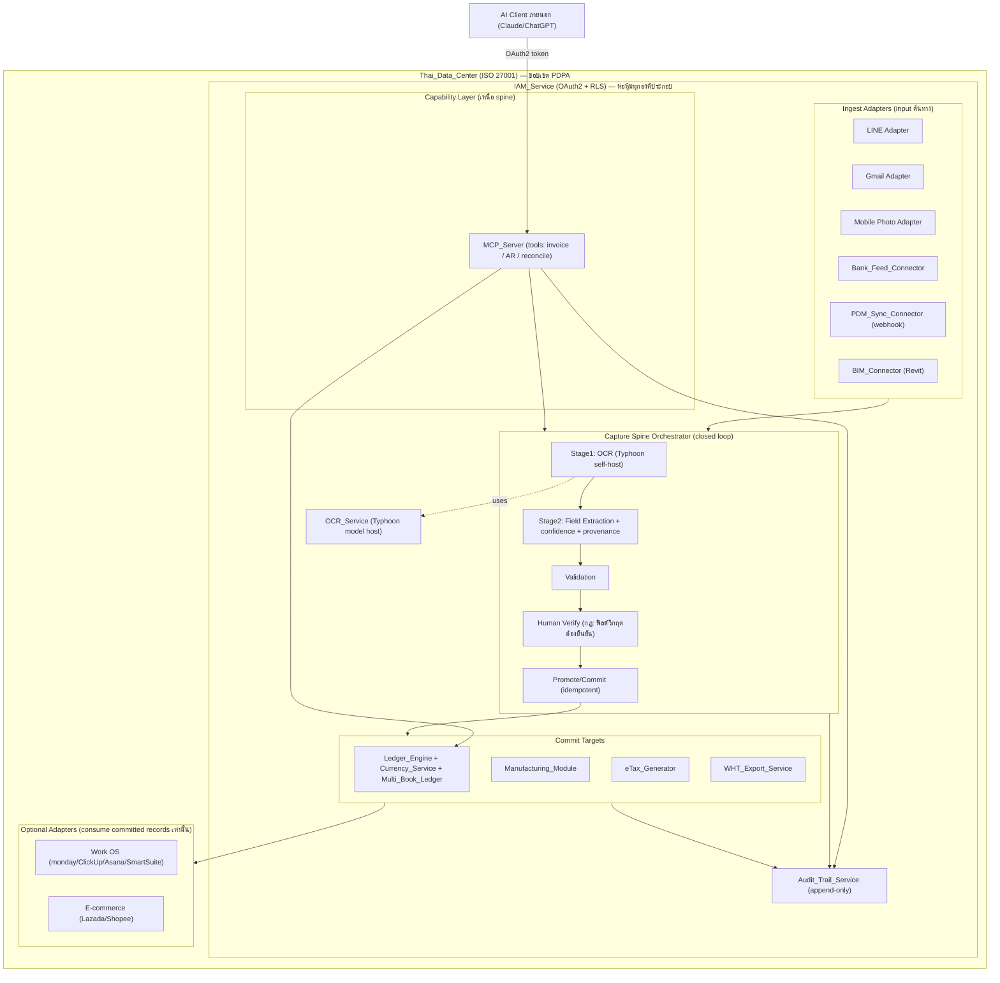

# เอกสารการออกแบบ (Design Document): Monolith Accounting & AI Orchestration

## Overview

Monolith Accounting & AI Orchestration คือระบบบัญชีและการประสานงานด้วย AI ระดับองค์กรแบบ Self-hosted ที่ติดตั้งทั้งหมดภายใน **Thai_Data_Center** เอกสารนี้ออกแบบสถาปัตยกรรมให้รองรับข้อกำหนดทั้ง 14 ข้อ โดยมี **"Capture Spine"** เป็นแกนกลาง (backbone) ที่เชื่อมร้อยทุกองค์ประกอบเข้าด้วยกัน

### หลักการออกแบบหลัก: Capture Spine

Capture Spine คือ **closed-loop pipeline** ภายในองค์กร (org-internal) ที่ไม่มีการเรียกบริการภายนอกองค์กร (no external calls) ทำให้ได้คุณสมบัติ **"PDPA by architecture"** โดยตัวสถาปัตยกรรมเอง ไม่ใช่โดยนโยบายภายหลัง

**สายงานหลัก (Flow):**

```
raw input (LINE / Gmail / photo)
  → Stage1: OCR ด้วยโมเดล Typhoon ที่ self-host (ไม่ส่งออกนอกองค์กรเด็ดขาด)
  → Stage2: field extraction (พร้อม confidence score + provenance)
  → validation
  → human verify (invariant: ฟิลด์วิกฤต เช่น จำนวนเงิน/ภาษี ต้องได้รับการยืนยันจากมนุษย์)
  → promote / commit (idempotent)
  → audit
```

หลักการ **Fail-safe: never guess** — เมื่อไม่มั่นใจ ระบบจะไม่เดาค่า แต่จะตีตรา "ต้องตรวจสอบ" และส่งให้มนุษย์ยืนยัน

**State machine (รูปแบบ agent_artifact / TCCK):**

```
proposed → approved → emitted
         ↘ rejected
         ↘ superseded
```

กฎเหล็ก: **NO-COMMIT-UNTIL-EMITTED** — ไม่มีการบันทึกลงบัญชีถาวร/ระบบปลายทางจนกว่า artifact จะถึงสถานะ `emitted`

**โมเดลข้อมูลแกนกลาง (ตารางเดียวที่ใช้ร่วมกัน):**

- `capture_artifact` (core) — ตารางกลางตารางเดียวสำหรับทุกประเภทการ capture
- `capture_type_config` (row-extensible ต่อแผนก) — ขยายด้วย **config ไม่ใช่ rebuild**
- `capture_audit` — ตาราง audit แบบ append-only

ประเภทการ capture ต่อแผนกเป็น **config เท่านั้น** (field schema + verify rule + commit target) ได้แก่:
`expense` / `site_survey` / `material_receipt` / `qc` / `installation_proof` / `delivery_pod` / `spec_draft`
การเพิ่มประเภทใหม่ทำโดยเพิ่มแถวใน `capture_type_config` ไม่ต้องแก้โค้ดแกนกลาง

### Capture Spine แมปกับข้อกำหนดทั้ง 14 ข้ออย่างไร

| Req | หัวข้อ | บทบาทของ Capture Spine |
|-----|--------|------------------------|
| 1 | ผู้ใช้ไม่จำกัด | ทุก verify/commit ทำในนามผู้ใช้จริงผ่าน IAM (ไม่ผูก per-seat) |
| 2 | Multi-currency | artifact เก็บสกุลเงินต้นทาง; commit target = Ledger_Engine ที่คงสมการบัญชีคู่ |
| 3 | Bank Feed | รายการเดินบัญชีเป็น input ต้นทางของ spine; idempotent ตาม bank txn id |
| 4 | Manufacturing | `material_receipt`/`qc` เป็น capture types; commit target = Manufacturing_Module |
| 5 | Multi-book | commit target ระบุ book (internal/external) ใน config |
| 6 | Audit Trail | `capture_audit` + Audit_Trail_Service เป็นปลายทางบังคับของทุก transition |
| 7 | e-Tax | สถานะ `emitted` ตรงกับการออกใบกำกับภาษี (immutable หลัง emit) |
| 8 | WHT export | ฟิลด์ WHT ถูก capture และ human-verify ก่อน export |
| 9 | MCP Server | MCP เป็น capability layer ที่เรียก tools เหนือ spine และ Ledger_Engine |
| 10 | AI-OCR | คือ Stage1+Stage2 ของ spine โดยตรง (Typhoon self-host) |
| 11 | PDM Sync | webhook PDM = input adapter; idempotent ตาม event id |
| 12 | BIM→BOQ | `site_survey`/`spec_draft` เป็น capture types; commit = BOQ/quotation |
| 13 | User-scoped Auth | ทุก transition บังคับผ่าน IAM_Service (OAuth2, RLS) |
| 14 | Data Residency/PDPA | spine ทำงาน org-internal ทั้งหมด → PDPA by architecture |

### การนำของเดิมมาใช้ซ้ำ (Dependencies / Reuse)

- **`ธุระกิจ/monolith_accounting.html`** (ต้นแบบที่มีอยู่) เป็น **seed ของ Ledger_Engine** — มีกลไกบัญชีคู่, ผังบัญชี (COA), สมุดรายวัน, งบทดลอง, งบกำไรขาดทุน, งบแสดงฐานะการเงิน, อัตราส่วนทางการเงิน และเครื่องมือ VAT/WHT อยู่แล้ว จะถูกแยกตรรกะ (extract) ออกเป็นบริการฝั่งเซิร์ฟเวอร์
- **workflow-copilot** (กลไก human verify / approval gate) เป็น **prerequisite** ที่ Capture Spine สร้างต่อยอด — ใช้เป็น verify stage ของ spine
- **MCP layer** วางอยู่ **เหนือ (above)** Ledger_Engine และ spine ไม่ใช่ภายใน closed loop
- **Typhoon self-host** ต้องตรวจสอบ **license** ก่อนใช้งานจริง (ดู Error Handling / ข้อควรพิจารณา)

### การเชื่อมต่อภายนอกเชิงเลือก (Optional Integration — นอก closed loop)

- **Work OS** (monday.com / ClickUp / Asana / SmartSuite) และ **e-commerce** (Lazada / Shopee) เป็น **adapter เชิงเลือก** ที่ **consume เฉพาะ records ที่ commit แล้ว** เท่านั้น ไม่อยู่ใน core closed loop และไม่สามารถเขียนเข้าบัญชีโดยตรงโดยไม่ผ่าน spine

---

## Architecture



**หลักสถาปัตยกรรมสำคัญ:**

1. **ทุกอย่างอยู่ใน Thai_Data_Center** — ไม่มี data path ออกนอกขอบเขต ยกเว้น response กลับไปยัง AI client ที่ผ่าน IAM แล้ว (และไม่ส่งข้อมูลส่วนบุคคลออก)
2. **IAM_Service ห่อหุ้มทุกองค์ประกอบ** — ทุก request ผ่าน OAuth2 + Row-Level Security (RLS)
3. **OCR/Typhoon อยู่ภายใน** — รูปภาพและเอกสารไม่เคยออกนอกองค์กร
4. **MCP เป็น capability layer** — ไม่ bypass spine; การเขียนข้อมูลต้องผ่าน commit target ที่คงค่า invariant
5. **Optional adapters อ่าน committed records** เท่านั้น ไม่อยู่ใน closed loop

---

## Components and Interfaces

หมายเหตุ: ลายเซ็นอินเทอร์เฟซเขียนเป็น TypeScript-style เพื่อความชัดเจน (implementation-ready) ทุกเมธอดถือว่าทำงานภายใต้ `AuthContext` ที่ IAM ฉีดเข้ามา

### 1. Capture Spine Orchestrator

ตัวประสานงาน state machine กลางของระบบ

```typescript
type CaptureState = "proposed" | "approved" | "emitted" | "rejected" | "superseded";

interface CaptureSpine {
  // รับ input ดิบจาก adapter ใด ๆ สร้าง artifact สถานะ proposed
  ingest(input: RawInput, typeKey: string, ctx: AuthContext): CaptureArtifact;
  // ดำเนิน Stage1+Stage2: OCR + field extraction (เติม confidence + provenance)
  extract(artifactId: string, ctx: AuthContext): CaptureArtifact;
  // ตรวจ validation ตาม verify rule ของ type config
  validate(artifactId: string, ctx: AuthContext): ValidationResult;
  // มนุษย์ยืนยันฟิลด์ (บังคับสำหรับฟิลด์วิกฤต) → approved
  verify(artifactId: string, confirmedFields: FieldMap, ctx: AuthContext): CaptureArtifact;
  // commit ไปยัง commit target แบบ idempotent → emitted (NO-COMMIT-UNTIL-EMITTED)
  emit(artifactId: string, ctx: AuthContext): EmitResult;
  reject(artifactId: string, reason: string, ctx: AuthContext): CaptureArtifact;
  supersede(artifactId: string, bySupersedeId: string, ctx: AuthContext): CaptureArtifact;
}
```

### 2. Ledger_Engine (seed: monolith_accounting.html)

แกนบัญชีคู่ ผังบัญชี สมุดรายวัน และงบการเงิน

```typescript
interface LedgerEngine {
  postJournalEntry(entry: JournalEntryInput, ctx: AuthContext): JournalEntry; // บังคับ debit=credit
  createDraftEntry(entry: JournalEntryInput, ctx: AuthContext): JournalEntry;  // status=draft
  approveDraft(entryId: string, ctx: AuthContext): JournalEntry;               // draft→posted
  trialBalance(bookId: string, period: Period): TrialBalance;
  incomeStatement(bookId: string, period: Period): IncomeStatement;
  balanceSheet(bookId: string, asOf: Date): BalanceSheet; // คงสมการบัญชี
  financialRatios(bookId: string, asOf: Date): Ratios;     // D/E, Current, ROA, ROE
}
```

### 3. Currency_Service

```typescript
interface CurrencyService {
  listSupportedCurrencies(): CurrencyCode[]; // >= 160
  getRate(from: CurrencyCode, to: CurrencyCode, date: Date): Rate | NotFoundError;
  convert(amount: Money, to: CurrencyCode, date: Date): Money; // ปัดเศษ 2 ตำแหน่ง
}
```

### 4. Bank_Feed_Connector

```typescript
interface BankFeedConnector {
  pull(accountId: string, ctx: AuthContext): BankTxn[]; // idempotent ตาม bankTxnId
  store(txn: BankTxn): { created: boolean };            // ไม่สร้างซ้ำถ้ามี bankTxnId แล้ว
  autoMatch(txn: BankTxn): MatchResult;                 // จับคู่ตามวันที่+จำนวนเงิน
  // ไม่จับคู่ → status="pending_reconcile"
}
```

### 5. Manufacturing_Module

```typescript
interface ManufacturingModule {
  createBOM(productId: string, lines: BomLine[], ctx: AuthContext): BOM;
  explodeBOM(bomId: string, units: number): MaterialRequirement[]; // qtyPerUnit * units
  issueMaterial(jobId: string, materialId: string, qty: number, ctx: AuthContext):
    IssueResult | InsufficientStockError; // ลด inventory; ปฏิเสธถ้าไม่พอ
  closeJob(jobId: string, ctx: AuthContext): JobCost; // total = material+labor+overhead
  postJobToLedger(jobId: string, ctx: AuthContext): JournalEntry; // debit=credit
}
```

### 6. Multi_Book_Ledger

```typescript
interface MultiBookLedger {
  books(): Book[]; // >= internal, external
  post(entry: JournalEntryInput, bookId: string, ctx: AuthContext): JournalEntry; // เฉพาะ book ที่ระบุ
  statutoryStatement(bookId: string, format: "DBD2554" | "IFRS_Format3", entityType: EntityType): Statement;
}
```

### 7. Audit_Trail_Service

```typescript
interface AuditTrailService {
  record(event: AuditEventInput): AuditTrailRecord; // append-only; ล้มเหลว → block การแก้ไข
  history(targetId: string): AuditTrailRecord[];     // เรียงตามเวลา
}
```

### 8. eTax_Generator

```typescript
interface ETaxGenerator {
  issue(saleId: string, ctx: AuthContext): ETaxInvoice | MissingDataError;
  // สร้าง PDF/A-3 ฝัง XML, ลงลายเซ็นดิจิทัล, VAT 7%, เลขที่ไม่ซ้ำ
}
```

### 9. WHT_Export_Service

```typescript
interface WhtExportService {
  export(period: Period, ctx: AuthContext): {
    pnd3: RdPrepFile;  // ผู้ถูกหัก = บุคคลธรรมดา
    pnd53: RdPrepFile; // ผู้ถูกหัก = นิติบุคคล
    totals: { totalPaid: Money; totalWithheld: Money };
  };
  // WHT amount = base * rateByIncomeType
}
```

### 10. MCP_Server (capability layer)

```typescript
interface McpServer {
  listTools(): McpTool[]; // createInvoice, findOverdueReceivables, reconcile
  invoke(toolName: string, params: object, ctx: AuthContext): McpResult;
  // บังคับ secure API filter; ทำในนามผู้ใช้ (IAM); log ทุกคำสั่งผ่าน Audit
}
```

### 11. OCR_Service (Typhoon self-host)

```typescript
interface OcrService {
  stage1Ocr(image: ImageBlob): OcrText;                 // โมเดล Typhoon ภายในองค์กร
  stage2Extract(text: OcrText, schema: FieldSchema):    // เติม confidence + provenance
    ExtractedFields;
}
```

### 12. PDM_Sync_Connector

```typescript
interface PdmSyncConnector {
  onWebhook(event: PdmEvent, ctx: AuthContext): SyncResult | InvalidPayloadError;
  // idempotent ตาม eventId; upsert ตาม partNo; เก็บประวัติ revision
}
```

### 13. BIM_Connector

```typescript
interface BimConnector {
  importRevit(model: RevitQuantities, ctx: AuthContext): BOQ;     // → รายการ BOQ
  priceBoq(boqId: string): BOQ | NoPriceFlag;                     // line = qty * unitPrice
  createQuotation(boqId: string, ctx: AuthContext): Quotation;    // total = sum(lines); VAT 7%
}
```

### 14. IAM_Service

```typescript
interface IamService {
  createUser(profile: UserProfile, ctx: AuthContext): User; // ไม่จำกัดจำนวน
  authorize(token: OAuthToken): AuthContext | AuthError;    // ตรวจ token + scope
  enforceScope<T>(ctx: AuthContext, query: Query<T>): Query<T>; // RLS — จำกัดผลลัพธ์
  // ปฏิเสธ privilege escalation + ข้ามแผนก; log ความพยายามผ่าน Audit
}
```

---

## Data Models

### โมเดลแกนกลาง Capture Spine

```typescript
// ตารางกลางตารางเดียวสำหรับทุกประเภทการ capture (core)
interface CaptureArtifact {
  id: string;
  typeKey: string;            // อ้างถึง capture_type_config.typeKey
  state: CaptureState;        // proposed | approved | emitted | rejected | superseded
  rawRef: string;             // pointer ไปยัง input ดิบ (เก็บภายในองค์กร)
  fields: Record<string, {
    value: unknown;
    confidence: number;       // 0..1
    provenance: string;       // ที่มาของค่า เช่น "ocr:bbox(...)" | "human" | "adapter:bankfeed"
    humanConfirmed: boolean;  // ฟิลด์วิกฤตต้อง = true ก่อน emit
  }>;
  ownerUserId: string;        // เจ้าของ (สำหรับ RLS)
  departmentId: string;
  commitTargetRef: string | null; // เติมเมื่อ emit แล้ว (idempotency key)
  idempotencyKey: string;     // กันการประมวลผล input ซ้ำ
  createdAt: Date;
  updatedAt: Date;
}

// ขยายต่อแผนกด้วย config ไม่ใช่ rebuild (row-extensible)
interface CaptureTypeConfig {
  typeKey: string;            // expense | site_survey | material_receipt | qc |
                              // installation_proof | delivery_pod | spec_draft
  fieldSchema: FieldSchema;   // ฟิลด์ + ชนิด + ฟิลด์ใดเป็น "วิกฤต"
  criticalFields: string[];   // ต้อง human-confirm (เช่น amount, tax)
  verifyRule: RuleExpr;       // เงื่อนไข validation
  commitTarget: "ledger" | "manufacturing" | "etax" | "wht" | "boq";
  bookId?: string;            // สำหรับ multi-book
}

// ตาราง audit แบบ append-only
interface CaptureAudit {
  id: string;
  artifactId: string;
  fromState: CaptureState | null;
  toState: CaptureState;
  actorUserId: string;
  sessionId: string;
  at: Date;
  before: object | null;
  after: object | null;
}
```

### Audit_Trail_Record (ทั่วทั้งระบบ)

```typescript
interface AuditTrailRecord {
  id: string;
  targetType: string;       // เช่น "journal_entry"
  targetId: string;
  actorUserId: string;
  sessionId: string;
  action: "create" | "update" | "delete";
  at: Date;
  before: object | null;
  after: object | null;
  // append-only: ไม่มี update/delete
}
```

### เอนทิตีบัญชีแกนกลาง (Core Accounting)

```typescript
interface Account {            // ผังบัญชี (COA)
  code: string;
  name: string;
  type: "asset" | "liability" | "equity" | "revenue" | "expense";
  parentCode?: string;
}

interface JournalEntry {
  id: string;
  bookId: string;            // multi-book
  date: Date;
  description: string;
  status: "draft" | "posted"; // draft (จาก OCR) ไม่เข้างบจนกว่าอนุมัติ
  currency: CurrencyCode;     // สกุลต้นทาง
  lines: JournalLine[];
  // invariant double-entry: sum(debit) === sum(credit) ในสกุลเงินหลัก
}

interface JournalLine {
  accountCode: string;
  debit: Money;              // หนึ่งใน debit/credit เป็น 0
  credit: Money;
  baseDebit: Money;          // แปลงเป็นสกุลหลักแล้ว
  baseCredit: Money;
}

interface Money {
  amount: number;            // ทศนิยม 2 ตำแหน่งหลังแปลงค่า
  currency: CurrencyCode;
}
```

**Invariant สำคัญ (double-entry):** สำหรับทุก `JournalEntry` ที่ `status = "posted"` ผลรวม `baseDebit` ของทุก line ต้องเท่ากับผลรวม `baseCredit` (สมการบัญชี: สินทรัพย์ = หนี้สิน + ส่วนของเจ้าของ)

---

## Correctness Properties

*Property คือลักษณะหรือพฤติกรรมที่ต้องเป็นจริงเสมอในทุกการทำงานที่ถูกต้องของระบบ — เป็นข้อความเชิงรูปนัยที่ระบุว่าระบบควรทำอะไร Property ทำหน้าที่เป็นสะพานเชื่อมระหว่างข้อกำหนดที่มนุษย์อ่านเข้าใจกับการรับประกันความถูกต้องที่เครื่องตรวจสอบได้ ทุก Property เป็นฐานสำหรับ property-based testing*

หมายเหตุ: ผ่าน Property Reflection แล้ว — ได้รวมเกณฑ์ที่ซ้ำซ้อนเข้าด้วยกัน (5.2+5.3 → ACC-7; 8.2+8.3+8.4+8.5 → ACC-10; 13.1+13.2+13.5 → AUTHZ-1; 7.3+12.5 อยู่ในแนวคิด VAT เดียวกันแต่คง target ต่างกัน)

### กลุ่มที่ 1: Capture Spine Invariants (SPINE-1 ถึง SPINE-9)

### Property 1: SPINE-1 — No-Commit-Until-Verified

*For any* capture artifact, ระบบจะไม่ commit ไปยัง commit target (สถานะ `emitted`) จนกว่า artifact จะผ่านสถานะ `approved` (human verify) เสมอ — และร่างที่ยังไม่ `emitted` จะไม่ถูกรวมในงบการเงิน

**Validates: Requirements 10.4, 10.5**

### Property 2: SPINE-2 — Number-Verify-Forced

*For any* capture artifact และทุกฟิลด์วิกฤต (critical fields เช่น จำนวนเงิน/ภาษี) ที่ระบุใน `capture_type_config.criticalFields`, artifact ไม่สามารถเปลี่ยนเป็นสถานะ `emitted` ได้เว้นแต่ทุกฟิลด์วิกฤตมี `humanConfirmed = true`

**Validates: Requirements 10.3, 10.4**

### Property 3: SPINE-3 — Idempotent

*For any* input ต้นทางที่มี `idempotencyKey` เดียวกัน (bank txn id หรือ PDM event id), การประมวลผลซ้ำกี่ครั้งจะให้ผลลัพธ์เท่ากับการประมวลผลครั้งเดียว (ไม่สร้างระเบียนซ้ำ ไม่เปลี่ยนสถานะซ้ำซ้อน) — f(x) = f(f(x))

**Validates: Requirements 3.4, 11.5**

### Property 4: SPINE-4 — No-Guess (Fail-Safe)

*For any* เอกสารที่สกัดฟิลด์วิกฤตไม่ได้หรือ confidence ต่ำกว่าเกณฑ์ ระบบจะตีตรา "ต้องตรวจสอบ"/"ไม่มีราคา" โดยไม่เติมค่าที่เดาเอง และจะไม่มีค่าที่เดาถูก commit ลงระบบ

**Validates: Requirements 10.3, 12.4**

### Property 5: SPINE-5 — Provenance

*For any* ฟิลด์ใน capture artifact ที่มีค่า ฟิลด์นั้นต้องมี `provenance` ระบุที่มา (ocr / human / adapter) และ `confidence` เสมอ — ไม่มีค่าใดอยู่ในระบบโดยไม่มีที่มา

**Validates: Requirements 6.1, 10.1**

### Property 6: SPINE-6 — Immutable

*For any* capture artifact ที่ถึงสถานะ `emitted` และทุก audit record ที่บันทึกแล้ว ค่าของระเบียนนั้นจะไม่ถูกแก้ไขหรือลบ การเปลี่ยนแปลงทำได้เพียงสร้าง artifact ใหม่ที่ `supersede` ของเดิมเท่านั้น

**Validates: Requirements 6.2, 7.4**

### Property 7: SPINE-7 — Audit-Complete

*For any* การเปลี่ยนสถานะของ artifact หรือการ create/update/delete รายการบันทึกบัญชี หรือการเรียก tool ผ่าน MCP จะมี audit record ที่ระบุ actorUserId, sessionId, เวลา, การกระทำ, ค่าก่อน และค่าหลัง ครบถ้วนเสมอ และเมื่อขอประวัติจะได้ record ทั้งหมดเรียงตามเวลา

**Validates: Requirements 6.1, 6.3, 9.6**

### Property 8: SPINE-8 — On-Prem / PDPA-by-Architecture

*For any* operation ใน Capture Spine จะไม่มีการเรียกบริการหรือส่งข้อมูล (โดยเฉพาะข้อมูลส่วนบุคคล) ออกนอกขอบเขต Thai_Data_Center และเมื่อเจ้าของข้อมูลขอลบ ข้อมูลส่วนบุคคลจะถูกลบ/ทำให้ไม่ระบุตัวตน ยกเว้นระเบียนที่กฎหมายบัญชี/ภาษีบังคับให้เก็บ

**Validates: Requirements 14.2, 14.5**

### Property 9: SPINE-9 — Extensible (Config not Rebuild)

*For any* ประเภทการ capture ที่เพิ่มใหม่โดยเพิ่มแถวใน `capture_type_config` (field schema + verify rule + commit target) ระบบจะประมวลผล artifact ประเภทนั้นได้ครบทุกสถานะของ state machine โดยไม่ต้องแก้โค้ดแกนกลาง และ invariant SPINE-1..8 ยังคงเป็นจริง

**Validates: Requirements 4.1, 10.2** *(สถาปัตยกรรมรองรับ types: expense / site_survey / material_receipt / qc / installation_proof / delivery_pod / spec_draft)*

### กลุ่มที่ 2: Accounting & Domain Invariants

### Property 10: ACC-1 — Double-Entry Balance (สมการบัญชีคู่)

*For any* รายการบันทึกบัญชีที่สถานะ `posted` (ไม่ว่าเกิดจาก Ledger, Manufacturing, MCP หรือการอนุมัติร่าง OCR) ผลรวม `baseDebit` ของทุกบรรทัดต้องเท่ากับผลรวม `baseCredit` ในสกุลเงินหลัก

**Validates: Requirements 2.5, 4.6, 9.4, 10.5**

### Property 11: ACC-2 — Currency Conversion (เก็บสองค่า + ปัด 2 ตำแหน่ง)

*For any* ธุรกรรมต่างสกุลที่มีอัตราแลกเปลี่ยน ระบบเก็บทั้งจำนวนเงินสกุลต้นทางและจำนวนที่แปลงเป็นสกุลหลัก โดยจำนวนที่แปลง = ปัดเศษ(amount × rate, 2 ตำแหน่ง) เสมอ

**Validates: Requirements 2.2, 2.3**

### Property 12: ACC-3 — Bank Feed Storage & Match

*For any* รายการเดินบัญชีที่จัดเก็บ จะอ่านกลับได้ครบ (วันที่/จำนวน/คำอธิบาย) และจะถูกจับคู่อัตโนมัติเฉพาะกับรายการบันทึกบัญชีที่วันที่และจำนวนเงินตรงกันเท่านั้น

**Validates: Requirements 3.1, 3.2**

### Property 13: ACC-4 — BOM Explosion

*For any* BOM และจำนวนหน่วยที่สั่งผลิต ปริมาณวัตถุดิบที่ต้องใช้ของทุกบรรทัด = ปริมาณต่อหน่วยใน BOM × จำนวนหน่วยที่สั่ง และ BOM ที่สร้างจะอ่านกลับได้ครบ

**Validates: Requirements 4.1, 4.2**

### Property 14: ACC-5 — Job Cost Summation

*For any* งานการผลิตที่ปิดงาน ต้นทุนรวม = ต้นทุนวัตถุดิบ + ต้นทุนแรงงาน + ต้นทุนค่าโสหุ้ย ที่บันทึกในงานนั้น

**Validates: Requirements 4.3**

### Property 15: ACC-6 — Inventory Reduction

*For any* การเบิกวัตถุดิบที่ปริมาณ ≤ ยอดคงเหลือ ยอดคงเหลือหลังเบิก = ยอดคงเหลือก่อนเบิก − ปริมาณที่เบิก พอดี

**Validates: Requirements 4.4**

### Property 16: ACC-7 — Multi-Book Isolation

*For any* รายการที่บันทึกเข้าชุดบัญชีหนึ่ง รายการนั้นจะปรากฏเฉพาะในชุดบัญชีที่ระบุ และงบการเงินของชุดบัญชีใด ๆ จะคำนวณจากรายการของชุดบัญชีนั้นเท่านั้น (ไม่ปนข้าม book)

**Validates: Requirements 5.2, 5.3**

### Property 17: ACC-8 — VAT 7%

*For any* มูลค่าก่อนภาษี VAT ที่คำนวณในใบกำกับภาษีและใบเสนอราคา = ปัดเศษ(มูลค่าก่อนภาษี × 0.07, 2 ตำแหน่ง)

**Validates: Requirements 7.3, 12.5**

### Property 18: ACC-9 — Invoice Number Uniqueness

*For any* ชุดใบกำกับภาษีที่ออกในระบบ เลขที่ใบกำกับภาษีทุกใบไม่ซ้ำกัน

**Validates: Requirements 7.4**

### Property 19: ACC-10 — WHT Classification, Calculation & Totals

*For any* ชุดรายการหัก ณ ที่จ่ายในงวดหนึ่ง: ผู้ถูกหักที่เป็นบุคคลธรรมดาปรากฏเฉพาะในไฟล์ ภ.ง.ด.3 และนิติบุคคลเฉพาะใน ภ.ง.ด.53; ยอดหักของแต่ละรายการ = ฐาน × อัตราตามประเภทเงินได้; และยอดรวมในไฟล์ = ผลรวมของทุกรายการ

**Validates: Requirements 8.2, 8.3, 8.4, 8.5**

### Property 20: ACC-11 — e-Tax XML Round-Trip

*For any* รายการขายที่ออกใบกำกับภาษี XML ที่ฝังใน PDF/A-3 เมื่อ parse กลับจะได้ข้อมูลตรงกับข้อมูลขายต้นทาง (serialization round-trip)

**Validates: Requirements 7.1**

### Property 21: ACC-12 — Overdue Receivables Predicate

*For any* ชุดลูกหนี้ ผลลัพธ์ของการค้นหาหนี้ค้างชำระประกอบด้วยลูกหนี้ที่มีวันครบกำหนดก่อนวันปัจจุบันและยังไม่ได้รับชำระเต็มจำนวน "ทั้งหมดและเฉพาะ" รายการที่เข้าเงื่อนไข (soundness + completeness)

**Validates: Requirements 9.3**

### Property 22: ACC-13 — PDM Sync, Upsert & Revision History

*For any* Webhook PDM ที่ถูกต้อง ข้อมูล partNo/revision/BOM จะถูกซิงก์เข้าระบบ; เมื่อ partNo ตรงของเดิมจะ update แทนสร้างใหม่ (จำนวน part ไม่เพิ่ม); และเลขรีวิชันก่อนหน้าจะถูกเก็บเป็นประวัติครบทุกครั้งที่มีรีวิชันใหม่

**Validates: Requirements 11.1, 11.2, 11.3**

### Property 23: ACC-14 — BIM → BOQ → Quotation

*For any* ข้อมูลปริมาณจาก Revit ที่นำเข้า BOQ จะครอบคลุมชนิดวัสดุและปริมาณครบ; ราคาของแต่ละรายการ = ปริมาณ × ราคาต่อหน่วย; และยอดรวมใบเสนอราคา = ผลรวมราคาของทุกรายการใน BOQ

**Validates: Requirements 12.1, 12.2, 12.3**

### Property 24: ACC-15 — OCR Extraction → Draft Entry

*For any* ชุดฟิลด์ที่สกัดได้สำเร็จ รายการบันทึกบัญชีร่างที่สร้างจะสะท้อนค่าวันที่/จำนวนเงิน/VAT/WHT ที่สกัดได้ครบถ้วน

**Validates: Requirements 10.2**

### กลุ่มที่ 3: Authorization & Security Invariants

### Property 25: AUTHZ-1 — User-Scoped Result (RLS)

*For any* คำสั่งและผู้ใช้ที่เรียกใช้ คำสั่งจะทำงานภายใต้สิทธิ์ของผู้เรียก (effective identity = caller) และผลลัพธ์ทุกแถวเป็นสับเซตของข้อมูลที่ผู้ใช้นั้นมีสิทธิ์เข้าถึง — คำขอข้ามแผนกที่ไม่มีสิทธิ์จะถูกปฏิเสธเสมอ

**Validates: Requirements 13.1, 13.2, 13.5**

### Property 26: AUTHZ-2 — Secure Filter Enforcement

*For any* คำสั่งที่เรียกผ่าน MCP_Server คำสั่งนั้นจะผ่านการกรองของ secure API และการตรวจสิทธิ์ก่อนถูกดำเนินการเสมอ (ไม่มี execution path ที่ bypass การกรองได้)

**Validates: Requirements 9.2**

---

## Error Handling

ระบบยึดหลัก **Fail-safe: never guess** และ **fail-closed** (ปฏิเสธเมื่อไม่แน่ใจ แทนการเดา)

### หลักการตามชั้น

| สถานการณ์ | พฤติกรรม | Req |
|-----------|----------|-----|
| OCR สกัดฟิลด์วิกฤตไม่ได้ / confidence ต่ำ | ตีตรา "ต้องตรวจสอบ" รอ human verify ไม่เดาค่า (no-guess) | 10.3 |
| ไม่มีอัตราแลกเปลี่ยน | ปฏิเสธการบันทึก ส่งคืน NotFoundError | 2.4 |
| เบิกวัตถุดิบเกินคงเหลือ | ปฏิเสธ ส่งคืน InsufficientStockError; stock ไม่เปลี่ยน | 4.5 |
| Bank Feed API ล้มเหลว | log error; รายการที่ซิงก์แล้วคงเดิมไม่เปลี่ยน | 3.5 |
| รายการ Bank Feed ซ้ำ | idempotent ตาม bank txn id ไม่สร้างซ้ำ | 3.4 |
| PDM webhook ซ้ำ (event id เดิม) | idempotent ไม่เปลี่ยนข้อมูลซ้ำซ้อน | 11.5 |
| PDM webhook ข้อมูล partNo ไม่ครบ | ปฏิเสธการซิงก์ + log | 11.4 |
| e-Tax ข้อมูลจำเป็นไม่ครบ | ปฏิเสธ + ระบุฟิลด์ที่ขาด (MissingDataError) | 7.5 |
| วัสดุ BIM ไม่มีราคา | ตีตรา "ไม่มีราคา" รอกำหนดราคา (no-guess) | 12.4 |
| MCP พารามิเตอร์ผิด/ไม่ครบ | ปฏิเสธ + อธิบายเหตุผล | 9.5 |
| บันทึก Audit ล้มเหลว | ปฏิเสธ (rollback) การแก้ข้อมูลที่เกี่ยวข้อง (atomic) | 6.4 |
| token OAuth2 หมดอายุ/ผิด | ปฏิเสธ + ให้ยืนยันตัวตนใหม่ | 13.4 |
| พยายามยกระดับสิทธิ์ | ปฏิเสธ + log ผ่าน Audit | 13.3 |
| ร้องขอส่ง PII ออกนอกประเทศ | ปฏิเสธ + log ผ่าน Audit | 14.3 |

### Idempotency Strategy

- **Bank Feed**: ใช้ `bankTxnId` จากธนาคารเป็น unique key; `store()` ตรวจก่อนเขียน (upsert no-op ถ้ามีแล้ว)
- **PDM Webhook**: ใช้ `eventId` เป็น idempotency key เก็บใน processed-event log; webhook ซ้ำคืนผลเดิมโดยไม่ side-effect
- **Spine commit**: `emit()` ใช้ `idempotencyKey` ของ artifact เป็น key ของ commit target — commit ซ้ำชี้ไปยัง record เดิม (`commitTargetRef`)

### Transactional Guarantee

การเปลี่ยนสถานะ artifact และการเขียน audit อยู่ใน transaction เดียวกัน — ถ้า audit เขียนไม่สำเร็จ ทั้ง transaction ถูก rollback (SPINE-7 / Req 6.4)

---

## Security & PDPA (ความปลอดภัยและการคุ้มครองข้อมูลส่วนบุคคล)

### Row-Level Security (RLS) & User-Scoped Authorization

- ทุก query ผ่าน `IamService.enforceScope()` ที่ฉีดเงื่อนไข RLS ตาม `ownerUserId`/`departmentId` ก่อนถึงฐานข้อมูล — ผลลัพธ์ถูกจำกัดในขอบเขตผู้ใช้เสมอ (AUTHZ-1)
- คำสั่งจาก AI/MCP ทำงานในนามผู้ใช้ผู้เรียกผ่าน OAuth 2.0 (อ้างอิง **OWASP MCP02** — ป้องกัน confused-deputy/privilege escalation)
- ความพยายามข้ามแผนกหรือยกระดับสิทธิ์ถูกปฏิเสธและบันทึกผ่าน Audit_Trail_Service

### Data Residency (PDPA by Architecture)

- โครงสร้างพื้นฐานทั้งหมดอยู่ใน **Thai_Data_Center** (ISO 27001) — ไม่มี data egress นอกประเทศ
- Capture Spine เป็น closed-loop ภายในองค์กร: OCR (Typhoon) self-host รูปภาพ/เอกสารไม่ออกนอกองค์กร
- คำขอส่ง PII ออกนอกประเทศถูก fail-closed + log (Req 14.3)

### Encryption

- **At rest**: เข้ารหัสฐานข้อมูลและไฟล์แนบ (รวม raw input ของ artifact)
- **In transit**: TLS สำหรับทุกการสื่อสารภายในและ webhook ขาเข้า

### สิทธิ์เจ้าของข้อมูล (Right to Erasure)

- เมื่อขอลบตาม PDPA ระบบ anonymize/ลบ PII แต่คงระเบียนที่กฎหมายบัญชี/ภาษีบังคับเก็บ (เช่น ใบกำกับภาษี) ในรูปไม่ระบุตัวตน (SPINE-8 / Req 14.5)

### ข้อควรพิจารณาด้านสิทธิ์ใช้งาน (License)

- โมเดล **Typhoon** ที่ self-host ต้องตรวจสอบเงื่อนไขลิขสิทธิ์/การใช้งานเชิงพาณิชย์ก่อน deploy production

---

## Testing Strategy

ใช้แนวทางทดสอบคู่ขนาน (dual approach): **property tests** สำหรับ invariant ทั่วไป + **unit/integration tests** สำหรับตัวอย่างเฉพาะ ขอบเขต และการเชื่อมต่อภายนอก

### Property-Based Testing

PBT เหมาะกับฟีเจอร์นี้อย่างยิ่ง เพราะมีตรรกะธุรกิจที่บริสุทธิ์จำนวนมาก (บัญชีคู่, การแปลงค่าเงิน, การคำนวณภาษี/ต้นทุน, round-trip, idempotency, invariant ของ state machine)

- เลือกไลบรารี property-based ตามภาษาเป้าหมาย (เช่น **fast-check** สำหรับ TypeScript) — **ไม่เขียน PBT เอง**
- ทุก property test รันอย่างน้อย **100 iterations**
- แต่ละ property test ต้องอ้างอิง property ในเอกสารนี้ด้วย tag:
  - รูปแบบ: `Feature: monolith-accounting, Property {SPINE-X | ACC-X | AUTHZ-X}: {property text}`
- แต่ละ Correctness Property ในเอกสารนี้ implement ด้วย property-based test **หนึ่งตัว**

**Generators ที่ต้องเตรียม:** journal entries (balanced/unbalanced), money + currency + วันที่ + rate table, BOM + units, bank txns (รวม id ซ้ำ), capture artifacts ทุก typeKey, ผู้ใช้+ขอบเขตสิทธิ์, WHT records (บุคคล/นิติบุคคล), Revit quantities, PDM events (รวม id ซ้ำ + payload ไม่ครบ) — generators ต้องครอบคลุม edge cases: whitespace, อักขระไทย/Unicode, จำนวนเงินติดลบ/ศูนย์, payload ขนาดใหญ่

### Unit Tests (ตัวอย่าง + edge + error)

ครอบคลุมเกณฑ์ที่จัดเป็น EXAMPLE/EDGE_CASE: รายการสกุลเงิน ≥160 (2.1), books ≥2 (5.1), รูปแบบ DBD2554/IFRS (5.4, 5.5), error conditions (2.4, 3.3, 3.5, 4.5, 6.4, 7.5, 9.5, 11.4, 12.4, 13.3, 13.4, 14.3), encryption config (14.4), MCP tool listing (9.1)

### Integration / Smoke Tests (ไม่ใช้ PBT)

- **INTEGRATION**: OCR Typhoon สกัดข้อมูลจริง (10.1) ด้วยชุดเอกสารตัวอย่าง 1–3 ใบ; ลายเซ็นดิจิทัล e-Tax (7.2); รูปแบบไฟล์ RD Prep (8.1)
- **SMOKE**: data residency config = Thailand (14.1); ความต่อเนื่องเมื่อผู้ใช้พร้อมกันเพิ่ม (1.3 — load test)

### Optional Adapter Tests

Work OS และ e-commerce adapters ทดสอบว่า **consume เฉพาะ committed records** และไม่สามารถเขียนเข้าบัญชีโดยข้าม Capture Spine ได้
