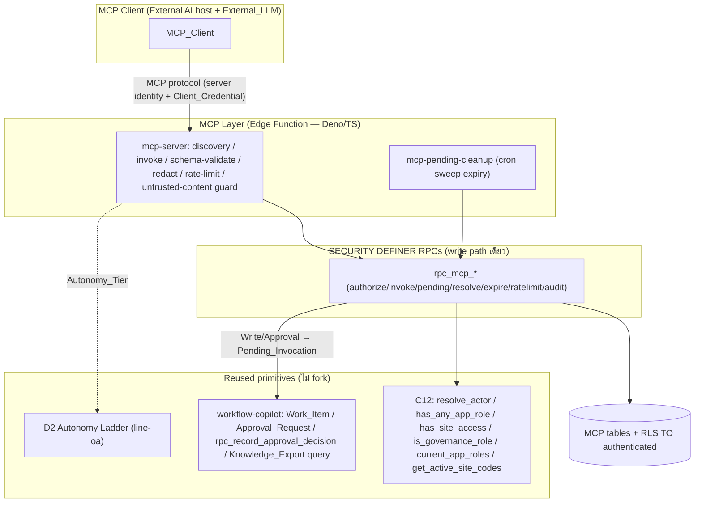
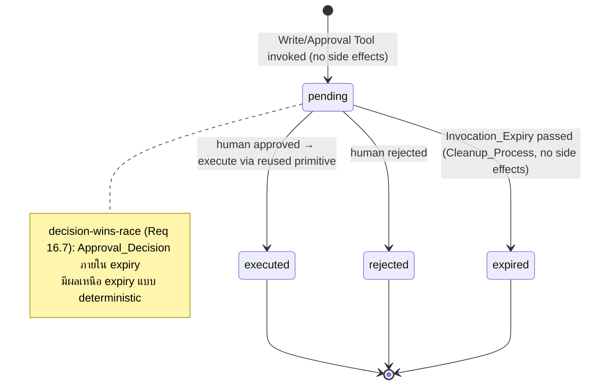

# Design Document — MCP Layer (Monolith)

## Overview

MCP Layer เปิดเผยความสามารถของ Monolith เป็น **MCP Tool** มาตรฐาน (Model Context Protocol) เพื่อยกระดับ AI จาก advisor → **controlled operator** โดย **ทุกการกระทำอยู่ใต้ธรรมาภิบาลเดิมเสมอ** โมดูลนี้ **ห่อหุ้ม (wrap) ไม่ fork** primitive ที่ส่งมอบแล้ว: C12 (`line-oa-commerce`), Work_Item/Approval/`rpc_record_approval_decision`/Knowledge_Export query (`monolith-workflow-copilot`), D2 Autonomy Ladder, รูปแบบ audit append-only

หลักการออกแบบ:
1. **Human-in-the-loop invariant** — Read_Tool อาจ auto ภายใต้ D2; Write_Tool/Approval_Tool ต้องผ่าน Human_Approval_Gate (async Pending_Invocation) เสมอ
2. **Reuse-not-fork** — ไม่นิยาม auth/approval/audit ใหม่; ส่งการอนุมัติเข้า workflow เดิมผ่าน `rpc_record_approval_decision`
3. **Fail-safe** — governance ไม่พร้อม → block (ADR-011) ไม่ auto-pass
4. **PDPA-by-boundary** — redact/minimize PII ที่ Data_Minimization_Boundary ก่อน output ออกไป External_LLM; cross-border control
5. **MCP security first-class** — server identity, per-Tool authz, untrusted-content (prompt-injection/tool-poisoning) defense, audit ทุก Tool_Invocation
6. **Self-contained** ภายใน `determined-williams/`

---

## Architecture

### Component diagram

### Trust boundaries และ write path
- **MCP Client = untrusted.** ทุก input + เนื้อหาที่ Read_Tool ดึงจากภายนอก = `Untrusted_Content` (ไม่ตีความเป็นคำสั่ง — Req 19)
- ไม่มี client write path ตรง — ทุก mutation ผ่าน SECURITY DEFINER RPC ที่ re-check role + `resolve_actor()`
- **Principal binding (Req 2.5):** ทุก Tool_Invocation ผูก Principal ของเซสชัน (ยืนยันด้วย Client_Credential) ไม่เชื่อ actor id จาก client
- **Authz re-derive ทุกครั้ง (Req 19.3):** Tool_Authorization derive จาก Principal + C12 เท่านั้น (กัน confused deputy)
- **Redaction boundary (Req 9):** output ผ่าน Redaction_Policy ก่อนออก; redact ล้มเหลว → block (fail-safe)

### Tool_Class governance model

| Tool_Class | Autonomy (D2) | เส้นทาง |
|---|---|---|
| **Read_Tool** | auto ได้ภายใต้ guardrail | execute → redact → audit |
| **Write_Tool** | ต้อง Human_Approval_Gate | Pending_Invocation → workflow approval → execute on approve |
| **Approval_Tool** | ต้อง Human_Approval_Gate | Pending_Invocation → Approver มนุษย์ตัดสินผ่าน `rpc_record_approval_decision` |

### Async Pending_Invocation state machine (Req 5, 16, 17)

- `expired` ≠ `approved` ≠ `rejected` (แยกแยะได้ — Req 16.3); expired ไม่ก่อ side effect
- decision-vs-expiry race → decision ชนะแบบ deterministic (Req 16.7)
- Cleanup_Process รอบ ≤ 5 นาที (Req 16.4)

---

## Components and Interfaces

### Edge Functions (Deno/TS)
- **`mcp-server`** — ปลายทาง MCP: นำเสนอ `MCP_Server_Identity`, ยืนยัน `Client_Credential` → ผูก Principal, discovery (`Tool_Catalog` filtered by authz), invoke (schema-validate → rate-limit → autonomy classify → redact → call RPC), บังคับ `Untrusted_Content` guard ก่อนส่ง schema/result; ไม่ทำ business logic เอง (เรียก RPC)
- **`mcp-pending-cleanup`** — cron ≤ 5 นาที: เรียก `rpc_mcp_expire_pending` กวาด Pending_Invocation ที่พ้น `Invocation_Expiry`

### SECURITY DEFINER RPCs (write path เดียว — reuse C12)
ทุกตัว: `SECURITY DEFINER`, `resolve_actor()`, re-check role ผ่าน C12, เขียน `mcp_audit_log`, scrub secret/PII

- **`rpc_mcp_invoke_read(tool_name, input, idempotency_key?)`** — authz (Req 3) → Autonomy_Tier (Req 4) → execute Read_Tool (wrap Knowledge_Export query) → คืน result + `Source_Provenance` (Req 6.4, 19.4); low-confidence mark (Req 6.5)
- **`rpc_mcp_create_pending(tool_name, tool_class, input, idempotency_key?, model_provenance)`** — Write/Approval: สร้าง `Pending_Invocation` + `approval_request` ผ่าน workflow เดิม; no side effects (Req 5.1, 5.5); idempotent ตาม (Idempotency_Key, Principal) (Req 17)
- **`rpc_mcp_resolve_pending(pending_id)`** — เรียกเมื่อ Approval_Decision = approved (ผ่าน `rpc_record_approval_decision`): execute capability เดิม (create Work_Item / record decision) แล้ว set executed (Req 5.3, 7.5); reject → rejected (Req 5.4)
- **`rpc_mcp_expire_pending()`** — sweep expiry → `expired` + audit; decision-wins-race guard (Req 16.2, 16.4, 16.7)
- **`rpc_mcp_check_rate_limit(scope_keys, est_cost)`** — atomic นับ + บังคับ Rate_Limit_Policy/Cost_Budget ทุก scope; เกิน → Throttling_Event (Req 15)
- **`rpc_mcp_audit(...)`** — append-only writer (reuse audit pattern)
- **Approval path:** reuse `rpc_record_approval_decision` (workflow-copilot) — ไม่สร้างเส้นทางใหม่ (Req 5.2, 8.1)

### Tool_Catalog (initial)
| tool | Tool_Class | wraps | reqs |
|---|---|---|---|
| `query_knowledge` | Read_Tool | Knowledge_Export query path | Req 6 |
| `create_work_item` | Write_Tool | `rpc_create_work_item` (workflow) | Req 7 |
| `record_approval_decision` | Approval_Tool | `rpc_record_approval_decision` | Req 8 |

---

## Data Models

ทุกตาราง: เปิด RLS; `SELECT` policy `TO authenticated USING (public.is_governance_role() OR public.has_site_access(site_code))`; ไม่มี client write policy

### `mcp_tool_registry`
- `tool_name text PRIMARY KEY`
- `tool_class text NOT NULL CHECK (tool_class IN ('Read_Tool','Write_Tool','Approval_Tool'))`
- `input_schema jsonb NOT NULL`, `output_schema jsonb NOT NULL`
- `requires_approval boolean NOT NULL` — true สำหรับ Write/Approval (Req 1.6)
- `default_autonomy_tier text NOT NULL`
- (Req 1)

### `tool_invocation`
- `id uuid PRIMARY KEY`
- `tool_name text NOT NULL REFERENCES mcp_tool_registry`
- `tool_class text NOT NULL`
- `principal text NOT NULL` — `resolve_actor()` (text, email-based) (Req 2.5)
- `site_code text NULL`
- `autonomy_tier text NOT NULL`
- `status text NOT NULL CHECK (status IN ('executed','pending','rejected','expired','throttled','error'))`
- `idempotency_key text NULL`
- `model_provenance jsonb NOT NULL DEFAULT '{"model":"unknown","provider":"unknown"}'` (Req 18)
- `result_ref jsonb NULL`, `created_at timestamptz NOT NULL DEFAULT timezone('utc',now())`
- (Req 2, 11, 18)

### `pending_invocation`
- `id uuid PRIMARY KEY`
- `tool_invocation_id uuid NOT NULL REFERENCES tool_invocation`
- `approval_request_id uuid NOT NULL` — โยงเข้า workflow-copilot Approval_Request (reuse)
- `status text NOT NULL CHECK (status IN ('pending','executed','rejected','expired'))`
- `invocation_expiry timestamptz NOT NULL` — default now()+72h, ช่วง 1h–30d (Req 16.1)
- `created_at timestamptz NOT NULL DEFAULT timezone('utc',now())`
- (Req 5, 16)

### `mcp_idempotency_record`
- `idempotency_key text NOT NULL`, `principal text NOT NULL`
- `PRIMARY KEY (idempotency_key, principal)` (Req 17.1)
- `input_hash text NOT NULL` — conflict detection (Req 17.8)
- `result_ref jsonb NULL`, `tool_invocation_id uuid NULL`
- `created_at timestamptz NOT NULL DEFAULT timezone('utc',now())`
- CHECK `length(idempotency_key) BETWEEN 1 AND 255` (Req 17.7)
- (Req 17)

### `mcp_rate_limit_counter`
- `scope_kind text NOT NULL CHECK (scope_kind IN ('Principal','MCP_Client','Tool_Class'))`
- `scope_key text NOT NULL`, `window_start timestamptz NOT NULL`
- `invocation_count int NOT NULL DEFAULT 0`, `accrued_cost numeric NOT NULL DEFAULT 0`
- `PRIMARY KEY (scope_kind, scope_key, window_start)` — atomic upsert (Req 15.7)
- (Req 15)

### `mcp_audit_log` (append-only)
- `id uuid PRIMARY KEY`, `event_type text NOT NULL` — invocation / approval / throttling / expiry / redaction / injection_detected
- `tool_name text NULL`, `tool_class text NULL`, `principal text NOT NULL`, `site_code text NULL`
- `autonomy_tier text NULL`, `result text NULL`, `model_provenance jsonb NULL`, `at timestamptz NOT NULL DEFAULT timezone('utc',now())`
- trigger `trg_mcp_audit_immutable` raise บน UPDATE/DELETE; `REVOKE UPDATE, DELETE` (Req 11.2)
- (Req 11)

### Config (reuse/extend, ไม่ hard-code)
- `redaction_policy` (Req 9.5), `rate_limit_policy` / `cost_budget` (Req 15.5), `Consent_Record` + cross-border measures = อ้างแหล่งเดิมของแพลตฟอร์ม (Req 10.5)

---

## Correctness Properties

### Property 1: Tool_Catalog กรองตามสิทธิ์
*For any* การร้องขอ Tool_Catalog ผลลัพธ์ SHALL มีเฉพาะ MCP_Tool ที่ Principal ของเซสชันมีสิทธิ์เรียกตาม Tool_Authorization; tool ที่ไม่มีใน catalog → reject
**Validates: Requirements 1.2, 1.5**

### Property 2: Server identity + client auth ผูก Principal
*For any* เซสชัน MCP_Server SHALL นำเสนอ identity ที่ตรวจสอบได้ และทุก Tool_Invocation SHALL ผูก Principal ที่ยืนยันแล้ว (resolve_actor) — ไม่เชื่อ actor id จาก client; credential เพิกถอน/หมดอายุ → reject ครั้งถัดไป
**Validates: Requirements 2.2, 2.5, 2.6**

### Property 3: Per-tool authorization (C12 + site access)
*For any* Tool_Invocation การอนุญาต SHALL ผ่าน `has_any_app_role()` + `has_site_access()` ก่อนดำเนินการ; ไม่มีสิทธิ์ หรือ site_code ∉ `get_active_site_codes()` → reject
**Validates: Requirements 3.1, 3.2, 3.4, 3.6**

### Property 4: Autonomy enforcement ต่อ Tool_Class
*For any* Tool_Invocation จะถูกจัด Autonomy_Tier ก่อนตัดสิน; Read_Tool ที่ tier อนุญาต → auto; Write_Tool/Approval_Tool → Pending_Invocation เสมอ
**Validates: Requirements 4.1, 4.2, 4.3, 4.5**

### Property 5: Human-in-the-loop — ไม่มี side effect ก่อนอนุมัติ
*For any* Write_Tool/Approval_Tool WHILE ยังไม่ได้ Approval_Decision สถานะ Monolith SHALL ไม่เปลี่ยน; approved → execute; rejected → ยกเลิกไม่เปลี่ยนสถานะ
**Validates: Requirements 5.1, 5.3, 5.4, 5.5, 5.6**

### Property 6: Knowledge read-only + provenance + low-confidence
*For any* Read_Tool ของ Knowledge_Export SHALL ไม่เขียนกลับต้นทาง, แนบ source_version/imported_at, และ mark low confidence เมื่อ review_status ≠ approved หรือ stale (ไม่ซ่อน)
**Validates: Requirements 6.1, 6.3, 6.4, 6.5**

### Property 7: Work_Item creation ผ่าน gate + reject ขั้นไม่รู้จัก
*For any* create_work_item Tool การสร้างจริง SHALL เกิดหลัง human approve เท่านั้น; Process_Step ∉ Knowledge_Export → reject; site_code ต้อง ∈ active
**Validates: Requirements 7.2, 7.3, 7.4, 7.5**

### Property 8: Approval recording ผ่าน resolve_actor + idempotent
*For any* Approval_Tool การบันทึก SHALL ผ่าน `rpc_record_approval_decision` โดยผู้ตัดสิน = มนุษย์ที่ resolve_actor (ไม่เชื่อ Principal ของ client); ผู้ตัดสิน ≠ Approver → reject; request ที่ตัดสินแล้ว → คืนผลเดิม
**Validates: Requirements 8.3, 8.4, 8.5**

### Property 9: PII redaction fail-safe ที่ boundary
*For any* output ที่จะส่งออก SHALL ผ่าน Redaction_Policy ที่ Data_Minimization_Boundary; redact ล้มเหลว → block (ไม่ส่งข้อมูลที่ยัง redact ไม่สำเร็จ)
**Validates: Requirements 9.1, 9.3, 9.4**

### Property 10: PDPA consent + cross-border fail-safe
*For any* output ที่มี PII IF ไม่มี Consent_Record ครอบคลุม → ระงับ; cross-border โดยไม่มีมาตรการคุ้มครองพอ → ระงับแบบ fail-safe
**Validates: Requirements 10.1, 10.2, 10.3**

### Property 11: Audit completeness (append-only, redacted)
*For any* Tool_Invocation SHALL มี mcp_audit_log หนึ่งรายการครบ field (tool/class/principal/site/tier/result/UTC) โดยไม่มี secret/PII; audit reject UPDATE/DELETE; คงรายการเสมอแม้ scrub ล้มเหลว
**Validates: Requirements 11.1, 11.2, 11.3, 11.6**

### Property 12: Fail-safe เมื่อ governance ไม่พร้อม
*For any* Tool_Invocation IF Governance_Mechanism ใดไม่พร้อม (authz/approval/redaction/audit/autonomy) → block; classify tier ไม่สำเร็จ → ถือว่าต้อง human approval (ไม่ auto-pass); audit เขียนไม่ได้ → reject side-effect tool
**Validates: Requirements 12.1, 12.2, 12.3, 12.4, 12.5**

### Property 13: I/O schema validation + round-trip
*For any* input ที่ไม่ตรง schema → reject; *for all* output/ข้อความที่ถูกต้อง การ serialize→parse (และ parse→serialize) ได้ผลเทียบเท่าเดิม (round-trip)
**Validates: Requirements 13.1, 13.2, 13.4, 13.5**

### Property 14: Reuse-not-fork (structural)
THE MCP_Layer_Manager SHALL reuse C12/audit/D2/`rpc_record_approval_decision`/Knowledge_Export query และ SHALL ไม่สร้างโมเดลสิทธิ์/ช่องอนุมัติ/audit ใหม่ขนานกัน
**Validates: Requirements 14.1, 14.3, 14.4**

### Property 15: Rate-limit + cost atomic (no overshoot)
*For any* ชุด Tool_Invocation ของ scope เดียวกัน การนับ/บังคับ SHALL atomic เพื่อให้จำนวนที่ดำเนินการจริงไม่เกินเพดาน; เกิน Rate_Limit/Cost_Budget → reject (no side effects) + Throttling_Event; ไม่มี policy → default fail-safe
**Validates: Requirements 15.1, 15.2, 15.3, 15.6, 15.7, 15.8**

### Property 16: Pending expiry + cleanup (no side effects, decision-wins-race)
*For any* Pending_Invocation ที่พ้น Invocation_Expiry → expired ภายใน 5 นาที โดยไม่ก่อ side effect; expired แยกจาก approved/rejected; decision ภายใน expiry ชนะ race แบบ deterministic; บันทึก approve ให้ expired → reject
**Validates: Requirements 16.2, 16.3, 16.4, 16.6, 16.7**

### Property 17: Write_Tool idempotency (conflict-reject)
*For any* (Idempotency_Key, Principal) ซ้ำ + input เดิม → คืนผลเดิม; input ต่าง → reject conflict (คง record เดิม); double-submit พร้อมกัน → สร้าง ≤ 1 รายการ; key ว่าง/>255 → reject
**Validates: Requirements 17.2, 17.7, 17.8, 17.9**

### Property 18: Model provenance (unknown-fallback, untrusted)
*For any* Tool_Invocation SHALL บันทึก Model_Provenance (ส่วนที่ไม่เปิดเผย = unknown), scrub secret (scrub ล้มเหลว → unknown), คง audit เสมอ; SHALL ไม่ใช้ provenance ตัดสิน authz (untrusted)
**Validates: Requirements 18.1, 18.2, 18.5, 18.6, 18.7**

### Property 19: Prompt-injection / tool-poisoning defense
*For any* Untrusted_Content คำสั่งฝังตัว SHALL ถูกเพิกเฉย (ไม่ยกระดับสิทธิ์/ไม่ข้าม approval/ไม่เกิด side effect); authz re-derive จาก Principal+C12 เท่านั้น (กัน confused deputy); ค่าที่ trace Source_Provenance ไม่ได้ → mark unverified (ไม่ซ่อน) + audit การตรวจพบ
**Validates: Requirements 19.2, 19.3, 19.4, 19.5, 19.6**

---

## Error Handling

- **Authz/auth fail (Req 2, 3):** reject + error (insufficient permission / auth) + audit (ไม่รั่ว credential)
- **Governance unavailable (Req 12):** block fail-safe + error ระบุเหตุ; classify-fail → ถือว่าต้อง human approval
- **Redaction/consent fail (Req 9, 10):** ระงับ output, ไม่ส่งข้อมูลที่ redact ไม่สำเร็จ
- **Rate-limit/cost (Req 15):** reject no-side-effect + Throttling_Event
- **Expiry (Req 16):** expired ≠ approved/rejected, no side effect; บันทึก approve ให้ expired → reject "expired"
- **Idempotency conflict (Req 17.8):** reject + error "idempotency conflict", คง record เดิม
- **Audit write fail (Req 12.4):** reject side-effect tool (no untraceable action)
- **Untrusted content (Req 19):** เพิกเฉยคำสั่งฝังตัว, re-derive authz, audit detection — ไม่มี secret/PII ใน log

---

## Testing Strategy

1. **fast-check (PBT)** — pure logic: autonomy classify, authz eval, rate-limit atomic counter, idempotency conflict, expiry/decision race, schema round-trip, redaction policy eval, untrusted-content guard (mock LLM/Supabase)
2. **pgTAP / DB-harness** — RLS reuse C12, mcp_audit_log append-only immutability, idempotency unique (idempotency_key, principal), rate_limit_counter atomic upsert
3. **Integration** — Write_Tool → Pending_Invocation → `rpc_record_approval_decision` → execute; expiry sweep cron; reuse Knowledge_Export query path
4. **Smoke (reuse-not-fork)** — ยืนยันไม่มีโมเดลสิทธิ์/approval/audit ใหม่ขนาน; RPC เป็น SECURITY DEFINER + resolve_actor; MCP server identity + client credential
5. แต่ละ Correctness Property (1–19) → property test ตัวเดียว tag `// Feature: monolith-mcp-layer, Property N: ...`

## Open Questions / Dependencies

- **DEP-1:** พึ่ง `monolith-workflow-copilot` (Phase 1) — Approval_Request / `rpc_record_approval_decision` / Work_Item / Knowledge_Export query path ต้องพร้อม
- **DEP-2:** D2 Autonomy Ladder + C12 จาก `line-oa-commerce` (ส่งมอบแล้ว)
- **OQ-MCP-1:** External_LLM location detection สำหรับ Cross_Border (Req 10.2) — อาศัยข้อมูลที่ MCP_Client เปิดเผย (untrusted) → default treat as cross-border เมื่อไม่ทราบ (fail-safe)
- **OQ-MCP-2:** Cost estimation ของ token External_LLM (Req 15) — ประมาณการจาก input/output size + config; ปรับได้
- **GATE:** migration ใหม่ของ mcp-layer ต้องรัน `supabase db reset` เขียวก่อนถือ task done (deploy-verified) — supabase CLI 2.108.0 + Docker พร้อมในเครื่องนี้ (C12+line_oa เขียวแล้ว verified)
