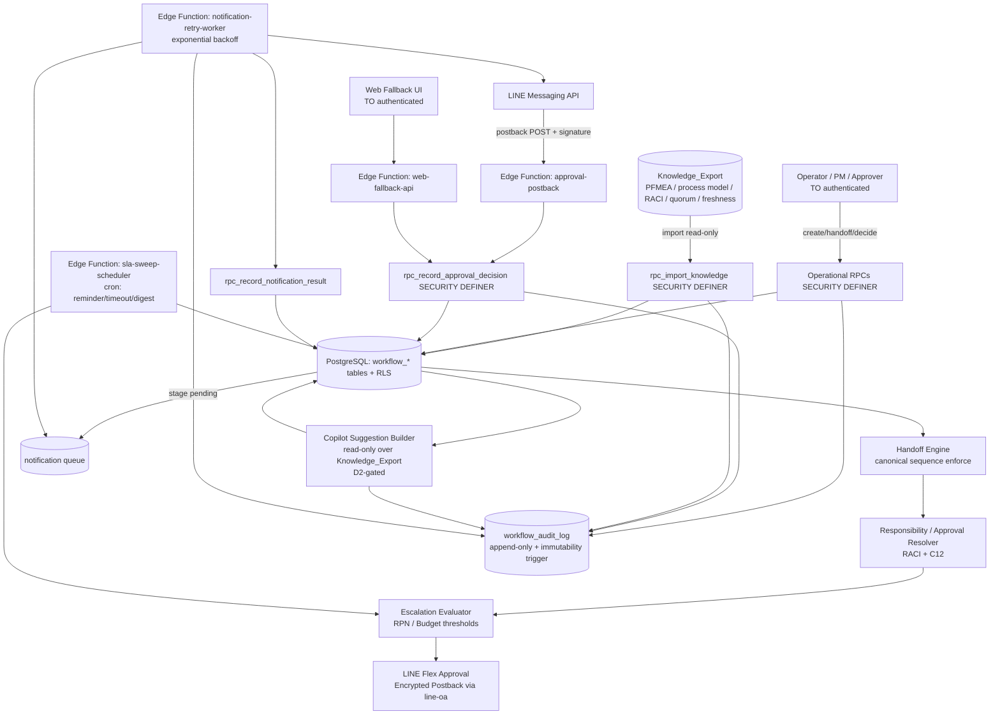
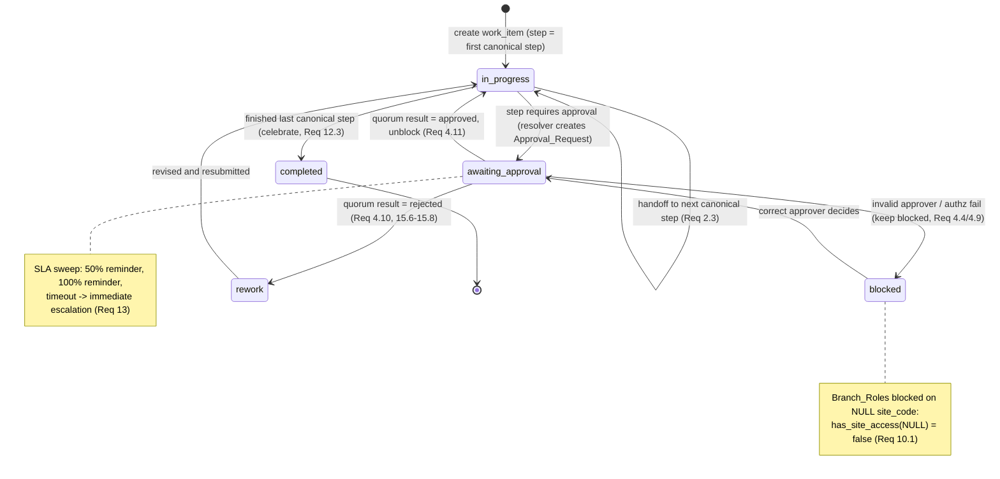
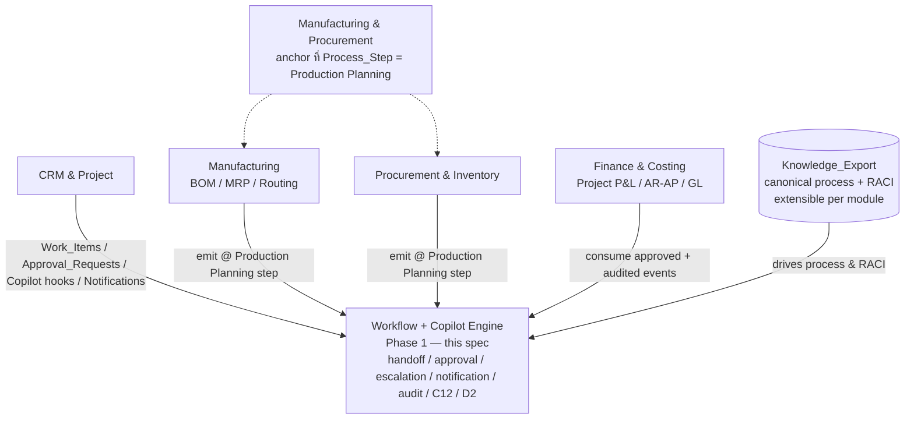

# Design Document — Workflow, Approvals & AI Copilot (Monolith)

## Overview

โมดูลนี้คือ **ชั้นกลางด้านสติปัญญาและการลงมือทำ (Intelligence + Action layer)** ของแพลตฟอร์ม Monolith (Supabase / PostgreSQL) สำหรับ DAPH Decor โมดูลทำหน้าที่เชื่อม **ชั้นความรู้ (Knowledge layer)** จาก spec `daph-obsidian-second-brain` เข้ากับ **ชั้นการมีส่วนร่วม (Engagement layer)** จาก spec `line-oa-commerce` เพื่อขับเคลื่อน workflow ส่งต่องาน, การหาผู้รับผิดชอบ/ผู้อนุมัติ, การอนุมัติคลิกเดียวผ่าน LINE, การแจ้งเตือนแบบกันข้อมูลล้น, AI Copilot เชิงให้คำแนะนำ, audit trail และการควบคุมการเข้าถึง — โดยมีหลักการสำคัญว่า **มนุษย์เป็นผู้ตัดสินใจเสมอ**

โมดูลนี้เป็น **โมดูลพี่น้อง (sibling module)** ที่ **พึ่งพา (depends on)** primitive ที่ส่งมอบแล้วของ `line-oa-commerce` และ Knowledge_Export ของ `daph-obsidian-second-brain` โดย **ไม่นิยามสัญญาเหล่านั้นซ้ำ** แต่อ้างอิงตามชื่อ

### หลักการออกแบบที่นำกลับมาใช้ (Reused Platform Primitives)

โมดูลนี้นำของที่ส่งมอบแล้วกลับมาใช้โดยไม่นิยามซ้ำ (อ้างอิงตามชื่อ):

- **A1 topology** — `public.get_active_site_codes()` เป็นแหล่งเดียวของ Site_Code ที่ใช้ได้ (Req 2.6, 10.6)
- **C12 security federation** — `public.current_app_roles()`, `public.has_any_app_role(text[])`, `public.has_site_access(text)`, `public.is_governance_role()`, `public.resolve_actor()`; RLS gated `TO authenticated`; ทุก write ผ่าน SECURITY DEFINER RPC; ไม่มี `service_role` จาก client (Req 10)
- **Supabase Vault** — เก็บความลับ (token / channel secret) เป็น *reference* ไม่ใช่ plaintext แก้ได้เฉพาะใน SECURITY DEFINER RPC และ Edge Function (Req 9.3)
- **Edge Functions** — ขอบเขต HTTP ฝั่ง server แบบเดียวกับ `line-webhook` / `line-outbound-sender` ของ `line-oa-commerce`
- **Postback_Data_Contract / Encrypted_Postback** — โครงสร้าง payload ของปุ่ม LINE ที่เข้ารหัส/ลงนาม (Req 4.1)
- **Message_Templates** — slot-filling ผูกเทมเพลต, ข้อความไทยน้ำเสียงอบอุ่น ≤ 200 ตัวอักษร ตาม Brand_Voice_Guideline (Req 6.7, 6.8, 12.2)
- **D2 Autonomy Ladder** — กำกับทุกการกระทำของ AI (Req 5.5)
- **Append-only audit log + immutability trigger** — รูปแบบเดียวกับ `line_oa_audit_log` (Req 9.2)
- **Staged outbound `pending → sent`** — เพื่อ idempotent retry และ strict consistency (Req 16, 18)

### Knowledge_Export contract (consumed, not defined here)

โมดูลนี้ **บริโภค** Knowledge_Export ที่ Vault_Builder ของ `daph-obsidian-second-brain` ปล่อยออกมาในรูป JSON/ฐานข้อมูลที่เครื่องอ่านได้ ประกอบด้วย: `PFMEA_Risk_Row` (Process Step → Failure Mode → Cause → Control → RPN), โมเดลกระบวนการ (Process_Step + Sub_Process_Group + ลำดับ canonical), `RACI_Map`, `Approval_Quorum` ต่อ Process_Step และ `Knowledge_Freshness` (source_version / imported_at / review_status) — โมดูลนี้ query เท่านั้น ไม่เขียนกลับ (Req 11)

### Scope & Non-Goals

- **Scope:** identity binding, process handoff engine, responsibility/approval resolver, one-click approval ผ่าน LINE + web fallback, escalation, notification engine, Copilot advisory, audit, access control, SLA/reminder/timeout sweeps, delegation, multi-approver quorum, concurrency protection, knowledge freshness/trust
- **Non-Goals:** ไม่สร้าง/แก้ไขความรู้ต้นทางใน Obsidian Vault, ไม่นิยาม C12 / Vault / Postback / Message_Templates ซ้ำ, ไม่ข้ามความปลอดภัยด้วย `service_role` จาก client, ไม่สร้างโมเดลสิทธิ์ใหม่

## Architecture

### Component layers



### Trust boundaries และ write path

- **ไม่มี client write path.** ทุกตารางมี RLS `SELECT` policy gated `TO authenticated` และ **ไม่มี** client `INSERT/UPDATE/DELETE` policy ทุก mutation ผ่าน SECURITY DEFINER RPC ที่ตรวจบทบาทผู้เรียกซ้ำ *ภายในฟังก์ชัน* และหาตัวผู้กระทำผ่าน `public.resolve_actor()` (Req 10.4, 10.5)
- **Secret boundary.** เฉพาะ SECURITY DEFINER RPC และ Edge Function (ฝั่ง server) เท่านั้นที่ resolve Vault secret ได้ ความลับไม่ข้ามไป client และถูกลบออกจาก log/error/audit ทุกเส้นทาง (Req 9.3)
- **Strict consistency boundary (Req 16.4).** การบันทึก state transition ทำเป็น transaction เดียวแบบ atomic; การส่ง Notification เป็นขั้นตอนแยกหลัง commit ที่ขับจากแถว `pending` ที่ persist แล้ว — persistence ที่ล้มเหลวจึงไม่เกิด side effect ภายนอก
- **Anti-impersonation boundary (Req 4.3, 4.9, 20.4).** ตัวระบุผู้กระทำที่ส่งมาจาก client/postback ไม่เคยถูกเชื่อ ผู้ตัดสินถูกหาตัวผ่าน `public.resolve_actor()` และการตรงกันของ LINE_User_Id เพียงอย่างเดียวไม่ถือเป็นการอนุญาตที่เพียงพอ — **ขยายครอบ Customer_Approver:** customer postback ต้อง resolve ผ่าน `line_oa_resolve_customer_identity` + match `work_item.primary_customer_id` + Encrypted_Postback signature (ดู Property 7)

### Customer approval boundary (Req 20) — Edge Function gatekeeper (ลูกค้าไม่เป็น DB principal)

- ลูกค้า **ไม่มี** Supabase session / app_role / customer RLS policy / JWT helper — DB RLS คง `TO authenticated` = พนักงานล้วน (ไม่แตะของเดิม)
- customer access ถูก mediate ทั้งหมดผ่าน Edge Function: `approval-postback` (กดอนุมัติ/ปฏิเสธ) และ `customer-design-view` LIFF (ดูแบบ) — ทั้งคู่ verify LINE identity แล้วเรียก server-side ด้วย customer_id ที่ verify แล้ว
- **tradeoff (ยอมรับ):** RPC เชื่อว่า Edge Function verify customer แล้ว (แพตเทิร์นเดียวกับ employee postback ปัจจุบัน) — Edge Function ต้องเป็น path เดียว + verify signature เข้ม
- ❌ ไม่มี `resolve_customer_id()` JWT helper · ❌ ไม่มี customer RLS policy · ❌ ไม่มี customer Supabase session

### Canonical process model (Req 2.1)

ลำดับ canonical ของ Process_Step มาจาก Knowledge_Export: `Sale → Area Measurement → Designer → 3D_Presentation → Production Planning → 3D_Rendering_Final → สถานี Factory → Installation` (ชื่อ 8 ขั้นนี้เป็น **phase ระดับสูง**) โมดูลนี้บังคับให้ Work_Item เคลื่อนทีละขั้นตามลำดับนี้อย่างเคร่งครัด

> **ADR-017 (order-keyed, sub-step granularity):** อัตลักษณ์ของ Process_Step คือ **`canonical_order`** (0..n-1) ไม่ใช่ชื่อขั้น — เพราะ export จริงแตก Factory เป็นสถานีและ Installation เป็นงานย่อย (รวม ~28 sub-steps) และ**ชื่อขั้นซ้ำได้** (งานตรวจสอบใน Installation เกิดซ้ำหลายจังหวะ). `process_model` จึง key ด้วย `canonical_order`, `work_item.current_order` เก็บตำแหน่ง execution, และ handoff adjacency = `current_order + 1`. การอนุมัติเกิดเฉพาะขั้น `requiresApproval=true` (Office 4 จุด + Installation เริ่ม/จบ = 6 จุดจาก 28 ขั้น) ส่วนขั้น checklist ไปต่อด้วยการบันทึก Capture_Item โดยไม่รอ approval.
>
> **ADR-018 (approver source):** ขั้น `unanimous` → approver set จาก `approvers` array ของ RACI entry (อาจ >1 คน); ขั้น `first_response`/เดี่ยว → `accountable`. design/3D step (Req 20.2) → { export `approvers`, Customer_Approver } unanimous. ชื่อขั้นที่ซ้ำใน Installation มี `accountable` เดียวกันทั้ง group → RACI lookup by name ไม่ ambiguous.

### Work_Item state machine (Req 2, 4, 15)



### Approval decision sequence (Req 4, 16)

```mermaid
sequenceDiagram
    participant LINE
    participant EF as Edge Fn approval-postback
    participant RPC as rpc_record_approval_decision
    participant V as Vault
    participant DB as PostgreSQL
    LINE->>EF: postback POST + signature (Encrypted_Postback)
    EF->>RPC: (encrypted_payload, signature, webhook_event_id)
    RPC->>V: resolve verifying key by channel
    alt signature/decrypt invalid
        RPC-->>EF: reject + audit, no secret in error (Req 4.5)
    else duplicate webhook_event_id
        RPC->>DB: lookup prior decision (idempotent)
        RPC-->>EF: return prior result + audit attempted-replay (Req 4.7, 16.5)
    else actor != resolved approver
        RPC-->>EF: reject permission; keep Work_Item BLOCKED (Req 4.4)
    else actor = approver but authz re-check fails
        RPC-->>EF: reject permission (identity match insufficient) (Req 4.9)
    else authorized
        RPC->>DB: optimistic-lock on work_item.version; record decision atomically
        RPC->>DB: aggregate quorum; unblock/approve or rework (Req 15, 4.10/4.11)
        RPC-->>EF: success + audit (Req 4.6)
    end
```

### Technology Choices

| ด้าน | ตัวเลือก | เหตุผล |
|------|---------|--------|
| Datastore | Supabase / PostgreSQL + RLS | ใช้แพลตฟอร์มเดียวกับ `line-oa-commerce` |
| Write path | SECURITY DEFINER RPC (PL/pgSQL) | re-check role + `resolve_actor()` ภายในฟังก์ชัน (Req 10.4) |
| HTTP boundary | Supabase Edge Function (Deno/TypeScript) | รูปแบบเดียวกับ `line-webhook` / `line-outbound-sender` |
| Secrets | Supabase Vault (reference) | ความลับไม่อยู่ในตาราง/log (Req 9.3) |
| Scheduled work | Edge Function + cron (SLA/reminder/timeout/digest) | ตรวจ timeout ทันทีโดยไม่รอ formal status (Req 13.4) |
| Outbound resilience | retry queue + exponential backoff | ความต่อเนื่องทางธุรกิจ (Req 18) |
| Test | **Vitest + fast-check** (PBT) สำหรับ logic บริสุทธิ์ | repo มี `vitest` + `fast-check` อยู่แล้ว |

### ERP Extension Points (อนาคต — นอกขอบเขต Phase 1)

> **หมายเหตุขอบเขต:** หัวข้อนี้เป็น **เอกสารสถาปัตยกรรมเชิงมองไปข้างหน้า (forward-looking)** เท่านั้น จุดเสียบต่อ (extension points) ทั้งหมดด้านล่าง **ไม่ใช่ส่วนหนึ่งของขอบเขตการสร้างใน Phase 1** และ **ไม่เพิ่ม** requirement, Correctness Property หรือ scope ใด ๆ ให้สเปกปัจจุบัน — ขอบเขตของสเปกนี้ยังคงเดิมทุกประการ (ดู Scope & Non-Goals) วัตถุประสงค์คือบันทึกว่าโมดูลนี้ถูกออกแบบให้เป็น **กระดูกสันหลังที่นำกลับมาใช้ซ้ำได้ (reusable Workflow Engine + Copilot spine)** สำหรับ AI-Native ERP ในอนาคต โดยไม่ต้อง fork หรือเขียนกลไกแกนกลางใหม่

#### Phased ERP roadmap

- **Phase 1 — Workflow & Copilot Engine (สเปกนี้):** identity binding, process handoff engine, responsibility/approval resolver, one-click approval, escalation, notification engine, Copilot advisory, audit, access control — กระดูกสันหลังกลางที่โมดูลอื่นจะเสียบต่อ
- **Phase 2 — โมดูลธุรกิจรอบนอก:** CRM & Project, Manufacturing (BOM / MRP / Routing), Procurement & Inventory — แต่ละโมดูลเสริม domain data ของตน แล้ว **ป้อนงานเข้า** เครื่องยนต์กลางแทนการสร้าง workflow/approval ของตัวเอง
- **Phase 3 — Finance & Costing:** Project P&L, AR/AP, GL — บริโภคเหตุการณ์ที่ผ่านการอนุมัติและ audit trail จากเครื่องยนต์กลางเป็นแหล่งความจริงทางการเงิน

#### กลไกการเสียบต่อโดยนำ primitive กลับมาใช้ (plug-in by reuse, not fork)

ทุกโมดูล ERP ในอนาคตเสียบต่อเครื่องยนต์เดียวกันด้วยการ **ปล่อย (emit)** หน่วยงานเข้าสู่ primitive ที่มีอยู่แล้วของ Phase 1:

- ปล่อย **Work_Items** เข้าสู่ Handoff Engine (เคลื่อนตามลำดับ canonical จาก Knowledge_Export)
- ปล่อย **Approval_Requests** เข้าสู่ resolver + escalation เดียวกัน
- ลงทะเบียน **Copilot hooks** ที่จุดตัดสินใจ (advisory-only, D2-gated)
- ปล่อย **Notifications** ผ่าน notification engine (direct/group, suppression, digest)

ด้วยเหตุนี้ทุกโมดูลในอนาคตจึง **ได้คุณสมบัติแกนกลางมาฟรี** โดยไม่ต้องสร้างเอง: การควบคุมการเข้าถึง C12 (Req 10), audit trail แบบ append-only (Req 9), การกำกับ autonomy ตาม D2 (Req 5), SLA/escalation (Req 8, 13), delegation (Req 14) และ quorum (Req 15) — ทั้งหมดบังคับใช้ผ่าน SECURITY DEFINER RPC และ RLS เส้นทางเดียวกับ Phase 1

#### Conceptual extension contract (ระดับ interface — ยังไม่ใช่ schema เต็ม)

จุดเสียบต่อขั้นต่ำในเชิงแนวคิดคือ **ตัวระบุโมดูลต้นทางของงาน (work item source / module identifier)** เพื่อให้ Handoff Engine, resolver และ audit สามารถ **attribute** Work_Item แต่ละชิ้นกลับไปยังโมดูล ERP ที่เป็นต้นทางได้ (เช่น `source_module ∈ {workflow, crm_project, manufacturing, procurement_inventory, finance_costing}`) โดย:

- โมเดลกระบวนการ canonical และ RACI ยังคง **มาจาก Knowledge_Export** เป็นแหล่งความจริงเดียว และ **ขยายต่อได้ราย module** (เพิ่ม Process_Step / RACI_Map ของโมดูลนั้นใน export) แทนการนิยามซ้ำในแต่ละโมดูล
- ไม่มีการเปลี่ยนสัญญาใด ๆ ของ Phase 1 — ตัวระบุต้นทางเป็นเพียง metadata attribution ที่ไหลผ่านเส้นทาง write/audit ที่มีอยู่แล้ว

#### แผนภาพการเสียบต่อ (5 โมดูลรอบเครื่องยนต์กลาง)



#### ตัวสร้างความต่าง (key differentiator / moat)

ความได้เปรียบเชิงแข่งขันคือ **ความรู้ (PFMEA / SOS) บวก Copilot อยู่ที่แกนกลาง** ของเครื่องยนต์ workflow — ไม่ใช่ส่วนเสริมภายนอก ERP ทั่วไปทำ workflow + อนุมัติได้ แต่การที่ทุกจุดตัดสินใจถูกหนุนด้วยความเสี่ยง PFMEA/RPN และคำแนะนำ Copilot เชิงรุก (advisory, มีมนุษย์ในวงจร) คือคูเมือง (moat) ที่ ERP ทั่วไปทำซ้ำได้ยาก

## Components and Interfaces

### Edge Functions (ขอบเขต HTTP ฝั่ง server)

- **`approval-postback`** — public endpoint รับ LINE postback ของการกดอนุมัติ/ปฏิเสธ อ่าน raw body + signature + `webhook_event_id` แล้วส่งให้ `rpc_record_approval_decision` (การถอดรหัส/ตรวจลายเซ็น Encrypted_Postback ทำ *ภายใน* RPC เพื่อให้ความลับอยู่ในขอบเขต DB) ใช้ Postback_Data_Contract ของ `line-oa-commerce` ซ้ำ ไม่ทำ business logic เอง — **รองรับทั้ง employee และ customer channel**: เมื่อเป็น customer → verify LINE webhook + resolve `line_oa_resolve_customer_identity` แล้วเรียก RPC ด้วย customer_id ที่ verify แล้ว (Req 20.3, 20.4)
- **`customer-design-view` (LIFF — ใหม่, Req 20.12)** — Edge Function gatekeeper สำหรับลูกค้า: verify LINE identity (LIFF idToken) → ดึงเฉพาะ design-presentation artifacts (mood&tone board / 3D render / layout / construction drawing + คำขออนุมัติ) ของ Work_Item ที่ `primary_customer_id` ตรง **server-side** → ส่งกลับ (ซ่อน cost/BOM unit price/production internals/PFMEA/RACI/โครงการอื่น); **ไม่ใช่ DB VIEW + RLS** (ลูกค้าไม่ query DB ตรง ไม่มี Supabase session)
- **`web-fallback-api`** — endpoint สำรองสำหรับการอนุมัติเมื่อ LINE ล่ม (Req 18.4, 18.5) ผู้ใช้ `TO authenticated` บันทึก Approval_Decision ผ่าน `rpc_record_approval_decision` เส้นทางเดียวกับ LINE เพื่อให้ตรรกะ authz/idempotency/quorum เหมือนกันทุกประการ
- **`sla-sweep-scheduler`** — worker ตาม cron: คำนวณ SLA, ส่ง reminder ที่ 50%/100%, กระตุ้น escalation เมื่อเกิน timeout ทันที (Req 13), และประกอบ/ส่ง Daily_Digest (Req 6.4)
- **`notification-retry-worker`** — claim แถว `pending` ใน `notification` queue, ส่งผ่าน LINE, แล้วเรียก `rpc_record_notification_result`; retry ด้วย exponential backoff และบันทึก `Delivery_Failure` เมื่อครบจำนวนครั้ง (Req 18.1–18.3) scrub token จาก log

### SECURITY DEFINER RPCs (เส้นทาง write เดียว — Req 10.4)

RPC ทุกตัว: `SECURITY DEFINER`, execute grant `TO authenticated` เมื่อ caller-facing, หาตัวผู้กระทำผ่าน `public.resolve_actor()`, re-check บทบาทผ่าน C12 helpers ภายในฟังก์ชัน, เขียน `workflow_audit_log`, และ scrub ความลับ

- **`rpc_create_work_item(site_code text, first_step text)`** (Req 2.1, 2.2, 2.6, 2.7, 10.6)
  - ตรวจ `site_code ∈ public.get_active_site_codes()`; มิฉะนั้น error "unknown or inactive" (Req 2.6, 10.6)
  - ตรวจ `first_step` มีอยู่ใน Knowledge_Export process model; มิฉะนั้น error "unknown step" (Req 2.7)
  - สร้าง `work_item` ที่ step แรกของลำดับ canonical พร้อม `version = 0`

- **`rpc_handoff_work_item(work_item_id uuid, expected_version int, target_step text)`** (Req 2.3, 2.4, 2.5, 16.1, 16.3, 16.4)
  - optimistic lock: ถ้า `work_item.version <> expected_version` → fail transaction, state คงเดิม (Req 16.3)
  - ตรวจ `target_step` = ขั้นถัดไปตามลำดับ canonical เท่านั้น; การข้ามขั้น → error "invalid sequence" (Req 2.5)
  - ตรวจ `target_step` มีใน Knowledge_Export; มิฉะนั้น error "unknown step" (Req 2.7)
  - กำหนดเจ้าของใหม่จาก RACI_Map, increment `version`, เขียน audit handoff (ขั้นเดิม/ขั้นใหม่/ผู้กระทำ) แบบ atomic (Req 2.4, 16.4)

- **`rpc_resolve_approver(work_item_id uuid, process_step text)`** (Req 3, 8, 14)
  - หา Approver จาก RACI_Map ของ Process_Step รวมกับ C12 ผ่าน `public.has_any_app_role()` (Req 3.1, 3.2) — **ADR-018:** ขั้น `unanimous` ใช้ `approvers` array (เซ็ตหลายคน), ขั้น `first_response`/เดี่ยว ใช้ `accountable`; ชื่อขั้นซ้ำใน Installation มี accountable เดียวกัน → lookup by name ไม่ ambiguous
  - ประเมิน Escalation: ถ้า Production release และ RPN > RPN_Threshold หรือ budget > Budget_Ceiling → executive_owner; ขั้นจัดซื้อเกินงบ → executive_owner ทันที (Req 8.1–8.3); Design draft sign-off → หัวหน้า Designer เสมอ ไม่ยกระดับ (Req 8.4); Production release ไม่เข้าเงื่อนไข → หัวหน้า Production Planning (Req 8.5); Installation start/finish → หัวหน้า Installation + แจ้ง Sale/PM (Req 8.6)
  - **RPN fail-safe ในการประเมิน escalation (ADR-011):** ถ้า `rpn_status ≠ computed` ห้ามสรุปว่า "RPN ไม่เกิน threshold → ไม่ต้อง escalate" (RPN = null ไม่ใช่ความเสี่ยงต่ำ) — `severity_only` ใช้ SEV ≥ 8 เป็นเกณฑ์ยกระดับสำรอง; `not_assessed` → บังคับเส้นทาง human review ไม่ผ่านอัตโนมัติ
  - ถ้าหา Approver ไม่ได้ → fail-safe ระงับ + ยกระดับ executive_owner + audit เหตุผล (Req 3.4)
  - ใช้ delegation routing: ถ้าเวลาปัจจุบันอยู่ใน [start_time, end_time] ของ delegation ที่ valid → route ไป Acting_Approver (Req 14.4)
  - หลายผู้รับผิดชอบ → สร้าง Approval_Request ครบทุกคน + บันทึก Approval_Quorum จาก Knowledge_Export (Req 3.3, 15.5)

- **`rpc_record_approval_decision(encrypted_payload text, signature text, webhook_event_id text, expected_version int)`** (Req 4, 15, 16)
  - ถอดรหัส/ตรวจ Encrypted_Postback; ไม่ผ่าน → reject + audit ไม่เปิดเผยความลับ (Req 4.5)
  - idempotent: `INSERT ... ON CONFLICT (webhook_event_id) DO NOTHING`; ถ้าซ้ำ → คืนผลเดิม + audit attempted replay + แจ้งผู้กดว่าตัดสินแล้ว (Req 4.7, 16.5)
  - หาตัวผู้ตัดสินผ่าน `public.resolve_actor()` (Req 4.3) — ไม่เชื่อ id จาก client
  - ถ้าผู้กด ≠ Approver ที่ resolve → reject permission + คง Work_Item ใน `blocked` (Req 4.4)
  - ถ้าผู้กด = Approver แต่ authz อื่นไม่ผ่าน (C12 re-check / `has_site_access()`) → reject (การตรงกันของ id อย่างเดียวไม่พอ) (Req 4.9)
  - optimistic lock บน `work_item.version`; บันทึก Approval_Decision atomically (Req 16.2, 16.4)
  - รวมผลตาม Approval_Quorum (Req 15): unanimous/majority/first_response รวมถึง fail-fast เมื่อ rejected (Req 15.6–15.8)
  - approved → unblock + continue ตามลำดับ canonical (Req 4.11); rejected → unblock + เข้าสู่ rework path (Req 4.10); ค้าง → คง blocked (Req 4.8)
  - เขียน audit การตัดสิน (Work_Item, Process_Step, ผล, ผู้ตัดสิน, เวลา UTC) (Req 4.6)

- **`rpc_create_delegation(approver_employee uuid, acting_employee uuid, process_step text, start_time timestamptz, end_time timestamptz)`** (Req 14.1–14.3, 14.5)
  - อนุญาต iff Acting_Approver มี C12_Role เพียงพอตามที่ Process_Step ต้องการ ผ่าน `public.has_any_app_role()`; มิฉะนั้น reject permission (Req 14.2, 14.3)
  - บันทึก delegation + audit ผู้กระทำผ่าน `resolve_actor()` (Req 14.5)

- **`rpc_revoke_delegation(delegation_id uuid)`** (Req 14.6, 14.5)
  - executive_owner เพิกถอน → Approval_Request ถัดไปกลับไป Approver เดิม + audit

- **`rpc_record_capture(work_item_id uuid, process_step text, capture jsonb)`** (Req 7.3, 7.6, 7.7, 7.8)
  - ผูก Capture_Item เข้ากับ Work_Item + Process_Step + ผู้บันทึก (`resolve_actor()`) แบบ atomic ทั้งหมดในหนึ่ง transaction; ถ้าส่วนใดล้มเหลว (รวม actor resolution) → **raise exception** ทำให้ business transaction roll back ทั้งก้อน ไม่ผูกบางส่วน (Req 7.7, 7.8)
  - เขียน audit การบันทึก capture เมื่อสำเร็จ (Req 7.6)
- **`rpc_log_capture_failure(work_item_id uuid, process_step text, failure_reason text, actor_hint text)`** (Req 7.9 — failure-audit write path)
  - SECURITY DEFINER; **append failure-audit เข้า `workflow_audit_log` อย่างเดียว** ไม่แตะ business data; scrub ความลับ
  - เรียกโดย Edge Function caller ใน **transaction แยก** (caller-driven) หลัง catch exception จาก `rpc_record_capture` เพื่อให้ audit ติดแม้ business transaction roll back (Property 40); **ไม่ใช้** dblink/pg_background

- **`rpc_dispatch_notification(target jsonb, category text, template_key text, slots jsonb, is_direct_responsibility boolean)`** (Req 1.4, 6, 9.5)
  - เลือกช่องทาง: direct_push (ความรับผิดชอบ/อนุมัติส่วนตัว) vs group_message (handoff ข้ามทีม / FYI) (Req 6.1, 6.2)
  - suppression logic (ดู Notification suppression ด้านล่าง) (Req 6.3, 6.5, 6.6, 6.9)
  - ประกอบจาก Message_Templates ผูกเทมเพลต, บังคับ ≤ 200 ตัวอักษร; ถ้า Direct_Responsibility_Item เกิน 200 → queue ไม่ truncate (Req 6.7, 6.8, 6.10)
  - ถ้า Employee อ้างถึงยังไม่มี Identity_Binding ที่ active ขณะต้องส่ง → ยกระดับไปหัวหน้าแผนกที่มี binding ทันที + audit ทั้ง original failure และ escalation ไม่ block/queue รอ setup (Req 1.4)
  - insert แถว `pending` ใน `notification` queue (worker เป็นผู้ส่งจริง)

- **`rpc_record_notification_result(notification_id uuid, status enum('sent','failed'), error_detail text)`** (Req 9.5, 18.3)
  - เรียกโดย worker; failure → เก็บ `error_detail` (scrub ความลับ) ไม่ mark sent; ครบ retry → log `Delivery_Failure` คงไว้แม้ภายหลัง recover (Req 18.3)

- **`rpc_import_knowledge(export jsonb)`** (Req 11)
  - read-only over Knowledge_Export: validate schema; invalid → ปฏิเสธ export และคงฉบับล่าสุดที่สำเร็จ (last-good) (Req 11.5)
  - ยอมรับลำดับ canonical ที่เริ่มที่ 0 (Req 11.8)
  - บันทึก source_version / imported_at / review_status / quorum (Req 11.7, 11.9, 11.10)
  - ไม่เขียนกลับ Obsidian Vault (Req 11.6)

- **`rpc_query_audit(filters)`** (Req 9.4) — read helper เคารพ RLS คืนเฉพาะแถวที่ผู้เรียกมีสิทธิ์

#### RPCs สำหรับ Req 19 — Action Type Registry (classify เท่านั้น, ไม่มี execute path)

- **`upsert_action_type(action_type text, risk_class, max_tier, r02_bound boolean, description text)`** (Req 19.1, 19.7, 19.8, 19.10)
  - SECURITY DEFINER, re-check `public.is_governance_role()` เท่านั้น (Req 19.10); default risk = `medium` สำหรับ action ที่ไม่มี PFMEA (ห้าม low โดยไม่ตั้งใจ — Req 19.7)
  - เขียน audit เดิม→ใหม่ (Req 19.9); CHECK ของ table บังคับ REG-1/2/3
- **`derive_risk_from_export(action_type text)`** (Req 19.3, 19.9)
  - อ่าน pfmeaRiskRows/risk-scoring จาก `knowledge_import`: `computed`+AP=High→high · Medium→medium · Low→low · `severity_only`/`not_assessed` (requiresHumanReview=true)→high (fail-safe ceiling)
  - set `risk_source='derived'`; **ไม่ทับ** row ที่ `risk_source='manual'` (Req 19.9)
- **`classify_autonomy_tier(action_type text) RETURNS autonomy_ladder_tier`** (Req 19.4, 19.5, 19.11)
  - lookup จาก registry เท่านั้น (ไม่ hardcode — Req 19.4); **clamp ผลลัพธ์ทุก action ≤ L1_propose ใน phase นี้** แม้ `risk_class=low` (สอดคล้อง CHECK `atr_phase_tier_cap` — Req 19.11)
  - **ไม่มี execute path** — ใช้ classify/label เท่านั้น (Req 19.5); unregistered action → reject (Req 19.6)

#### RPCs สำหรับ Req 20 — Customer as Approver (ขยายของเดิม ไม่สร้างเส้นทางใหม่)

- **`rpc_resolve_approver` (ขยาย)** (Req 20.2, 20.5, 20.7, 20.8, 20.9)
  - WHERE step ∈ {Designer, 3D_Presentation, 3D_Rendering_Final} → approver set = { internal Designer lead (RACI Accountable), Customer_Approver (= `work_item.primary_customer_id`) }, quorum=unanimous (Req 20.2)
  - **§3 reconcile (Req 8.4↔20.2):** Req 8.4 กำหนดเฉพาะ internal lead = Designer lead (ไม่ escalate) และ **SHALL NOT** ลบล้างการเพิ่ม Customer_Approver — set ผสมเสมอที่ขั้น design/3D
  - WHERE `primary_customer_id` IS NULL → internal lead เดี่ยว, quorum degrade single (Req 20.7)
  - escalation production release (RPN/budget) → **replace** approver ด้วย executive_owner ไม่ใช่ co-sign (Req 20.5)
  - IF customer ยังไม่มี `line_oa_customer_identity` active → เริ่ม binding flow; ไม่สำเร็จใน SLA → escalate Project_Manager + audit (Req 20.8)
- **`rpc_record_approval_decision` (ขยาย)** (Req 20.3, 20.4, 20.6)
  - เมื่อ postback มาจาก customer channel → resolve customer ผ่าน `line_oa_resolve_customer_identity`; authorize iff resolved customer_id = `work_item.primary_customer_id` **AND** Encrypted_Postback signature ถูกต้อง (Req 20.3)
  - **ไม่เชื่อ** customer identifier จาก client; LINE_User_Id ตรงอย่างเดียวไม่พอ (ขยาย anti-impersonation — Req 20.4)
  - audit ด้วย customer_id ไม่บันทึก PII ชื่อ/เบอร์ (Req 20.6); ใช้ quorum logic เดิม (unanimous)

#### RPCs สำหรับ Req 21 — Revision Discipline & Design Locks

- **`rpc_record_design_lock(work_item_id uuid, gate text)`** (Req 21.3, 21.11) — ตั้ง lock เมื่อ gate approve (signoff) เขียน `design_locks` + audit; ปลดได้เฉพาะผ่าน approved scope_change (no silent unlock)
- **`rpc_classify_revision(work_item_id uuid, gate text, changed_fields text[], customer_comment text)`** (Req 21.1, 21.2, 21.4, 21.9, 21.12, 21.13)
  - **deterministic ก่อน** (Req 21.9): ถ้า `changed_fields ∩ locked_fields(gate ก่อนหน้า) ≠ ∅` → `scope_change`; ถ้า artifact ≠ signed spec → `daph_defect`; else `customer_change`; ไม่ deterministic → flag `pm_judgment`
  - นับ threshold เฉพาะ `customer_change` (Req 21.2); `daph_defect` → insert QA_Metric ไม่นับ ไม่มี cost display (Req 21.13)
- **`rpc_request_scope_change(work_item_id uuid, ...)`** (Req 21.6, 21.10) — set `awaiting_requote`; สร้าง **single consolidated re-quote** (PM + executive_owner บนชุดราคาเดียว — Req 21.6); action `request_scope_change` = risk high/r02_bound
- **`rpc_accept_requote(work_item_id uuid, accept boolean)`** (Req 21.17 — ใหม่) — รับ customer acceptance ของราคา re-quote **ผ่าน Edge gatekeeper เดียวกับ Req 20**: เรียกได้หลัง internal re-quote approved ครบ (PM+exec) เท่านั้น → set `awaiting_customer_acceptance`; เมื่อ `primary_customer_approver` accept → revert ไป gate ที่ field ถูกแก้ + re-lock + proceed; IF ไม่ตอบใน SLA → คง `awaiting_requote`, escalate PM, audit, **ไม่ปลด lock / ไม่เดินต่อ / ไม่บล็อกเงียบ**
- **`rpc_appeal_revision_reason(revision_event_id uuid)`** (Req 21.14) — customer appeal การ classify → executive_owner; daph_defect rate ต่อ team feed QA_Metric (กัน under-report)

### Copilot Suggestion Builder (read-only, advisory-only)

- อ่าน PFMEA_Risk_Row จาก Knowledge_Export (read-only) สร้าง Copilot_Suggestion ที่มี **2–3 ตัวเลือก** พร้อมข้อดี/ข้อเสีย และอ้างอิง PFMEA_Risk_Row + RPN เสมอ (Req 5.1–5.3, 12.4)
- ถ้าจะมีตัวเลือก ≥ 4 → ปฏิเสธ suggestion เพื่อคงช่วง 2–3 (Req 5.9)
- จัดประเภท Autonomy_Tier ตาม D2 **ก่อน** นำเสนอใด ๆ (Req 5.5); การกระทำที่ไม่ใช่คำแนะนำต้องผ่าน human approval (D2-gated) (Req 5.4, 5.6); ถ้า Approval_Mechanism ของงานเสี่ยงสูงไม่พร้อม → fail-safe block (Req 5.7)
- แสดง source_version + imported_at (Req 17.1); ถ้าเก่ากว่า freshness threshold → แสดง warning (Req 17.2); ถ้า review_status ≠ approved → mark low confidence แต่ยังแสดง (ไม่ซ่อน) (Req 17.3); stale → แสดงพร้อม warning เสมอ ไม่ซ่อน (Req 17.4)
- **RPN fail-safe (ADR-011):** อ่าน `rpn_status` ของ PFMEA_Risk_Row — `computed` ใช้ RPN ตามปกติ; `severity_only` ใช้เกณฑ์ SEV สำรอง (SEV ≥ 8 = ธงเตือน) + mark suggestion "ความเสี่ยงยังไม่ถูก quantify เต็ม — แนะนำ review"; `not_assessed` แสดง "ยังไม่ประเมินความเสี่ยง" + default "ต้องมนุษย์ review" **ห้าม auto-pass** (สอดคล้อง Req 5.7)
- บันทึกทุก suggestion (ตัวเลือก, การอ้างอิง, Autonomy_Tier) ลง audit (Req 5.8)

### Field_View (Req 7)

- แสดง Process_Step ปัจจุบันของ Work_Item เป็น "ขั้นตอนที่ต้องทำตอนนี้" (Req 7.1) + เช็กลิสต์จาก Knowledge_Export SOS/JES (Req 7.2)
- ถ้ามี Knowledge_Export SOS/JES → แสดง Obsidian_Deep_Link; ถ้าไม่มี → ซ่อน deep link และแสดงข้อความ "ยังไม่มีเอกสารมาตรฐาน" แทนเช็กลิสต์ว่าง (Req 7.4, 7.5)

## Data Models

ทุกตาราง: เปิด RLS; `SELECT` policy `TO authenticated USING (public.is_governance_role() OR public.has_site_access(site_code))`; ไม่มี client write policy ตารางที่ site_code อาจยังไม่กำหนดใช้ `site_code text NULL` เพื่อให้ `has_site_access(NULL) = false` บล็อก Branch_Role โดยธรรมชาติ (Req 10.1)

### `identity_binding`
- `id uuid PRIMARY KEY`
- `employee_id uuid NOT NULL`
- `line_user_id text NOT NULL`
- `department text NOT NULL`
- `is_active boolean NOT NULL DEFAULT true`
- **Partial unique index:** `UNIQUE (line_user_id) WHERE is_active` — บังคับ LINE_User_Id ไม่ซ้ำต่อหนึ่ง binding ที่ active (Req 1.2)
- หมายเหตุ: บทบาท C12 ไม่เก็บซ้ำ — resolve ผ่าน `public.current_app_roles()` (Req 1.3)
- (Req 1)

### `work_item`
- `id uuid PRIMARY KEY`
- `site_code text NULL` — validate กับ `get_active_site_codes()` ตอนสร้าง/ดำเนินการ (Req 2.6, 10.6)
- `current_step text NOT NULL` — Process_Step ปัจจุบัน
- `current_owner uuid NULL` — Employee/Department เจ้าของปัจจุบัน (Req 2.2)
- `status enum('in_progress','awaiting_approval','blocked','rework','awaiting_requote','awaiting_customer_acceptance','completed') NOT NULL` — `awaiting_requote` (Req 21.10), `awaiting_customer_acceptance` (Req 21.17)
- `version int NOT NULL DEFAULT 0` — optimistic locking counter (Req 16.1)
- `data jsonb NOT NULL DEFAULT '{}'` — capture-once-reuse payload (Req 12.1)
- `primary_customer_id uuid NULL` — canonical customer_id จาก `line_oa_customer_identity` (Req 20.1, 20.9); NULL = โครงการภายใน (Req 20.7)
- `approver_kind text NOT NULL DEFAULT 'employee'` — เชิงบริบทผู้อนุมัติของ Work_Item (employee/customer-augmented); customer ไม่ใช่ DB principal (Req 20.1)
- `revision_count int NOT NULL DEFAULT 0` — นับเฉพาะ customer_change (Req 21.2)
- `design_locks jsonb NOT NULL DEFAULT '{}'` — `{g1:{locked_at,fields[]}, g2:{...}, g3:{...}, g4:{...}}` (Req 21.3, 21.11)
- (Req 2, 16, 20, 21)

### `process_model` (sourced from Knowledge_Export, read-only mirror)
- `process_step text PRIMARY KEY`
- `sub_process_group text NOT NULL` — {Office, Factory, Installation}
- `canonical_order int NOT NULL` — อาจเริ่มที่ 0 (Req 11.8)
- `approval_quorum enum('unanimous','majority','first_response') NULL` (Req 11.10, 15.1)
- `requires_approval boolean NOT NULL DEFAULT false`
- (Req 2.1, 11.3)

### `approval_request`
- `id uuid PRIMARY KEY`
- `work_item_id uuid NOT NULL REFERENCES work_item`
- `process_step text NOT NULL`
- `site_code text NULL`
- `resolved_approver uuid NOT NULL` — ผู้อนุมัติที่หาตัวแล้ว (Req 3.1)
- `approver_kind text NOT NULL DEFAULT 'employee' CHECK (approver_kind IN ('employee','customer'))` — เมื่อ `customer` → `resolved_approver` = customer_id (Req 20.1, 20.2)
- `quorum enum('unanimous','majority','first_response') NOT NULL` (Req 15.1)
- `sla_deadline timestamptz NOT NULL` (Req 13.1)
- `timeout_at timestamptz NOT NULL` (Req 13.4)
- `reminder_50_sent boolean NOT NULL DEFAULT false`, `reminder_100_sent boolean NOT NULL DEFAULT false`
- `status enum('pending','approved','rejected','escalated') NOT NULL`
- (Req 3, 4, 8, 13, 15)

### `approval_decision`
- `id uuid PRIMARY KEY`
- `approval_request_id uuid NOT NULL REFERENCES approval_request`
- `webhook_event_id text NOT NULL UNIQUE` — idempotency anchor (Req 4.7, 16.5)
- `decider uuid NOT NULL` — จาก `public.resolve_actor()` (Req 4.3)
- `decision enum('approved','rejected') NOT NULL`
- `channel enum('line','web') NOT NULL` — web fallback ใช้เส้นทางเดียวกัน (Req 18.4)
- `decided_at timestamptz NOT NULL DEFAULT now()` (UTC)
- (Req 4, 15, 16, 18)

### `delegation`
- `id uuid PRIMARY KEY`
- `approver_employee uuid NOT NULL`
- `acting_approver uuid NOT NULL`
- `process_step text NOT NULL`
- `start_time timestamptz NOT NULL`, `end_time timestamptz NOT NULL`
- `is_revoked boolean NOT NULL DEFAULT false`
- (Req 14)

### `copilot_suggestion`
- `id uuid PRIMARY KEY`
- `work_item_id uuid NOT NULL REFERENCES work_item`
- `options jsonb NOT NULL` — 2–3 ตัวเลือก แต่ละตัวมี pros/cons (Req 5.1, 5.2)
- `pfmea_citation jsonb NOT NULL` — PFMEA_Risk_Row + RPN (Req 5.3, 12.4)
- `autonomy_tier text NOT NULL` (Req 5.5)
- `source_version text NOT NULL`, `imported_at timestamptz NOT NULL`, `review_status text NOT NULL` — freshness/trust (Req 17.1, 17.3)
- `is_stale boolean NOT NULL DEFAULT false`, `is_low_confidence boolean NOT NULL DEFAULT false` (Req 17.2, 17.3)
- **CHECK:** `jsonb_array_length(options) BETWEEN 2 AND 3` (Req 5.9)
- (Req 5, 12, 17)

### `notification`
- `id uuid PRIMARY KEY`
- `target jsonb NOT NULL` — line_user_id (direct) หรือ group id
- `channel enum('direct_push','group_message') NOT NULL` (Req 6.1, 6.2)
- `category text NOT NULL` — Notification_Category (mute ได้) (Req 6.5)
- `is_direct_responsibility boolean NOT NULL DEFAULT false` (Req 6.6)
- `template_key text NOT NULL`, `slots jsonb NOT NULL` — template-bound (Req 6.8)
- `status enum('queued','pending','sent','failed') NOT NULL DEFAULT 'queued'`
- `retry_count int NOT NULL DEFAULT 0`, `next_attempt_at timestamptz NULL` — exponential backoff (Req 18.2)
- `error_detail text NULL` — scrub ความลับ (Req 9.5)
- `delivery_failure boolean NOT NULL DEFAULT false` — คงไว้แม้ recover ภายหลัง (Req 18.3)
- (Req 6, 18)

### `capture_item`
- `id uuid PRIMARY KEY`
- `work_item_id uuid NOT NULL REFERENCES work_item`
- `process_step text NOT NULL`
- `site_code text NULL`
- `captured_by uuid NOT NULL` — จาก `public.resolve_actor()` (Req 7.3)
- `payload jsonb NOT NULL` — ภาพถ่าย ref / ผลเช็กลิสต์
- `created_at timestamptz NOT NULL DEFAULT now()`
- หมายเหตุ: เขียนแบบ atomic เท่านั้น (Req 7.7, 7.8)
- (Req 7)

### `knowledge_import`
- `id uuid PRIMARY KEY`
- `source_version text NOT NULL` (Req 11.7, 17.1)
- `imported_at timestamptz NOT NULL DEFAULT now()` (Req 11.7, 17.1)
- `review_status text NOT NULL` — approved / pending / … (Req 11.9, 17.3)
- `quorum_by_step jsonb NOT NULL` (Req 11.10)
- `is_valid boolean NOT NULL` — false = ถูกปฏิเสธ, คง last-good (Req 11.5)
- `is_current boolean NOT NULL DEFAULT false` — last-good ที่ใช้งานอยู่
- (Req 11, 17)

### `workflow_audit_log`
- `id uuid PRIMARY KEY`
- `event_type text NOT NULL` — handoff / notification / approval / escalation / copilot / capture / identity / delegation / knowledge_import
- `work_item_id uuid NULL`
- `process_step text NULL`
- `site_code text NULL`
- `performed_by uuid NULL` — จาก `public.resolve_actor()` (Req 9.1)
- `detail jsonb NOT NULL` — รายละเอียด, ความลับถูก scrub โดยโครงสร้าง (Req 9.3)
- `performed_at timestamptz NOT NULL DEFAULT now()` (UTC) (Req 9.1)
- **Immutability:** trigger `trg_workflow_audit_log_immutable` raise เมื่อ `UPDATE`/`DELETE`; `REVOKE UPDATE, DELETE` จากทุก role (Req 9.2) แถว audit ถูกคงไว้เสมอแม้การ scrub ความลับล้มเหลว (เขียนแถวก่อน แล้ว scrub แบบ best-effort retry) (Req 9.6)
- (Req 9)

### Notification suppression matrix (Req 6.3, 6.5, 6.6, 6.9)

ตรรกะการระงับ (เรียงลำดับการตัดสิน): **mute มีผลเหนือสุดเสมอ**

| Notification | category ถูก mute | ใน Quiet_Hours | ผลลัพธ์ |
|---|---|---|---|
| Direct_Responsibility_Item | ใช่ | (ไม่สนใจ) | **ระงับ** (mute ชนะ — ไม่ข้าม mute หมวดตัวเอง) Req 6.5 |
| Direct_Responsibility_Item | ไม่ | ใช่ | **ส่งทันที** (ข้าม Quiet_Hours เฉพาะเงื่อนไขเวลา) Req 6.6 |
| Direct_Responsibility_Item | ไม่ | ไม่ | ส่ง |
| ไม่ใช่ Direct (handoff/FYI) | ใช่ | (ไม่สนใจ) | ระงับ Req 6.9 |
| ไม่ใช่ Direct (handoff/FYI) | ไม่ | ใช่ | **ระงับ + สะสมใน Daily_Digest** Req 6.3, 6.9 |
| ไม่ใช่ Direct (handoff/FYI) | ไม่ | ไม่ | ส่ง (group_message) |

### `action_type_registry` (Req 19 — ยกแพตเทิร์น TCCK registry `20260606000000`)
- `action_type text PRIMARY KEY` — 1 row = 1 governed operation (Req 19.8)
- `risk_class enum('low','medium','high') NOT NULL` (Req 19.1)
- `max_allowed_tier enum('L0_advisory','L1_propose','L2_auto_within_guardrail','L3_auto_with_notify') NOT NULL DEFAULT 'L0_advisory'` — นิยาม 4 ค่า ใช้ L0/L1 (Req 19.1)
- `r02_bound boolean NOT NULL DEFAULT false` (Req 19.1)
- `risk_source text NOT NULL DEFAULT 'manual' CHECK (risk_source IN ('manual','derived'))` — derived ไม่ทับ manual (Req 19.9)
- **CHECK `atr_r02_implies_high`**: `(NOT r02_bound) OR (risk_class='high')` — invariant ถาวร (Req 19.2 → REG-1)
- **CHECK `atr_ceiling_for_risk`**: `(risk_class='low') OR (max_allowed_tier IN ('L0_advisory','L1_propose'))` — invariant ถาวร (Req 19.2 → REG-2)
- **CHECK `atr_phase_tier_cap`** (แยกต่างหาก — ห้าม merge กับ CHECK ข้างบน): `max_allowed_tier IN ('L0_advisory','L1_propose')` แบบ **ไม่มีเงื่อนไข risk_class** (เข้มกว่า 19.2, phase-scoped — Req 19.11 → REG-3) ปลดได้เฉพาะเมื่อ capture-spine เปิด autonomous execution อนาคต
- RLS: `SELECT TO authenticated`; write ผ่าน RPC เท่านั้น
- (Req 19)

> **เหตุผลแยกสอง CHECK:** `atr_ceiling_for_risk` (19.2) = invariant ถาวรของโมเดลความเสี่ยง (ยกเว้น low); `atr_phase_tier_cap` (19.11) = เพดาน phase นี้ที่คุม **ทุก** action รวม low — แยกกันเพื่อให้ปลด phase-cap ได้ในอนาคตโดยไม่แตะ invariant ถาวร

### `revision_event` (Req 21)
- `id uuid PRIMARY KEY`
- `work_item_id uuid NOT NULL REFERENCES work_item`
- `gate text NOT NULL` — G1|G2|G3 (customer); G4 = internal (Req 21.3, 21.12)
- `reason enum('daph_defect','customer_change','scope_change') NOT NULL` (Req 21.1)
- `reason_classified_by uuid NULL` — PM เมื่อไม่ deterministic; NULL = deterministic (Req 21.9)
- `classification_basis text NOT NULL CHECK (classification_basis IN ('deterministic_lock','pm_judgment'))` (Req 21.9)
- `appeal_status text NULL CHECK (appeal_status IN ('open','upheld','overturned'))` — customer appeal → executive_owner (Req 21.14)
- `customer_comment text NULL` — free-text จากลูกค้า (Req 21.10)
- `billable boolean NOT NULL DEFAULT false` — true เมื่อ customer_change เกิน 1/gate (Soft model: visibility เท่านั้น ไม่คิดเงิน) (Req 21.5, 21.15, 21.16)
- `created_at timestamptz NOT NULL DEFAULT timezone('utc',now())`
- (Req 21)

### `design_lock_field_config` (Req 21.12 — seed 4-gate จาก DESIGN_LOCK_FIELDS)
- `gate text NOT NULL`, `field_key text NOT NULL`, `PRIMARY KEY (gate, field_key)`
- seed: **G1** = {function_users, function_usage, function_storage, style, mood_tone, color_tone}; **G2** = {furniture_layout, floor_plan, layout_plan, elevation_plan, ceiling_plan, lighting_layout, furniture_selection}; **G3** = {material_selection, finishes, lighting_selection, decoration_selection}; **G4** (internal) = {construction_drawing, dimensions, mep_positions, cabinet_wall_detail}
- customer locks = G1/G2/G3 (unanimous {lead+customer}); G4 = internal (production_planning_lead)
- ลำดับความแพง classify scope_change: G1 > G2 > G3 > G4 (Req 21.12)
- (Req 21)

## Correctness Properties

*Property (คุณสมบัติ) คือพฤติกรรมหรือคุณลักษณะที่ต้องเป็นจริงเสมอในทุกการทำงานที่ถูกต้องของระบบ เป็นข้อความเชิงรูปนัยที่ระบุว่าระบบควรทำอะไร ทำหน้าที่เป็นสะพานเชื่อมระหว่างข้อกำหนดที่มนุษย์อ่านเข้าใจกับการรับประกันความถูกต้องที่เครื่องตรวจสอบได้*

คุณสมบัติเหล่านี้สกัดจากการวิเคราะห์ prework ของทุก acceptance criteria แล้วรวบ (consolidate) criteria ที่ซ้ำซ้อนเข้าเป็นรูปแบบที่ครอบคลุมที่สุด แต่ละข้อเขียนสำหรับ property-based testing บน **ชั้น logic บริสุทธิ์** (การบังคับลำดับ canonical, การหา Approver, การรวมผล quorum, เกณฑ์ escalation, ตรรกะระงับการแจ้งเตือน, การคำนวณ SLA, optimistic locking, idempotency, freshness/trust, การประเมิน RLS) โดย mock LINE Messaging API และ Supabase ส่วน criteria ที่เป็นการเดินสายโครงสร้าง (SECURITY DEFINER, RLS reuse C12, read-only import, immutability trigger) และ schema validation จะทดสอบด้วย unit/integration/smoke test (ดู Testing Strategy)

### Property 1: ความไม่ซ้ำของ Identity_Binding ที่ active

*For any* ลำดับการสร้าง/เพิกถอน Identity_Binding ในทุกสถานะของระบบ SHALL ไม่มีเวลาใดที่มี Identity_Binding ที่ active สองรายการขึ้นไปแบ่งใช้ LINE_User_Id เดียวกัน

**Validates: Requirements 1.2**

### Property 2: ไม่มี binding ที่ active ขณะต้องส่ง → ยกระดับทันทีพร้อม audit สองรายการ

*For any* การส่ง Notification ที่อ้างถึง Employee ซึ่งไม่มี Identity_Binding ที่ active Notification นั้น SHALL ถูกยกระดับไปยังหัวหน้าแผนกที่มี binding ที่ active **ทันที** โดยมีรายการ Workflow_Audit_Log ทั้ง original delivery failure และ escalation และ SHALL ไม่ถูกพักในคิวเพื่อรอการตั้งค่า binding

**Validates: Requirements 1.4**

### Property 3: การเพิกถอน binding หยุด direct notification ทันที

*For any* Identity_Binding ที่ถูกเพิกถอน การส่ง direct_push ไปยัง LINE_User_Id นั้นที่เกิดหลังการเพิกถอน SHALL ถูกระงับเสมอ ไม่ว่าระเบียนในฐานข้อมูลจะยังแสดงสถานะ active หรือไม่

**Validates: Requirements 1.5**

### Property 4: การบังคับลำดับ canonical ของ Process_Step

*For any* Work_Item และ *for any* คำขอส่งต่อไปยัง target Process_Step การส่งต่อ SHALL สำเร็จก็ต่อเมื่อ target เป็นขั้นถัดไปติดกันในลำดับ canonical และ target มีอยู่ใน Knowledge_Export process model เท่านั้น มิฉะนั้น SHALL ถูกปฏิเสธด้วยความผิดพลาด (invalid sequence หรือ unknown step) และเมื่อสำเร็จ เจ้าของใหม่ SHALL ถูกกำหนดจาก RACI_Map

**Validates: Requirements 2.1, 2.3, 2.5, 2.7**

### Property 5: Site_Code ยอมรับเมื่อ active เท่านั้น

*For any* Work_Item และ *for any* Site_Code ที่กำหนด การสร้างหรือการดำเนินการ SHALL ดำเนินต่อได้ก็ต่อเมื่อ Site_Code นั้นอยู่ในผลของ `public.get_active_site_codes()` เท่านั้น มิฉะนั้น SHALL ถูกปฏิเสธด้วยความผิดพลาด "unknown or inactive"

**Validates: Requirements 2.6, 10.6**

### Property 6: การหา Approver จาก RACI + C12 และ fail-safe escalation

*For any* Process_Step ที่ต้องอนุมัติ พร้อม RACI_Map และชุดบทบาท C12 ที่กำหนด เซ็ตของ Approver ที่หาได้ SHALL เท่ากับเซ็ตของ Employee ที่เป็น Accountable ใน RACI_Map และมีบทบาท C12 ที่ตรงตาม `public.has_any_app_role()` และเมื่อมีผู้รับผิดชอบหลายคน SHALL สร้าง Approval_Request ครบทุกคน และ IF เซ็ตที่หาได้ว่างเปล่า THEN การอนุมัติ SHALL ถูกระงับแบบ fail-safe และยกระดับไปยัง executive_owner

**Validates: Requirements 3.1, 3.2, 3.3, 3.4**

### Property 7: การกันการปลอมตัวและการคงสถานะ blocked

*For any* postback ของการอนุมัติ ผู้ตัดสิน SHALL ถูกหาตัวผ่าน `public.resolve_actor()` โดยไม่เชื่อตัวระบุที่ส่งจาก client และ IF ผู้กดไม่ใช่ Approver ที่หาตัวได้ หรือเป็น Approver ที่ตรงกันแต่การตรวจสิทธิ์อื่น (C12 re-check / `public.has_site_access()`) ไม่ผ่าน THEN Approval_Decision SHALL ถูกปฏิเสธด้วยสิทธิ์ไม่เพียงพอ และ Work_Item ที่ขึ้นกับการอนุมัติ SHALL ยังคงสถานะ BLOCKED (การตรงกันของตัวระบุเพียงอย่างเดียวไม่เป็นการอนุญาตที่เพียงพอ)

**Validates: Requirements 4.3, 4.4, 4.9**

### Property 8: Encrypted_Postback ที่ไม่ถูกต้องถูกปฏิเสธโดยไม่รั่วความลับ

*For any* Encrypted_Postback ที่การถอดรหัส/ตรวจลายเซ็นไม่ผ่าน คำขอ SHALL ถูกปฏิเสธ มีการบันทึก Workflow_Audit_Log และ SHALL ไม่มีค่าความลับใดปรากฏในข้อความผิดพลาด log หรือ audit

**Validates: Requirements 4.5**

### Property 9: Idempotency ของการอนุมัติและการ retry ที่อิสระ

*For any* postback การอนุมัติที่ส่งซ้ำ N ≥ 1 ครั้งด้วย webhook_event_id เดิม สถานะผลลัพธ์ SHALL เท่ากับการส่งครั้งเดียว มี Approval_Decision อย่างมากหนึ่งรายการ การพยายามตัดสินซ้ำ SHALL ถูก audit และมีการแจ้งผลกลับว่าตัดสินแล้ว ทั้งนี้การ retry หลังครั้งแรกล้มเหลว SHALL สามารถสำเร็จได้โดยไม่ถูกบังคับให้สะท้อนผลล้มเหลวของครั้งก่อน

**Validates: Requirements 4.7, 16.5**

### Property 10: ผลของ Approval_Decision ต่อ Work_Item

*For any* Work_Item ที่ขึ้นกับการอนุมัติ Work_Item SHALL ถูกบล็อกจนกว่าจะได้ผลรวม approved และ WHEN ผลรวม = approved Work_Item SHALL ถูกปลดบล็อกและดำเนินตามลำดับ canonical ต่อไป และ WHEN ผลรวม = rejected (จาก Approver ที่มีสิทธิ์) Work_Item SHALL ถูกปลดบล็อกและเข้าสู่ rework path

**Validates: Requirements 4.8, 4.10, 4.11**

### Property 11: รูปร่าง Copilot_Suggestion และการกำกับ D2

*For any* จุดตัดสินใจที่มี PFMEA_Risk_Row เกี่ยวข้อง Copilot_Suggestion ที่สร้าง SHALL มีจำนวนตัวเลือกในช่วง [2, 3] (ข้อเสนอที่มี ≥ 4 ตัวเลือก SHALL ถูกปฏิเสธ) แต่ละตัวเลือก SHALL มีข้อดี/ข้อเสีย ทุก suggestion SHALL อ้างอิง PFMEA_Risk_Row + RPN, SHALL ถูกจัดประเภท Autonomy_Tier ตาม D2 ก่อนนำเสนอ, SHALL ไม่เปลี่ยนสถานะ Work_Item โดยอัตโนมัติ และ IF การกระทำถูกจัดอยู่ใน tier ที่ต้องอนุมัติหรือ Approval_Mechanism ไม่พร้อม THEN การกระทำ SHALL ถูกระงับแบบ fail-safe จนกว่ามนุษย์จะอนุมัติ

**Validates: Requirements 5.1, 5.2, 5.3, 5.4, 5.5, 5.6, 5.7, 5.9, 12.4**

### Property 12: การจัดเส้นทางการแจ้งเตือน direct vs group

*For any* Notification IF เป็นความรับผิดชอบหรือการอนุมัติโดยตรงของบุคคล THEN SHALL ถูกส่งเป็น direct_push ไปยัง LINE_User_Id ของบุคคลนั้น ELSE (handoff ข้ามทีม / FYI) SHALL ถูกส่งเป็น group_message ไปยัง LINE group ของ Department ที่เกี่ยวข้อง

**Validates: Requirements 6.1, 6.2**

### Property 13: เมทริกซ์การระงับการแจ้งเตือน (mute เหนือกว่า, Direct ข้ามเวลาเท่านั้น)

*For any* Notification, category และสถานะ Quiet_Hours การตัดสินส่ง/ระงับ SHALL เป็นไปตามนี้: IF category ถูก mute THEN ระงับเสมอ (รวมถึง Direct_Responsibility_Item); ELSE IF เป็น Direct_Responsibility_Item THEN ส่งทันทีแม้อยู่ใน Quiet_Hours (ข้ามเฉพาะเงื่อนไขเวลา); ELSE IF อยู่ใน Quiet_Hours THEN ระงับและสะสมใน Daily_Digest โดย Notification ที่ไม่ใช่ Direct SHALL ไม่ข้าม Quiet_Hours หรือ mute ไม่ว่ากรณีใด

**Validates: Requirements 6.3, 6.5, 6.6, 6.9**

### Property 14: เนื้อหาผูกเทมเพลต ความยาว ≤ 200 และ queue ไม่ truncate

*For any* Notification หรือ Copilot_Suggestion ที่ประกอบขึ้น เนื้อหา SHALL ถูกประกอบจาก Message_Templates ที่ผูกเทมเพลต (ปฏิเสธ free-text) และทุก segment ที่ส่งออก SHALL มีความยาว ≤ 200 ตัวอักษร โดย IF เป็น Direct_Responsibility_Item ที่ประกอบแล้วเกิน 200 ตัวอักษร THEN SHALL ถูกพักในคิวจนจัดรูปแบบให้ ≤ 200 ได้ แทนการตัดข้อความแล้วส่ง และ IF segment อื่นเกิน 200 THEN SHALL ถูกปฏิเสธแทนการส่ง

**Validates: Requirements 6.7, 6.8, 6.10, 12.2, 12.5, 12.6**

### Property 15: Obsidian_Deep_Link แสดงเมื่อมีความรู้เท่านั้น

*For any* Process_Step ปัจจุบันใน Field_View IF มี Knowledge_Export SOS/JES สำหรับขั้นตอนนั้น THEN SHALL แสดง Obsidian_Deep_Link ELSE SHALL ซ่อน deep link และแสดงข้อความ "ยังไม่มีเอกสารมาตรฐาน" แทนเช็กลิสต์ว่าง

**Validates: Requirements 7.4, 7.5**

### Property 16: ความเป็น atomic ของการบันทึก Capture_Item

*For any* การบันทึก Capture_Item การผูกเข้ากับ Work_Item, Process_Step และผู้บันทึก (ผ่าน `public.resolve_actor()`) SHALL สำเร็จทั้งหมดหรือถูกปฏิเสธทั้งหมด IF ส่วนใดส่วนหนึ่งล้มเหลว (รวมถึง actor resolution) THEN SHALL ไม่มีการผูกบางส่วนเหลืออยู่ในระบบ

**Validates: Requirements 7.3, 7.7, 7.8**

### Property 17: เกณฑ์การยกระดับการอนุมัติตามความเสี่ยง/งบประมาณ

*For any* Work_Item และค่า RPN/budget ที่กำหนด การหา Approver SHALL เป็นไปตามนี้: ขั้น Design draft sign-off → หัวหน้า Designer เสมอ (ไม่ยกระดับแม้เกิน RPN_Threshold/Budget_Ceiling); ขั้น Production release → executive_owner iff RPN > RPN_Threshold หรือ budget > Budget_Ceiling มิฉะนั้นหัวหน้า Production Planning; ขั้นจัดซื้อเกิน Budget_Ceiling → executive_owner ทันที; ขั้น Installation start/finish → หัวหน้า Installation พร้อมแจ้ง Sale และ PM

**Validates: Requirements 8.1, 8.2, 8.3, 8.4, 8.5, 8.6**

### Property 18: ความครบถ้วนของ Workflow_Audit_Log

*For any* เหตุการณ์ที่ถูกกำกับ (handoff, Notification, Approval_Decision, Escalation, Copilot_Suggestion, Capture, identity, delegation, knowledge import) SHALL มีรายการ Workflow_Audit_Log ที่ประกอบด้วย event_type, Work_Item (เมื่อทราบ), Process_Step (เมื่อทราบ), Site_Code (เมื่อทราบ), ผู้กระทำ (ผ่าน `public.resolve_actor()`) และเวลา (UTC)

**Validates: Requirements 9.1**

### Property 19: การลบความลับออกจากทุกผลลัพธ์

*For any* ค่าความลับ (token, channel secret) และ *for any* เส้นทางการทำงาน (สำเร็จ, ปฏิเสธ, ส่งสำเร็จ, ส่งล้มเหลว) SHALL ไม่มี log, ข้อความผิดพลาด หรือฟิลด์ใน Workflow_Audit_Log ใดบรรจุค่าความลับนั้น โดยกรณี Notification ส่งไม่สำเร็จ SHALL บันทึกรายละเอียดความผิดพลาดทั้งหมดที่ค่าความลับถูกปกปิด

**Validates: Requirements 9.3, 9.5**

### Property 20: การคงรายการ audit แม้การ scrub ล้มเหลว

*For any* ผลลัพธ์ของการลบความลับ (สำเร็จหรือล้มเหลว) รายการ Workflow_Audit_Log SHALL ถูกคงไว้เสมอ และเมื่อการลบล้มเหลว ระบบ SHALL พยายามลบต่อ (retry) โดยไม่ทิ้งรายการ audit ในทุกผลลัพธ์

**Validates: Requirements 9.6**

### Property 21: การอ่านคืนเฉพาะแถวที่ผู้เรียกมีสิทธิ์ (RLS)

*For any* ผู้เรียกและชุดแถวที่จัดเก็บ การ SELECT SHALL คืนค่าเฉพาะแถวที่ผู้เรียกมีสิทธิ์: Governance_Role เห็นทุกแถวทุก Site_Code; Branch_Role เห็นเฉพาะแถวที่ `public.has_site_access(site_code)` คืน true เท่านั้น (จึงไม่เห็นแถว site_code = NULL เพราะ `has_site_access(NULL) = false`) — ครอบคลุมการ query Workflow_Audit_Log ตาม RLS ด้วย

**Validates: Requirements 9.4, 10.1, 10.2**

### Property 22: การปฏิเสธ mutation ที่ไม่มีสิทธิ์

*For any* ผู้เรียกที่พยายาม mutation โดยไม่มีบทบาทที่อนุญาตสำหรับการดำเนินการและ Site_Code นั้น การดำเนินการ SHALL ถูกปฏิเสธด้วยความผิดพลาดสิทธิ์ไม่เพียงพอ และ SHALL ไม่มีการเปลี่ยนแปลงสถานะใด

**Validates: Requirements 10.5**

### Property 23: ความถูกต้องของการนำเข้า Knowledge_Export และการคง last-good

*For any* Knowledge_Export ที่นำเข้า IF ไม่ตรง schema THEN การนำเข้า SHALL ถูกปฏิเสธและข้อมูลความรู้ฉบับล่าสุดที่นำเข้าสำเร็จ (last-good) SHALL ถูกคงไว้ และ export ที่ลำดับ canonical เริ่มต้นที่ค่า 0 SHALL ไม่ถูกปฏิเสธเพียงเพราะเริ่มที่ 0

**Validates: Requirements 11.5, 11.8**

### Property 24: Capture-once-reuse

*For any* ข้อมูลของ Work_Item ที่ถูกป้อนหรือบันทึกครั้งหนึ่งแล้ว ขั้นตอนถัดไป SHALL นำข้อมูลนั้นกลับมาใช้ได้โดยไม่ขอให้ผู้ใช้ป้อนข้อมูลเดิมซ้ำ

**Validates: Requirements 12.1**

### Property 25: การแสดงความยินดีเมื่อจบขั้นสุดท้ายเท่านั้น

*For any* Work_Item ข้อความแสดงความยินดี SHALL ถูกส่งก็ต่อเมื่อ Work_Item ไปถึงและเสร็จสิ้น Process_Step สุดท้ายของกระบวนการเท่านั้น (ไม่ใช่การปิด/ยกเลิกด้วยมือก่อนถึงขั้นสุดท้าย) และ SHALL ยังถูกส่งได้แม้มีข้อผิดพลาดอื่นของระบบเกิดขึ้นในการดำเนินการเดียวกัน

**Validates: Requirements 12.3, 12.7**

### Property 26: SLA reminder และ timeout escalation

*For any* Approval_Request ที่ยังไม่มี Approval_Decision SHALL คำนวณ SLA_Deadline จากค่าที่ตั้งได้ ส่ง reminder เมื่อเวลาผ่านไป ≥ 50% ของ SLA ส่ง reminder ซ้ำเมื่อถึง 100% และกระตุ้น Escalation ทันทีเมื่อเกิน timeout โดยไม่รอ formal status update ทั้งนี้ reminder ทุกครั้ง SHALL ถูกจัดประเภทเป็น Direct_Responsibility_Item

**Validates: Requirements 13.1, 13.2, 13.3, 13.4, 13.5**

### Property 27: การมอบหมายผ่านเมื่อบทบาทเพียงพอเท่านั้น และการ route ตามช่วงเวลา

*For any* การมอบหมาย delegation การมอบหมาย SHALL ได้รับอนุญาตก็ต่อเมื่อ (if and only if) Acting_Approver มีบทบาท C12 ที่เพียงพอตามที่ Process_Step ต้องการ (ผ่าน `public.has_any_app_role()`) มิฉะนั้น SHALL ถูกปฏิเสธสิทธิ์ไม่เพียงพอ และ WHILE เวลาปัจจุบันอยู่ในช่วง [start_time, end_time] ของ delegation ที่ valid Approval_Request SHALL ถูก route ไปยัง Acting_Approver มิฉะนั้น (รวมถึงหลังการเพิกถอนโดย executive_owner) SHALL กลับไปยัง Approver เดิม

**Validates: Requirements 14.2, 14.3, 14.4, 14.6**

### Property 28: ความหมายการรวมผล Approval_Quorum (ผ่าน/ล้มเหลว)

*For any* ชุด Approval_Decision ของ Process_Step ที่มี Approval_Quorum กำหนด ผลรวม SHALL เป็นไปตามนี้: unanimous → ผ่าน iff ทุกคน approved และล้มเหลวทันทีเมื่อมีผู้ใด rejected; majority → ผ่าน iff approved > ครึ่งหนึ่ง และล้มเหลวเมื่อ rejected ถึงเสียงข้างมาก; first_response → ผลแรกที่บันทึกเป็นผลสุดท้าย และเมื่อผลรวมล้มเหลว Work_Item SHALL เข้าสู่ rework path

**Validates: Requirements 15.2, 15.3, 15.4, 15.6, 15.7, 15.8**

### Property 29: Optimistic locking และ atomicity ของ state transition

*For any* การดำเนินการ state transition (handoff หรือ approval) บน Work_Item IF version ของ Work_Item เปลี่ยนก่อน commit THEN transaction นั้น SHALL ล้มเหลวและสถานะ Work_Item SHALL คงเดิมโดยไม่เสียหาย และทุก state transition SHALL ดำเนินการแบบ atomic (ทั้งหมดหรือไม่มีเลย)

**Validates: Requirements 16.2, 16.3, 16.4**

### Property 30: ความสดใหม่และความน่าเชื่อถือของความรู้

*For any* Copilot_Suggestion SHALL แสดง source_version และ imported_at ของ Knowledge_Export ที่ใช้ IF แหล่งความรู้เก่ากว่า freshness threshold ที่ตั้งได้ THEN SHALL แสดง warning และยังคงแสดง suggestion (stale ไม่ถูกซ่อนเสมอ) และ IF review_status ≠ approved THEN SHALL ทำเครื่องหมาย low confidence แต่ยังคงแสดง (ไม่ซ่อน)

**Validates: Requirements 17.1, 17.2, 17.3, 17.4**

### Property 31: ความต่อเนื่องทางธุรกิจและการไม่พึ่งพา LINE ช่องทางเดียว

*For any* Notification ที่ส่งไม่ได้เพราะ LINE ไม่พร้อม SHALL ถูกนำเข้า retry queue และ retry ด้วย exponential backoff (ช่วงเวลาเพิ่มขึ้น) และ IF retry ครบจำนวนที่ตั้งได้แล้วยังล้มเหลว THEN SHALL บันทึก Delivery_Failure และคงไว้แม้ภายหลัง LINE จะกลับมาใช้ได้ และ *for any* Approval_Request การบันทึก Approval_Decision SHALL ดำเนินการผ่านช่องทาง web สำรองได้โดยไม่ขึ้นกับความพร้อมของ LINE (ไม่มีการอนุมัติใดขึ้นกับ LINE เพียงช่องทางเดียว)

**Validates: Requirements 18.1, 18.2, 18.3, 18.4, 18.5**

### Property 32: REG-1 — r02_bound ⇒ high risk

*For any* แถวใน `action_type_registry` ที่ `r02_bound = true` SHALL มี `risk_class = high` เสมอ (บังคับด้วย CHECK `atr_r02_implies_high`)

**Validates: Requirements 19.1, 19.2**

### Property 33: REG-2 — risk ≠ low ⇒ tier ≤ L1 (invariant ถาวร)

*For any* แถวที่ `risk_class ≠ low` SHALL มี `max_allowed_tier ∈ {L0_advisory, L1_propose}` (บังคับด้วย CHECK `atr_ceiling_for_risk`)

**Validates: Requirements 19.2**

### Property 34: REG-3 — classify_autonomy_tier clamp ≤ L1 ใน phase นี้

*For any* Action_Type ที่ลงทะเบียน ผลของ `classify_autonomy_tier()` SHALL ∈ {L0_advisory, L1_propose} เสมอ (รวมถึง `risk_class = low`) โดยไม่มีเส้นทาง autonomous-execution (L2/L3) ใด — สอดคล้อง Req 19.5

**Validates: Requirements 19.5, 19.11**

### Property 35: CAR-1 — Customer_Approver เป็น project-scoped

*For any* Customer_Approver การอนุมัติ SHALL ได้รับอนุญาตเฉพาะ Work_Item ที่ resolved customer_id = `work_item.primary_customer_id` เท่านั้น และ Customer_Approver SHALL ไม่มี App_Role/Site_Access

**Validates: Requirements 20.1, 20.3**

### Property 36: CAR-2 — design/3D ผ่านเมื่อ unanimous {internal lead + customer}

*For any* Process_Step ∈ {Designer, 3D_Presentation, 3D_Rendering_Final} ที่มี `primary_customer_id` การอนุมัติโดยรวม SHALL ผ่านก็ต่อเมื่อทั้ง internal Designer lead และ Customer_Approver บันทึก approved (unanimous) — SHALL ไม่มี internal-only pass; และ Req 8.4 (Designer lead ไม่ escalate) SHALL ไม่ลบล้างการเพิ่ม customer เข้า set

**Validates: Requirements 20.2, 8.4**

### Property 37: CAR-3 — change แตะ field ที่ lock → scope_change

*For any* change request IF `changed_fields ∩ locked_fields(gate ก่อนหน้า) ≠ ∅` THEN SHALL ถูก classify เป็น `scope_change` (re-quote path) ไม่ใช่ revision ฟรี

**Validates: Requirements 21.4, 21.12**

### Property 38: CAR-4 — revision เกิน 1/gate → escalate (ไม่ silent absorb, ไม่ hard-block)

*For any* `customer_change` ที่เกิน 1 ครั้งต่อ gate SHALL แสดงต้นทุนสะสมประมาณการ gate-tiered + บังคับ Project_Manager อนุมัติ (executive_owner ถ้า break G1) ก่อนดำเนินการ และ SHALL ไม่ hard-block และ SHALL ไม่คิดเงินลูกค้า (Soft model)

**Validates: Requirements 21.5, 21.15**

### Property 39: CAR-5 — daph_defect ไม่นับ threshold → QA_Metric

*For any* revision ที่ classify เป็น `daph_defect` SHALL ไม่ถูกนับเข้า revision threshold ของลูกค้า, SHALL ไม่มี cost display และ SHALL ถูกบันทึกเข้า QA_Metric พร้อม Process_Step + responsible role

**Validates: Requirements 21.2, 21.13**

### Property 40: capture rollback preserves failure-audit (§1)

*For any* การบันทึก Capture_Item ที่ถูก roll back (binding หรือ actor resolution ล้มเหลว) `rpc_record_capture` SHALL raise exception ทำให้ business transaction roll back ทั้งก้อน (Capture_Item, การผูก, version counter, UI state) และ failure-audit entry SHALL ถูกเขียนลง Workflow_Audit_Log ผ่าน **caller-driven separate transaction** — Edge Function caller catch exception แล้วเรียก `rpc_log_capture_failure` ในการเรียกครั้งใหม่ (transaction แยก) เพื่อให้ audit ติดแม้ business transaction roll back โดยกลไกนี้ implement ข้าม Edge Function + RPC (ไม่ใช่ PL/pgSQL ก้อนเดียว และ **ไม่ใช้** dblink/pg_background)

**Validates: Requirements 7.7, 7.9, 9.5, 9.6**

### Property 41: re-quote ไม่ proceed ก่อน customer accept (§2)

*For any* scope_change re-quote การปลด Design_Lock และเดินงานต่อ SHALL เกิดขึ้นก็ต่อเมื่อ (a) internal re-quote ได้รับอนุมัติแบบ single consolidated จากทั้ง Project_Manager และ executive_owner บนชุดราคาเดียว **และ** (b) `primary_customer_approver` ตอบรับราคาใหม่ผ่าน Edge gatekeeper ครบทั้งคู่; IF ลูกค้าไม่ตอบรับใน SLA THEN SHALL คง `awaiting_requote`, escalate Project_Manager, ไม่ปลด lock, ไม่เดินต่อ, ไม่บล็อกเงียบ

**Validates: Requirements 21.6, 21.10, 21.17**

### Property 42: ทุก action_type max_allowed_tier ≤ L1 ใน phase นี้ (§5)

*For any* การ insert/update `action_type_registry` แถวที่มี `max_allowed_tier ∉ {L0_advisory, L1_propose}` SHALL ถูกปฏิเสธโดย CHECK `atr_phase_tier_cap` โดยไม่คำนึงถึง `risk_class` (รวม `low`) — CHECK นี้แยกจาก `atr_ceiling_for_risk` (19.2) และเข้มกว่า

**Validates: Requirements 19.11**

## Error Handling

ความผิดพลาดถูกจัดการที่ชั้นที่เป็นเจ้าของขอบเขตความเชื่อถือ และการปฏิเสธทุกครั้งถูก audit (โดยไม่มีความลับ) หลักการ: **fail-soft ต่อรายการ** (ความล้มเหลวของรายการหนึ่งไม่ฉุดรายการอื่น), **fail-fast เมื่อ persistence ล้มเหลว** (ไม่เกิด side effect ภายนอก), และ **คง audit เสมอ** (Req 9.6)

| สถานการณ์ | ชั้น | การจัดการ | Requirement |
|---|---|---|---|
| target step ไม่ใช่ขั้นถัดไป canonical | `rpc_handoff_work_item` | ปฏิเสธ "invalid sequence"; state คงเดิม | 2.5 |
| Process_Step ไม่มีใน Knowledge_Export | create/handoff RPC | ปฏิเสธ "unknown step" | 2.7 |
| site_code ไม่อยู่ใน get_active_site_codes() | create/mutation RPC | ปฏิเสธ "unknown or inactive"; state คงเดิม | 2.6, 10.6 |
| หา Approver ไม่ได้จาก RACI+C12 | `rpc_resolve_approver` | fail-safe block + escalate executive_owner + audit | 3.4 |
| ผู้กด postback ≠ Approver ที่ resolve | `rpc_record_approval_decision` | reject permission; คง Work_Item BLOCKED | 4.4 |
| id ตรงแต่ authz อื่นไม่ผ่าน | `rpc_record_approval_decision` | reject (match-alone ไม่พอ); ไม่เปลี่ยน state | 4.9 |
| Encrypted_Postback ตรวจไม่ผ่าน | `rpc_record_approval_decision` | reject + audit; ไม่เปิดเผยความลับ | 4.5 |
| postback ซ้ำ (webhook_event_id เดิม) | persistence (unique) + RPC | คืนผลเดิม idempotent; audit attempted; retry สำเร็จได้อิสระ | 4.7, 16.5 |
| version เปลี่ยนก่อน commit | mutation RPC | fail transaction; state คงเดิม | 16.3 |
| Copilot จะมี ≥ 4 ตัวเลือก | Copilot builder | ปฏิเสธ suggestion; คงช่วง 2–3 | 5.9 |
| Approval_Mechanism งานเสี่ยงสูงไม่พร้อม | Copilot / approval gate | fail-safe **block**; ไม่ดำเนินการต่อ | 5.7 |
| Direct_Responsibility_Item ประกอบแล้ว > 200 | `rpc_dispatch_notification` | queue ไว้ ไม่ truncate-and-send | 6.10 |
| segment อื่น > 200 | `rpc_dispatch_notification` | ปฏิเสธ segment; คืน error; ไม่ส่ง | 6.7, 12.6 |
| Employee อ้างถึงไม่มี binding active | `rpc_dispatch_notification` | escalate หัวหน้าแผนกทันที + audit คู่; ไม่ block/queue รอ setup | 1.4 |
| capture ผูกบางส่วน / resolve_actor ล้มเหลว | `rpc_record_capture` → `rpc_log_capture_failure` | raise exception → business tx roll back; Edge caller catch → เขียน failure-audit ใน tx แยก | 7.7, 7.8, 7.9 |
| Knowledge_Export ไม่ตรง schema | `rpc_import_knowledge` | ปฏิเสธ import; คง last-good | 11.5 |
| การลบความลับใน audit ล้มเหลว | audit writer | คงแถว audit เสมอ; retry scrub แบบ best-effort | 9.6 |
| Notification ส่งไม่สำเร็จ | `notification-retry-worker` | mark failed + error_detail (scrub); retry exponential backoff | 9.5, 18.1, 18.2 |
| retry ครบจำนวนยังล้มเหลว | `rpc_record_notification_result` | log Delivery_Failure; คงไว้แม้ recover ภายหลัง | 18.3 |
| LINE ไม่พร้อมขณะอนุมัติ | `web-fallback-api` | บันทึก Approval_Decision ผ่าน web เส้นทางเดียวกัน | 18.4, 18.5 |
| mutation ไม่มีสิทธิ์ | ทุก SECURITY DEFINER RPC | permission denied; ไม่เปลี่ยน state | 10.5 |
| UPDATE/DELETE บน audit log | DB trigger + revoked grants | ปฏิเสธที่ระดับฐานข้อมูล | 9.2 |

**กฎการลบความลับ:** ทุกเส้นทาง error ประกอบข้อความจากตัวระบุที่ไม่ใช่ความลับเท่านั้น (work_item_id, process_step, approval_request_id) ค่าความลับไม่เคยถูกแทรกใน error, log หรือ audit (Property 19)

## Testing Strategy

### แนวทางคู่ขนาน (Dual Approach)

- **Property-based tests** ตรวจ Correctness Properties สากลข้างต้นบนชั้น logic บริสุทธิ์ (การบังคับลำดับ canonical, การหา Approver, การรวมผล quorum, เกณฑ์ escalation, ตรรกะระงับการแจ้งเตือน, การคำนวณ SLA, optimistic-locking conflict, copilot option-count/freshness, postback idempotency, การประเมิน predicate RLS) โดย **mock** LINE Messaging API และ Supabase เพื่อให้รัน 100+ iteration ได้ถูกและ deterministic
- **Unit / example tests** ครอบคลุมกรณีรูปธรรมและการตรวจโครงสร้าง: การสร้าง Identity_Binding (1.1), การบันทึก current step/owner (2.2), การ render Flex ปุ่ม Encrypted_Postback (4.1), Field_View แสดงขั้นตอน/เช็กลิสต์ (7.1, 7.2), การส่ง Daily_Digest รวม (6.4), RACI ฉบับล่าสุดถูกใช้กับ request ใหม่ (3.6)
- **Integration tests (1–3 examples)** ครอบคลุมการเดินสายภายนอกที่ไม่แปรผันตาม input อย่างมีนัยสำคัญ: การ consume Knowledge_Export จริง (11.1), การส่ง LINE outbound reply/push, การส่ง Notification อัตโนมัติไป Sale/PM ในขั้น Installation (8.6)
- **Smoke tests (single execution)** ตรวจ configuration/โครงสร้าง: RLS เปิดและ `TO authenticated` reuse C12 helpers, ไม่มี client write policy, RPC เป็น SECURITY DEFINER + เรียก `public.resolve_actor()` (4.2, 10.3, 10.4), audit เป็น append-only + immutability trigger ปฏิเสธ UPDATE/DELETE (9.2), การเก็บความลับเป็น Vault reference, thresholds อ่านจาก config ไม่ hard-code (8.7), RACI/quorum อ่านจาก export (3.5, 15.5), import เป็น read-only ไม่ write-back (11.6)

### ความเหมาะสมของ PBT

PBT **เหมาะ** กับโมดูลนี้: ตรรกะแกนกลางเป็น pure/deterministic บน input space ขนาดใหญ่ (RACI map + role set, ชุด Approval_Decision, ค่า RPN/budget รอบ threshold, สถานะ Quiet_Hours/mute, ความยาวข้อความรอบ 200, เวลา SLA, version counter, ค่า freshness/review_status, ชุด role/site) ส่วนชั้น I/O (LINE HTTP, Knowledge_Export import) ถูกแยกออกจาก PBT และครอบด้วย integration test

- ใช้ไลบรารี PBT ที่มีอยู่แล้วในโปรเจกต์: **`fast-check`** สำหรับ logic ฝั่ง TypeScript (Edge Function / pure logic) และ **`pgTAP` + generated fixtures** หรือ harness ผ่าน DB driver สำหรับ property ระดับฐานข้อมูล — **ไม่** เขียน framework เอง
- property test แต่ละตัวรัน **ขั้นต่ำ 100 iteration**
- property test แต่ละตัวมี comment อ้างอิง design property ในรูปแบบ:
  **Feature: monolith-workflow-copilot, Property {number}: {property_text}**
- Correctness Property แต่ละข้อ (1–31) implement ด้วย property-based test **ตัวเดียว**

### Generators (ตัวสร้าง input สำคัญ)

- **Identity bindings**: ลำดับ create/revoke ที่อาจชน line_user_id เดียวกัน สำหรับ Property 1, 3
- **RACI + roles**: RACI_Map กับชุดบทบาท C12 รวมกรณีว่างเปล่า สำหรับ Property 6, 27
- **Postback events**: payload ถูกต้อง/ปลอม/ตรวจไม่ผ่าน พร้อม webhook_event_id ควบคุมได้สำหรับ replay/idempotency สำหรับ Property 7, 8, 9, 29
- **Approval decision sets**: ชุดการตัดสิน approved/rejected หลากหลายขนาด คู่กับ quorum {unanimous, majority, first_response} สำหรับ Property 28, 10
- **RPN / budget**: ค่ารอบ ๆ RPN_Threshold และ Budget_Ceiling รวม boundary สำหรับ Property 17
- **Notification context**: เป็น/ไม่เป็น Direct_Responsibility_Item, category ถูก/ไม่ถูก mute, ใน/นอก Quiet_Hours, ความยาวข้อความคร่อม 200 สำหรับ Property 13, 14
- **SLA timing**: เวลาที่ผ่านไปรอบ 50% / 100% / timeout สำหรับ Property 26
- **Freshness**: source_version, imported_at คร่อม freshness threshold, review_status ∈ {approved, pending, …} สำหรับ Property 30
- **Roles & sites**: principal Governance/Branch + map `has_site_access` รวมแถว site_code = NULL สำหรับ Property 21, 22
- **Knowledge exports**: export valid/invalid และลำดับ canonical เริ่มที่ 0 สำหรับ Property 23
- **Retry/backoff**: ลำดับความล้มเหลว/สำเร็จของการส่ง สำหรับ Property 31

### Traceability

ทุก requirement ถูกครอบคลุม: PBT (Property 1–31), integration (8.6, 11.1), unit/example (1.1, 2.2, 3.6, 4.1, 6.4, 7.1, 7.2), หรือ smoke (3.5, 4.2, 8.7, 9.2, 10.3, 10.4, 11.6, 15.5) โดย acceptance criteria ที่เป็น audit-completeness (1.6, 2.4, 4.6, 5.8, 7.6, 8.8, 11.7, 13.6, 14.5) ถูกครอบโดย Property 18 และ schema-shape ของ Knowledge_Export (11.2, 11.3, 11.4, 11.9, 11.10, 15.1) ถูกครอบด้วย schema validation test
