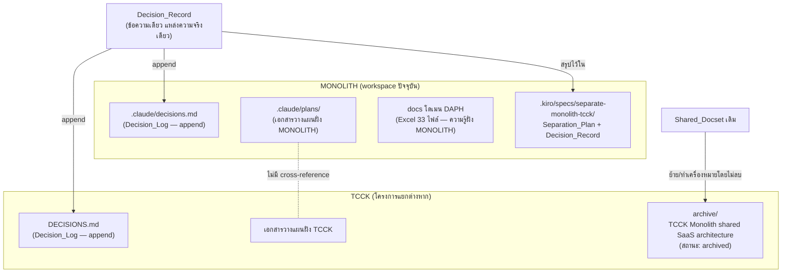

# Design Document

## Overview

ฟีเจอร์นี้คือ **"การแยกทิศทางแบบเบา" (lightweight separation)** ระหว่างสองโครงการที่ไม่เกี่ยวข้องกัน — MONOLITH (ระบบออกแบบ/ผลิตเฟอร์นิเจอร์ built-in แบบ parametric) และ TCCK (Thai cloud-kitchen / food ERP) โดยตัดสินใจ **ไม่** ดำเนินการตามแนวคิดแพลตฟอร์ม SaaS ร่วม

หัวใจสำคัญที่กำหนดรูปแบบของดีไซน์ทั้งหมด: ชุดเอกสาร "TCCK Monolith shared SaaS architecture" เป็น **เอกสารวางแผนเท่านั้น** (canonical promoted = 0) — **ไม่เคยมีโค้ดแพลตฟอร์มร่วมถูกเขียนขึ้นจริง** ดังนั้นงานนี้ไม่ใช่การ "แกะ" ระบบที่พันกัน แต่เป็นงาน **บันทึกการตัดสินใจ + จัดระเบียบเอกสาร + ยืนยันแบบเบา** ว่าวันนี้ทั้งสองโครงการเป็นอิสระต่อกันอยู่แล้ว

ด้วยเหตุนี้ดีไซน์จึงตั้งใจให้ **เบาและสมเหตุสมผลกับงานจริง**:
- ไม่มีเครื่องมือจัดประเภทขอบเขตอัตโนมัติ (no automated boundary-classification tool)
- ไม่มี state machine ติดตามการแยก
- ไม่มีตัวสแกน dependency แบบ 100% coverage — ใช้การยืนยันเชิงโครงสร้างแบบเบาที่ตรวจสอบได้ด้วยตาและคำสั่งค้นหาแบบง่าย

### เป้าหมายของดีไซน์ (Goals)

1. สร้าง Decision_Record ที่ชัดเจน ระบุการตัดสินใจ เหตุผล ข้อเท็จจริง canonical = 0 และวันที่
2. จัดเก็บ Shared_Docset เดิมเข้าคลังถาวรโดยไม่ลบ/ไม่แก้เนื้อหา และทำเครื่องหมาย "archived"
3. ยืนยันว่าแต่ละโครงการมีที่จัดเก็บเอกสารวางแผนของตัวเองโดยไม่อ้างอิงข้ามกัน
4. ต่อท้าย (append) Decision_Record ลง Decision_Log ของทั้งสองโครงการแบบไม่ทำลายของเดิม
5. บันทึกข้อยืนยันแบบเบาว่าไม่มี Cross_Project_Coupling ในปัจจุบัน

### นอกขอบเขต (Non-Goals)

- ไม่แก้ซอร์สโค้ดของ MONOLITH หรือ TCCK (ไม่มีอะไรต้อง "แยก" ในระดับโค้ด)
- ไม่สร้างไลบรารี/แพลตฟอร์มร่วมใด ๆ
- ไม่ลบ Shared_Docset
- ไม่สร้างเครื่องมืออัตโนมัติหนัก ๆ สำหรับตรวจ dependency

### ข้อสังเกตเพิ่มเติม: เอกสารกระบวนการผลิต DAPH (โฟลเดอร์ "New folder")

พบโฟลเดอร์ `c:\Users\thai3\OneDrive\Documents\MONOLITH\New folder` บรรจุไฟล์ Excel 33 ไฟล์ที่เป็นเอกสารกระบวนการผลิตเฟอร์นิเจอร์/งานตกแต่งภายในของ DAPH (PFMEA, SOS — Standardized Operation Sheets, Process Control Plans, แผนติดตั้ง, เทมเพลต feasibility/spec-sheet) เอกสารเหล่านี้เป็น **องค์ความรู้โดเมนฝั่ง MONOLITH** (Sale → วัดหน้างาน → Designer → 3D Pytha/Max → Production Planning/MaxCut/เจาะ → ติดตั้ง) ดีไซน์นี้กำหนดให้จัดเอกสารชุดนี้เป็นความรู้โดเมนฝั่ง MONOLITH ที่ **เก็บและจัดระเบียบไว้ฝั่ง MONOLITH เท่านั้น ไม่ปะปนกับเอกสาร TCCK** (สอดคล้องกับ Requirement 3)

## Architecture

เนื่องจากเป็นงานเอกสาร/การจัดระเบียบ "สถาปัตยกรรม" ในที่นี้คือ **โครงสร้างของไฟล์และเอกสาร** ที่จะถูกสร้างหรือปรับ ไม่ใช่ runtime architecture



### หลักการออกแบบ (Design Principles)

1. **Single source of truth สำหรับ Decision_Record** — เขียนข้อความตัดสินใจ "ครั้งเดียว" แล้วนำไปต่อท้าย (append) ในทั้งสอง Decision_Log ให้ตรงกัน เพื่อกัน drift ระหว่างสองโครงการ (Requirement 4.3)
2. **Append-only, non-destructive** — ทุกการเขียนลง Decision_Log เป็นการต่อท้าย ไม่แก้/ไม่ลบรายการเดิม (Requirement 4.1, 4.2)
3. **Archive = preserve, ไม่ใช่ delete** — เก็บ Shared_Docset ไว้ครบ พร้อมทำเครื่องหมายสถานะ และมี rollback หากการย้ายล้มเหลว (Requirement 2)
4. **เอกสารแต่ละฝั่งอยู่ใต้รากของโครงการตัวเอง** — บังคับความเป็นอิสระเชิงโครงสร้างโดยตำแหน่งไฟล์ ไม่ใช่ลิงก์ข้าม (Requirement 3)
5. **ยืนยันเบา ตรวจได้** — การยืนยัน no-coupling ทำผ่านการตรวจรายการ checklist + คำสั่งค้นหาแบบง่ายที่ทำซ้ำได้ ไม่ใช่เครื่องมือสแกนเต็มรูปแบบ (Requirement 5)

## Components and Interfaces

ในที่นี้ "component" คือ artifact เอกสารและขั้นตอนการดำเนินการ (manual/script-assisted procedure) ไม่ใช่ซอฟต์แวร์ที่รันต่อเนื่อง

### C1. Decision_Record (artifact)

- **รูปแบบ**: บล็อกข้อความ markdown มาตรฐาน ใช้ซ้ำได้ทั้งสองฝั่ง
- **ฟิลด์**: หัวข้อการตัดสินใจ, สถานะ (Decided / Will-not-do), วันที่, บริบท, การตัดสินใจ, เหตุผล, ข้อเท็จจริง canonical promoted = 0, ผลที่ตามมา (consequences)
- **ผู้บริโภค**: MONOLITH `.claude/decisions.md`, TCCK `DECISIONS.md`, และ Separation_Plan
- **Interface**: ข้อความเดียวที่คัดลอกไปต่อท้ายแต่ละ Decision_Log แบบคำต่อคำ (verbatim) เพื่อความสอดคล้อง

### C2. Archive Procedure (ฝั่ง TCCK)

- **อินพุต**: `C:\Users\thai3\TCCK-All-Projects-Backup\TCCK  Monolith shared SaaS architecture`
- **เอาต์พุต**: ที่จัดเก็บถาวร เช่น `.../archive/TCCK Monolith shared SaaS architecture/` พร้อมไฟล์เครื่องหมายสถานะ `ARCHIVED.md` (ระบุ "archived", วันที่, เหตุผล, อ้างอิง Decision_Record)
- **คุณสมบัติ**: คัดลอก/ย้ายโดยรักษาเนื้อหาเดิมครบถ้วน ไม่แก้เนื้อหาในเอกสาร; ถ้าล้มเหลวต้องคงต้นทางไว้ไม่เปลี่ยนแปลง (Requirement 2.3)
- **หมายเหตุ**: TCCK อยู่นอก workspace ปัจจุบัน ขั้นตอนนี้จึงเป็น procedure ที่ดำเนินการฝั่ง TCCK (ระบุคำสั่ง/ขั้นตอนให้ชัดในช่วง tasks) ไม่ใช่โค้ดในรีโปนี้

### C3. Per-Project Planning Locations (โครงสร้าง)

- **MONOLITH**: `.claude/plans/` (มีอยู่แล้ว) + ที่เก็บความรู้โดเมน DAPH ฝั่ง MONOLITH
- **TCCK**: ที่เก็บเอกสารวางแผนของ TCCK เอง (เช่น โฟลเดอร์ docs/planning ของ TCCK)
- **Interface/Invariant**: ไม่มีไฟล์ฝั่งหนึ่ง cross-reference (ลิงก์/พาธสัมพัทธ์/อ้างชื่อไฟล์) ไปยังเอกสารวางแผนของอีกฝั่ง (Requirement 3.3)

### C4. Decision_Log Append (ทั้งสองฝั่ง)

- **MONOLITH**: ต่อท้ายส่วนใหม่ใน `.claude/decisions.md` (ปัจจุบันมีตาราง "Active Decisions" + ส่วน hardware) — เพิ่มหัวข้อใหม่ เช่น `## Decision: No Shared SaaS Platform (YYYY-MM-DD)` ต่อท้ายไฟล์
- **TCCK**: ต่อท้ายรายการใหม่ใน `DECISIONS.md`
- **คุณสมบัติ**: append-only; เนื้อหาการตัดสินใจในสองไฟล์ต้องสื่อข้อสรุปและเหตุผลตรงกัน (Requirement 4.3)

### C5. Separation_Plan + Coupling Assertion (artifact)

- **ที่ตั้ง**: `.kiro/specs/separate-monolith-tcck/` ฝั่ง MONOLITH (เป็นที่เก็บผลสรุปของฟีเจอร์นี้)
- **เนื้อหา**: สรุปการตัดสินใจ, ผลการ archive, ผลการยืนยันความเป็นอิสระ + checklist การยืนยัน no-coupling
- **Coupling checklist** (4 หมวด): shared runtime, shared database, shared deployment, cross-project source imports
- **ผลลัพธ์**: ถ้าครบทั้ง 4 หมวดไม่พบ coupling → บันทึกสถานะ "independent" + วันที่ (Requirement 5.3); ถ้าพบอย่างน้อยหนึ่งรายการ → บันทึกรายการนั้น + ประเภท + ทำเครื่องหมาย "ต้องแก้ไขก่อน" (Requirement 5.2)

## Data Models

### Decision_Record

```
DecisionRecord {
  title:        string        // เช่น "ไม่ดำเนินการแพลตฟอร์ม SaaS ร่วม (MONOLITH × TCCK)"
  status:       "Decided — Will Not Do"
  date:         ISO-8601 date // วันที่ตัดสินใจ (Req 1.3)
  context:      string        // ที่มา: เคยมีแผน shared SaaS platform
  decision:     string        // ไม่ทำแพลตฟอร์มร่วม (Req 1.1)
  rationale:    string        // โดเมนต่างกัน + ส่วนร่วมเป็น generic infra ใช้ library สำเร็จรูปแทน (Req 1.1)
  canonicalFact:"canonical promoted = 0 — ไม่เคยมีโค้ดแพลตฟอร์มร่วมจริง" // (Req 1.2)
  consequences: string        // archive docset, แต่ละโครงการเดินแยกอิสระ
}
```

### Archive_Marker (`ARCHIVED.md`)

```
ArchiveMarker {
  status:       "archived"          // (Req 2.2)
  archivedDate: ISO-8601 date
  originalPath: string              // ตำแหน่งเดิมของ Shared_Docset
  reason:       string              // อ้างถึง Decision_Record
  note:         "historical reference only — ไม่ใช้ดำเนินการต่อ"
}
```

### Coupling_Assertion (ส่วนหนึ่งของ Separation_Plan)

```
CouplingAssertion {
  checkedDate:  ISO-8601 date
  categories: [
    { type: "shared-runtime",        coupled: boolean, evidence: string },
    { type: "shared-database",       coupled: boolean, evidence: string },
    { type: "shared-deployment",     coupled: boolean, evidence: string },
    { type: "cross-project-imports", coupled: boolean, evidence: string }
  ]
  result:       "independent" | "coupling-found"   // (Req 5.3 / 5.2)
  findings:     CouplingFinding[]                   // ว่างเมื่อ independent
}

CouplingFinding {
  type:        string   // ประเภทการพึ่งพา
  description: string
  mustFixBeforeIndependent: true   // (Req 5.2)
}
```

### Project_Planning_Index (เชิงแนวคิด)

```
ProjectPlanning {
  project:           "MONOLITH" | "TCCK"
  planningRoot:      string      // อยู่ใต้รากของโครงการตัวเอง (Req 3.1, 3.2)
  crossReferences:   []          // ต้องว่างเสมอ (Req 3.3)
}
```

## Testing Strategy

### การประเมินความเหมาะสมของ Property-Based Testing (PBT)

ฟีเจอร์นี้ **ไม่เหมาะกับ property-based testing** และดีไซน์จึง **ไม่มีหัวข้อ Correctness Properties** ด้วยเหตุผลต่อไปนี้:

- งานทั้งหมดเป็น **การบันทึกการตัดสินใจและจัดระเบียบเอกสาร** (documentation/organization) บวกกับ **การยืนยันแบบเบาครั้งเดียว** ไม่มีฟังก์ชัน pure ที่รับอินพุตหลากหลายแล้วผลิตเอาต์พุตที่ต้องถือ property แบบ "for all inputs"
- ไม่มี parser / serializer / data transformation / algorithm ที่พฤติกรรมแปรผันตามอินพุต
- การยืนยัน no-coupling เป็นการตรวจสถานะปัจจุบันแบบ deterministic ครั้งเดียว (เข้าข่าย SMOKE/verification) การรัน 100 รอบไม่เพิ่มคุณค่า
- การ append/archive เป็น file operation ที่ตรวจด้วยตัวอย่างเฉพาะได้ดีกว่า (example-based)

ตามแนวทาง "ถ้าเขียนข้อความ for all inputs X, property P(X) holds ที่มีความหมายไม่ได้ ก็ไม่ควรใช้ PBT" จึงใช้ **example-based checks + verification checklist** แทน

### แนวทางการทดสอบ/ตรวจรับที่ใช้จริง

เนื่องจากไม่มีโค้ดรันใหม่ การ "ทดสอบ" คือการตรวจรับ artifact และผลการยืนยัน (acceptance checks) ดังนี้:

1. **ตรวจ Decision_Record (Req 1)** — ยืนยันว่ามีข้อความตัดสินใจไม่ทำแพลตฟอร์มร่วม + เหตุผล + ข้อเท็จจริง canonical = 0 + วันที่ ครบทุกฟิลด์
2. **ตรวจการ Archive (Req 2)** — ตัวอย่างตรวจ: (ก) เนื้อหาใน Archive_Location ตรงกับต้นทางครบถ้วน (เทียบจำนวนไฟล์/ชื่อไฟล์/เนื้อหา), (ข) มีไฟล์ `ARCHIVED.md` ระบุสถานะ "archived", (ค) จำลองความล้มเหลว → ยืนยันว่าต้นทางไม่ถูกแก้ไข (Req 2.3)
3. **ตรวจความเป็นอิสระของที่เก็บเอกสาร (Req 3)** — ยืนยันว่า MONOLITH และ TCCK ต่างมี planning root ของตัวเอง และค้นด้วยคำสั่งค้นหาแบบง่าย (grep หาพาธ/ชื่อไฟล์ของอีกฝั่ง) แล้ว **ไม่พบ** cross-reference
4. **ตรวจ Decision_Log ทั้งสองฝั่ง (Req 4)** — ตัวอย่างตรวจ: (ก) รายการเดิมใน `.claude/decisions.md` และ `DECISIONS.md` ยังอยู่ครบ (append ไม่ทำลายของเดิม), (ข) ทั้งสองไฟล์มีรายการใหม่ที่ข้อสรุป/เหตุผลตรงกับ Decision_Record
5. **ตรวจ Coupling Assertion (Req 5)** — เดินผ่าน checklist 4 หมวด (shared runtime / shared database / shared deployment / cross-project imports) บันทึก evidence แต่ละหมวด แล้วสรุปผลเป็น "independent" + วันที่ หากไม่พบ coupling; ถ้าพบให้บันทึกรายการ + ประเภท + ทำเครื่องหมายต้องแก้ไข

### วิธีการยืนยัน no-coupling แบบเบา (Req 5)

ใช้การตรวจเชิงโครงสร้างที่ทำซ้ำได้ ไม่ใช่เครื่องมือสแกนเต็มรูปแบบ:

| หมวด | วิธีตรวจแบบเบา | คาดหวัง |
|------|----------------|---------|
| shared runtime | ตรวจว่าไม่มี process/service ที่ทั้งสองโครงการใช้ร่วม | ไม่มี |
| shared database | ตรวจ connection string/Supabase project ของแต่ละฝั่งว่าแยกกัน | แยกกัน |
| shared deployment | ตรวจ pipeline/โฮสต์ของแต่ละฝั่งว่าแยกกัน | แยกกัน |
| cross-project imports | ค้นหา import/พาธที่ชี้ข้ามรากโครงการอีกฝั่ง | ไม่พบ |

ผลการตรวจทั้งหมดถูกบันทึกลง Separation_Plan เป็นหลักฐานประกอบสถานะ "independent"

## Error Handling

เนื่องจากเป็นงานเอกสาร ความเสี่ยงหลักคือ **การสูญเสียข้อมูลเดิม** และ **ความไม่สอดคล้องระหว่างสองฝั่ง** จึงจัดการดังนี้:

1. **Archive ล้มเหลว (Req 2.3)** — ใช้รูปแบบ copy-then-verify-then-mark: คัดลอกไปยัง Archive_Location ก่อน, ตรวจความครบถ้วน, จึงทำเครื่องหมาย/ลบต้นทาง (ถ้าจะย้าย) หากขั้นตอนใดล้มเหลว ให้คงต้นทาง Shared_Docset ไว้ไม่เปลี่ยนแปลง และแสดงข้อความแจ้งความล้มเหลว ห้ามลบต้นทางจนกว่าจะยืนยันสำเนาครบ
2. **การเขียน Decision_Log ผิดพลาด** — ใช้ append เท่านั้น ห้ามเขียนทับ; หากไฟล์ไม่มีอยู่ (กรณี TCCK) ให้สร้างใหม่แล้วเพิ่มรายการ โดยไม่แตะรายการอื่น
3. **เนื้อหาสองฝั่งไม่ตรงกัน (drift)** — ลดความเสี่ยงด้วยการคัดลอก Decision_Record แบบ verbatim จากแหล่งเดียว และตรวจรับว่าข้อสรุป/เหตุผลตรงกัน (Req 4.3)
4. **พบ coupling ระหว่างยืนยัน (Req 5.2)** — ไม่ถือว่าเป็น failure ของฟีเจอร์ แต่บันทึกเป็น finding พร้อมประเภท และทำเครื่องหมาย "ต้องแก้ไขก่อนถือว่าอิสระ" — สถานะ Separation_Plan จะเป็น "coupling-found" แทน "independent"
5. **เอกสาร DAPH ปะปนข้ามฝั่ง** — หากพบไฟล์ DAPH ถูกอ้างอิงหรือวางไว้ฝั่ง TCCK ให้ถือเป็นการละเมิด Req 3 และย้ายกลับมาฝั่ง MONOLITH

## Design Decisions and Rationale

- **ทำไมไม่สร้างเครื่องมืออัตโนมัติ**: เพราะ canonical promoted = 0 — ไม่มีการผูกพันจริงให้ต้องตรวจเชิงลึก งานหนักเช่น dependency scanner หรือ state machine จะเกินความจำเป็นและเพิ่มภาระบำรุงรักษาโดยไม่มีคุณค่าเพิ่ม
- **ทำไม archive แทนการลบ**: เพื่อรักษาประวัติแนวคิดและเหตุผล (Req 2) เผื่อทบทวนภายหลัง และเป็นหลักฐานประกอบการตัดสินใจ
- **ทำไมต้อง append ทั้งสอง Decision_Log**: เพื่อให้ทั้งสองทีม/โครงการเห็นการตัดสินใจเดียวกันจากบันทึกของตัวเอง โดยไม่ต้องพึ่งการอ้างอิงข้ามโครงการ (สอดคล้องกับเป้าหมายความเป็นอิสระใน Req 3)
- **ทำไมเก็บ DAPH ฝั่ง MONOLITH**: เอกสารกระบวนการผลิตเฟอร์นิเจอร์เป็นองค์ความรู้โดเมน MONOLITH โดยตรง การเก็บแยกฝั่งช่วยรักษาความเป็นอิสระและไม่ทำให้เอกสาร TCCK ปนเปื้อน
