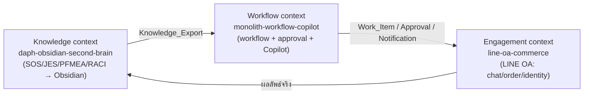

# Ubiquitous Language — Monolith (DAPH Decor)

> ภาษาเดียวที่ใช้ร่วมกันระหว่าง **โค้ด / ผู้พัฒนา / ผู้เชี่ยวชาญโดเมน** (แนวคิด Domain-Driven Design)
> ไฟล์นี้เป็น context map ระดับบนสุด — คำเฉพาะของแต่ละโมดูลดูใน Glossary ของ spec นั้น ๆ
> เมื่อพบคำกำกวมระหว่างทำงาน ให้ลับให้คมแล้วอัปเดตไฟล์นี้ (active refinement)

## ภาพรวมระบบ (3 Bounded Contexts)

Monolith คือแพลตฟอร์มแนว **AI-Native ERP สำหรับธุรกิจออกแบบตกแต่งภายใน/ผลิตเฟอร์นิเจอร์ (DAPH Decor)** ประกอบด้วยสามชั้น/สามบริบทที่ใช้ภาษาร่วมกัน:

| Context (spec) | บทบาท | แพลตฟอร์ม |
|----------------|-------|-----------|
| `daph-obsidian-second-brain` | ชั้นความรู้ (Knowledge) — จัดระเบียบ QMS เป็น Obsidian Vault + ปล่อย Knowledge_Export | Node/TS tool (static) |
| `monolith-workflow-copilot` | ชั้นกลาง (Intelligence + Action) — workflow, approval, Copilot, notification | Supabase/PostgreSQL |
| `line-oa-commerce` | ชั้นการมีส่วนร่วม (Engagement) — LINE OA: chat/order/CRM | Supabase/PostgreSQL |

## ลำดับกระบวนการธุรกิจจริง (canonical) — แหล่งความจริงเดียว

โมเดลนี้คือ "พิมพ์เขียว" ที่ทั้งสามบริบทอ้างอิง (มาจากเอกสารจริงใน `New folder/` + `_daph_extract/`):

- **Office** (6 หน่วย): Sale → Area Measurement → Designer → 3D_Presentation → Production Planning → 3D_Rendering_Final
- **Factory** (6 สถานี): Laminate HPL → Cutting → Edging → CNC → Assembly → Packing
- **Installation** (16 ขั้นตอน): การบรีฟงาน → … → การเก็บของ

> ⚠️ ชื่อไฟล์ "Main Process" ครอบคลุม 5 ชีต Office (Sale/Area Measurement/Designer/3D Model/Production Planning ไม่ใช่แผนกเดียว); `1.SOS DAPH.xlsx` (ไม่มีคำต่อท้าย) คือสายการผลิต Factory 6 สถานี — **ห้ามสมมติว่าหนึ่งไฟล์ = หนึ่งหน่วย**
> ⚠️ **3D สองขั้น (ดู ADR-010):** หน่วย 3D ถูกแยกเป็น `3D_Presentation` (เสนอลูกค้า, = ชีต "3D Model" 004 ในไฟล์ Main Process) และ `3D_Rendering_Final` (render สุดท้ายหลัง Production Planning, มาจาก Master Matrix `สำหรับคุณชุ.xlsx` ไม่ใช่ชีต SOS แยก) — Office จึงมี **6 หน่วยเชิงตรรกะ** แม้ไฟล์ SOS Main Process มี 5 ชีต

## คำศัพท์ร่วม (cross-cutting — ใช้ตรงกันทุกบริบท)

- **Sub_Process_Group**: หนึ่งใน {Office, Factory, Installation}
- **Process_Unit**: หน่วยกระบวนการหนึ่งหน่วย (Department / Station / Installation_Step) — เป็นทั้งโฟลเดอร์ใน Vault และ step ใน workflow
- **3D_Presentation**: ขั้น 3D ฝั่งออกแบบ — สร้าง 3D model/render เสนอคอนเซ็ปต์ให้ลูกค้าอนุมัติ (ตรงกับ SOS/JES "3D Model" Doc no. 004 ในกลุ่ม Office) อยู่ **ก่อน** Production Planning
- **3D_Rendering_Final**: ขั้น 3D rendering สุดท้าย — render photorealistic หลัง Production Planning ขึ้นโมเดลจริงแล้ว ก่อนส่งผลิต (งาน "Recheck all 3D final from Production Planning" ใน Master Matrix) อยู่ **หลัง** Production Planning
- **Document_Set**: ชุดเอกสารของหน่วยเดียวกันที่ลิงก์ถึงกัน — SOS ↔ JES ↔ PFMEA ↔ Process Control Plan
- **RACI_Map**: ใครรับผิดชอบ/อนุมัติแต่ละ Process_Step — สกัดจาก Master Process Matrix (`สำหรับคุณชุ.xlsx`)
- **PFMEA_Risk_Row / RPN**: แถวความเสี่ยง (Process Step → Failure Mode → Cause → Control → RPN); RPN = SEV×OCC×DET — เป็นเชื้อเพลิงของ AI Copilot
- **Knowledge_Export**: ข้อมูล machine-readable (JSON) ที่ `daph-obsidian-second-brain` ปล่อยออก (PFMEA rows + process model + RACI + Approval_Quorum + Knowledge_Freshness) ให้ `monolith-workflow-copilot` บริโภค (read-only)
- **Site_Code**: ตัวระบุสาขา (A1) ชุดที่ใช้ได้ = ผล `public.get_active_site_codes()`
- **C12 roles**: `branch_manager`, `branch_operator`, `admin`, `operations`, `finance`, `executive_owner`; Governance_Role อ่านข้ามสาขาได้
- **D2 Autonomy Ladder**: ธรรมาภิบาลกำกับว่าการกระทำของ AI ทำเองได้หรือต้องให้มนุษย์อนุมัติ
- **Postback_Data_Contract / Encrypted_Postback**: payload ปุ่ม LINE ที่เข้ารหัส/ลงนาม (กันปลอมตัว)
- **Message_Templates**: ข้อความ outbound แบบผูกเทมเพลต (slot-filling) น้ำเสียงอบอุ่น ≤ 200 ตัวอักษร
- **Finance_Context (Phase 3)**: บริบทการเงิน/ต้นทุน (`monolith-accounting`) — **consumer** ที่บริโภคเหตุการณ์ที่ emitted/อนุมัติแล้ว ไม่ fork Capture Spine/MCP/verify-audit/IAM (ADR-008, ADR-020)
- **Journal_Posting_Contract**: สัญญาที่ spine `rpc_capture_promote` เรียกเข้า Ledger_Engine ของ Finance_Context แบบ idempotent (key = artifact idempotency_key) เมื่อ `commit_target ∈ {ledger, actual_purchase_price}` — ทิศทางเดียว (accounting ไม่เขียนกลับ spine)
- **Posted_Entry vs Draft**: รายการบัญชีที่ "ร่าง" ของงานเอกสารอยู่ที่ artifact lifecycle ของ spine (proposed/approved); Ledger_Engine สร้างเฉพาะ journal entry สถานะ `posted` จาก artifact ที่ emitted แล้ว (draft ไม่ซ้ำใน accounting)
- **Non_Document_Posting**: เส้นทาง posting ตรงของ Ledger_Engine สำหรับ bank feed / manual / ปรับปรุงสิ้นเดือน / ค่าเสื่อม — บังคับบัญชีคู่ (debit=credit) โดยไม่ผ่าน spine
- **FX_Rounding_Difference**: บัญชี plug "ผลต่างจากการปัดเศษอัตราแลกเปลี่ยน" ที่รับ residual (sum baseDebit − sum baseCredit) เมื่อปัดเศษแต่ละบรรทัด → ทำให้บัญชีคู่สมดุลเสมอในสกุลหลัก (ADR-022; property ACC-1b: |residual| ≤ lines × 0.01)
- **หมายเหตุ scope Finance_Context:** commerce/foreign-SaaS egress = โดเมน `line-oa-commerce` (ADR-021); PDM sync (part/revision/BOM) = engineering master data ไม่ใช่การเงิน — accounting บริโภคเฉพาะ **BOM cost** (ADR-023)
- **Posting_Rule**: config (extensible) keyed by `(capture_type, category)` → template Dr/Cr accounts + VAT/WHT split; ใช้แปลง emitted artifact (ฟิลด์แบน) → journal entry ที่สมดุล; ไม่มี rule → Suspense_Account + human review (ADR-024)
- **Suspense_Account**: บัญชีพักสำหรับรายการที่หา posting_rule ไม่เจอ (fail-closed no-guess) รอมนุษย์ระบุการลงบัญชี
- **Book (accounting)**: มุมมองรายงาน (internal/statutory/tax) — **orthogonal** กับ A1 entity; journal entry ติดแท็ก `(entity, book_id)`; นิติบุคคลเดียวมีได้หลาย book (ADR-026)
- **Job_Cost_Contract**: สัญญา read-only จาก CAM engine = `job id + material quantities (cutlist)`; accounting เป็นเจ้าของ cost_rate (labor/overhead) + ต้นทุนวัตถุดิบจริงจาก material_receipt (ADR-027)
- **e-Tax signing**: ต้องใช้ **XAdES + X.509 qualified cert จาก ETDA-approved CA** (แนว `ETDA/etax-xades`); `src/crypto` ใช้เฉพาะ integrity ภายใน ไม่ใช่ลายเซ็น e-Tax ตามกฎหมาย (ADR-025)
- **Ledger runtime**: DB-first (Supabase RPC + RLS + pure logic ใน `src/` + PBT) เหมือนทั้งแพลตฟอร์ม; `ธุระกิจ/monolith_accounting.html` = reference สูตร/COA/อัตราส่วนเท่านั้น ไม่ใช่ runtime (ADR-024)
- **Extraction_Engine**: adapter seam ของ capture Stage1/Stage2 (OCR + field extraction) — สลับ engine ได้ผ่าน config; ปัจจุบัน `claude` (bridge, เฉพาะเอกสารธุรกิจ) → เป้าหมาย `typhoon` (on-prem) เมื่อผ่าน dual-run (ADR-033)
- **Cloud_Allowed (capture_type flag)**: ธงใน `capture_type_config` ว่าเอกสารประเภทนั้นส่งขึ้น cloud extraction ได้หรือไม่; ประเภทที่แตะข้อมูลบุคคลธรรมดา (site_survey, installation_proof) = false → manual entry จนกว่า on-prem พร้อม (ADR-033)

## หลักการที่ยึดทุกบริบท (invariants)

- **Human-in-the-loop เสมอ** — AI เสนอทางเลือก มนุษย์ตัดสิน
- **Non-destructive** — ไม่ลบ/ไม่แก้ไฟล์ต้นฉบับ (ย้าย junk ไป Archives, copy เข้า Vault)
- **Reuse ไม่ fork** — โมดูลใหม่ยิงงานเข้า primitive เดิม (C12/audit/D2/approval/notification) ไม่สร้างซ้ำ
- **Self-contained** — ทุกอย่างอยู่ใน `determined-williams/`
- **มนุษย์ตัดสินใจสำคัญผ่าน UI ของตัวเอง** — การตัดสินใจที่ย้อนยากบันทึกไว้ใน `architecture-decisions.md`

## Glossary รายบริบท (ดูรายละเอียดเต็ม)

- Knowledge: `.kiro/specs/daph-obsidian-second-brain/requirements.md` (§Glossary)
- Workflow: `.kiro/specs/monolith-workflow-copilot/requirements.md` (§Glossary)
- Engagement: `.kiro/specs/line-oa-commerce/requirements.md` (§Glossary)
