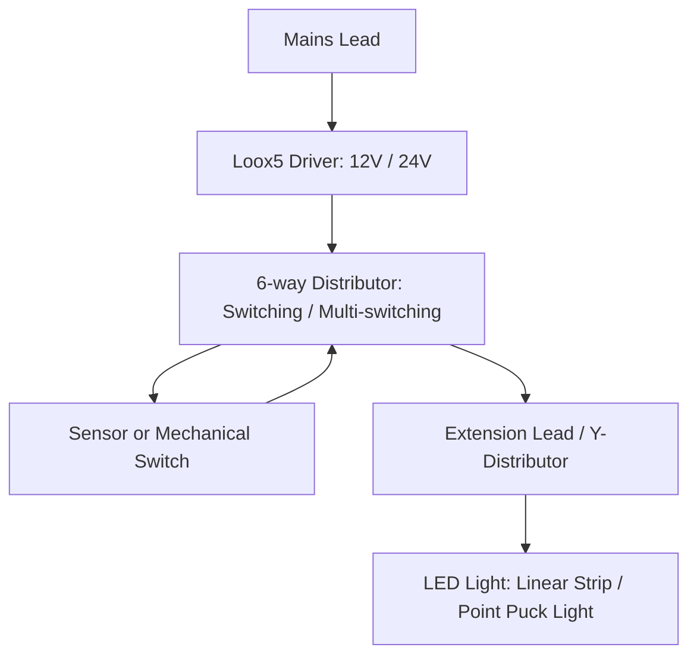

# 💡 Häfele Loox & Loox5 — Lighting Systems (MOC)

Source: [[hafele-design-catalog-2021]]

> [!NOTE]
> โน้ตกลุ่มนี้ครอบคลุมโครงสร้างระบบไฟเฟอร์นิเจอร์แบบโมดูลาร์ (Modular Furniture Lighting) ของ Häfele Loox และ Loox5 ในลักษณะ **Baseline Coverage** สำหรับการเตรียมพร้อมเชื่อมโยงกับ CAD/drillMap ในอนาคต

## แผนภาพโครงสร้างระบบไฟ (Modular System)

## 5 เสาหลักระบบไฟเฟอร์นิเจอร์ (Baseline Notes)

1. **แหล่งจ่ายไฟ (Power Supplies/Drivers)**:
   - [[hafele-loox5-drivers]] — ระบบแปลงไฟ 12V และ 24V แบบจ่ายแรงดันคงที่ (Constant Voltage) รองรับขนาดบางพิเศษ 16 มม.
2. **กล่องกระจายไฟ (Distributors)**:
   - [[hafele-loox5-distributors]] — กล่องควบคุม 6 ช่อง แบบ Standard Switching (1 สวิตช์คุมทั้งหมด) และ Multi-Switching (แยกคุมกลุ่ม)
3. **สายเชื่อมต่อและสายขยาย (Extension Leads & Distributors)**:
   - [[hafele-loox5-leads]] — ระบบสายเชื่อมต่อ 2-pin (Monochrome) และ 4-pin (RGB) พร้อมข้อกำหนดการสูญเสียแรงดันและขนาดรูร้อยปลั๊ก
4. **ตัวควบคุมและสวิตช์ (Switches & Controllers)**:
   - [[hafele-loox-switches]] — สวิตช์แบบสัมผัส, เซ็นเซอร์บานตู้, อุปกรณ์ตรวจจับความเคลื่อนไหว, สวิตช์กลไก และกล่องสวิตช์ทางสลับ
5. **โคมไฟและไฟเส้น LED (LED Lights & Profiles)**:
   - [[hafele-loox-led-lights]] — ภาพรวมไฟเส้น Linear Strip และไฟจุด Point/Puck Light พร้อมข้อกำหนดการบากหรือเจาะรูฝังไฟ

---

## 🛠️ รูเจาะที่ต้องใช้สำหรับควบคุมโมดูลในแบบ CAD / drillMap
| ขนาดรูเจาะที่ระบุ | ฟังก์ชัน | โมดูลที่เกี่ยวข้อง | โน้ตอ้างอิง |
|---|---|---|---|
| **Ø8 mm** | ปลั๊กต่อสาย (Plug) | สายต่อขยาย 4-way, Y-distributor, สวิตช์ inline | [[hafele-loox5-leads]] |
| **Ø9 mm** | ปลั๊กต่อสาย RGB | สายต่อขยาย RGB 4-pin | [[hafele-loox5-leads]] |
| **Ø12 mm** | เซ็นเซอร์/สวิตช์ฝัง | สวิตช์เซ็นเซอร์ modular, สวิตช์กลไกฝังตู้ | [[hafele-loox-switches]] |
| **Ø13 mm** | ซ็อกเก็ตต่อสาย (Socket) | ปลั๊กฝั่งตัวเมียสำหรับต่อสาย | [[hafele-loox5-leads]] |
| **Ø26 mm** | รูเจาะฝังไฟ Puck เล็ก | ไฟจุดรุ่นเล็ก (เช่น LED 2090, 3090) | [[hafele-loox-led-lights]] |
| **Ø35 mm** | รูเจาะฝังไฟ Puck กลาง | ไฟจุดรุ่นกลาง (เช่น LED 2040, 3008) | [[hafele-loox-led-lights]] |
| **Ø58 mm** | รูเจาะฝังไฟ Puck ใหญ่ | ไฟจุดรุ่นใหญ่ (เช่น LED 2025, 2092, 3092) | [[hafele-loox-led-lights]] |

---

## งานตรวจสอบที่ค้างอยู่ (Validation)
- [ ] ตรวจเช็คความถูกต้องของลิงก์และโครงสร้าง YAML ด้วยสคริปต์ตรวจสอบ [[CK-salice-hafele-specs]]
