# 🏠 DAPH Second Brain — Home

ศูนย์รวมการนำทางของ Obsidian Vault รวมสองโดเมน: **Hardware** และ **Process (QMS)**

## โดเมน
- 🔧 [[Hardware-MOC|Hardware — อุปกรณ์เฟอร์นิเจอร์]]

## กลุ่มกระบวนการ (Process)
- 📋 [[Office-MOC|Office]]
- 📋 [[Factory-MOC|Factory]]
- 📋 [[Installation-MOC|Installation]]

## แผนผังกระบวนการ (Process Flow)

```mermaid
flowchart TD
  subgraph Office
    Office_0["Sale"]
    Office_1["Area Measurement"]
    Office_0 --> Office_1
    Office_2["Designer"]
    Office_1 --> Office_2
    Office_3["3D Perspective"]
    Office_2 --> Office_3
    Office_4["Production Planning"]
    Office_3 --> Office_4
  end
  subgraph Factory
    Factory_0["Laminate HPL"]
    Factory_1["Cutting"]
    Factory_0 --> Factory_1
    Factory_2["Edging"]
    Factory_1 --> Factory_2
    Factory_3["CNC"]
    Factory_2 --> Factory_3
    Factory_4["Assembly"]
    Factory_3 --> Factory_4
    Factory_5["Packing"]
    Factory_4 --> Factory_5
  end
  subgraph Installation
    Installation_0["การบรีฟงาน"]
    Installation_1["การตรวจสอบหน้างาน"]
    Installation_0 --> Installation_1
    Installation_2["การตรวจสอบระยะ"]
    Installation_1 --> Installation_2
    Installation_3["การปูรองพื้น"]
    Installation_2 --> Installation_3
    Installation_4["เรียงอุปกรณ์"]
    Installation_3 --> Installation_4
    Installation_5["การติดตั้งโครงอลูมิเนียม"]
    Installation_4 --> Installation_5
    Installation_6["การตรวจสอบขนาดตู้"]
    Installation_5 --> Installation_6
    Installation_7["การจัดวางตู้"]
    Installation_6 --> Installation_7
    Installation_8["การติดตั้งผนัง"]
    Installation_7 --> Installation_8
    Installation_9["การติดตั้งท๊อป"]
    Installation_8 --> Installation_9
    Installation_10["การติดตั้งอุปกรณ์ภายในตู้"]
    Installation_9 --> Installation_10
    Installation_11["งานระบบไฟฟ้า"]
    Installation_10 --> Installation_11
    Installation_12["งานเก็บซิลิโคน"]
    Installation_11 --> Installation_12
    Installation_13["การตรวจสอบหน้าบาน"]
    Installation_12 --> Installation_13
    Installation_14["การรักษาความสะอาด"]
    Installation_13 --> Installation_14
    Installation_15["การเก็บของ"]
    Installation_14 --> Installation_15
  end
  Office_4 --> Factory_0
  Factory_5 --> Installation_0
```

### เข้าถึงแต่ละหน่วยกระบวนการ
**Office**: [[Sale-MOC|Sale]] · [[Area-Measurement-MOC|Area Measurement]] · [[Designer-MOC|Designer]] · [[3D-Perspective-MOC|3D Perspective]] · [[Production-Planning-MOC|Production Planning]]
**Factory**: [[Laminate-HPL-MOC|Laminate HPL]] · [[Cutting-MOC|Cutting]] · [[Edging-MOC|Edging]] · [[CNC-MOC|CNC]] · [[Assembly-MOC|Assembly]] · [[Packing-MOC|Packing]]
**Installation**: [[การบรีฟงาน-MOC|การบรีฟงาน]] · [[การตรวจสอบหน้างาน-MOC|การตรวจสอบหน้างาน]] · [[การตรวจสอบระยะ-MOC|การตรวจสอบระยะ]] · [[การปูรองพื้น-MOC|การปูรองพื้น]] · [[เรียงอุปกรณ์-MOC|เรียงอุปกรณ์]] · [[การติดตั้งโครงอลูมิเนียม-MOC|การติดตั้งโครงอลูมิเนียม]] · [[การตรวจสอบขนาดตู้-MOC|การตรวจสอบขนาดตู้]] · [[การจัดวางตู้-MOC|การจัดวางตู้]] · [[การติดตั้งผนัง-MOC|การติดตั้งผนัง]] · [[การติดตั้งท๊อป-MOC|การติดตั้งท๊อป]] · [[การติดตั้งอุปกรณ์ภายในตู้-MOC|การติดตั้งอุปกรณ์ภายในตู้]] · [[งานระบบไฟฟ้า-MOC|งานระบบไฟฟ้า]] · [[งานเก็บซิลิโคน-MOC|งานเก็บซิลิโคน]] · [[การตรวจสอบหน้าบาน-MOC|การตรวจสอบหน้าบาน]] · [[การรักษาความสะอาด-MOC|การรักษาความสะอาด]] · [[การเก็บของ-MOC|การเก็บของ]]

## ทรัพยากร (Resources)
- 📖 [[Glossary|อภิธานศัพท์]]
- 🗂️ [[Master-Matrix|Master Process Matrix (สำหรับคุณชุ)]]
- 📝 [[Project-Template|เทมเพลตโครงการลูกค้าใหม่]]
- 🔌 [[Plugin-Guide|คำแนะนำปลั๊กอิน]]
- 🏷️ [[Tag-Reference|รายการแท็ก]]
