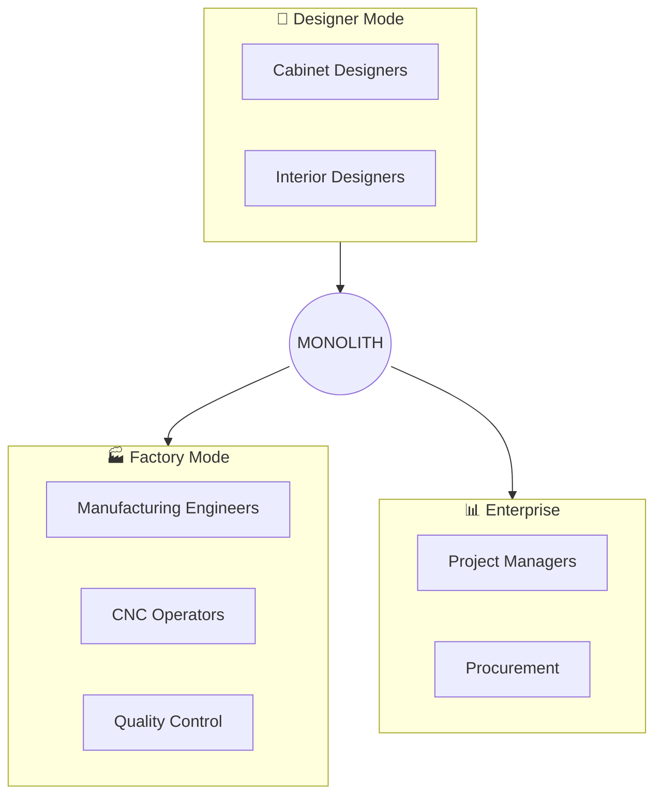
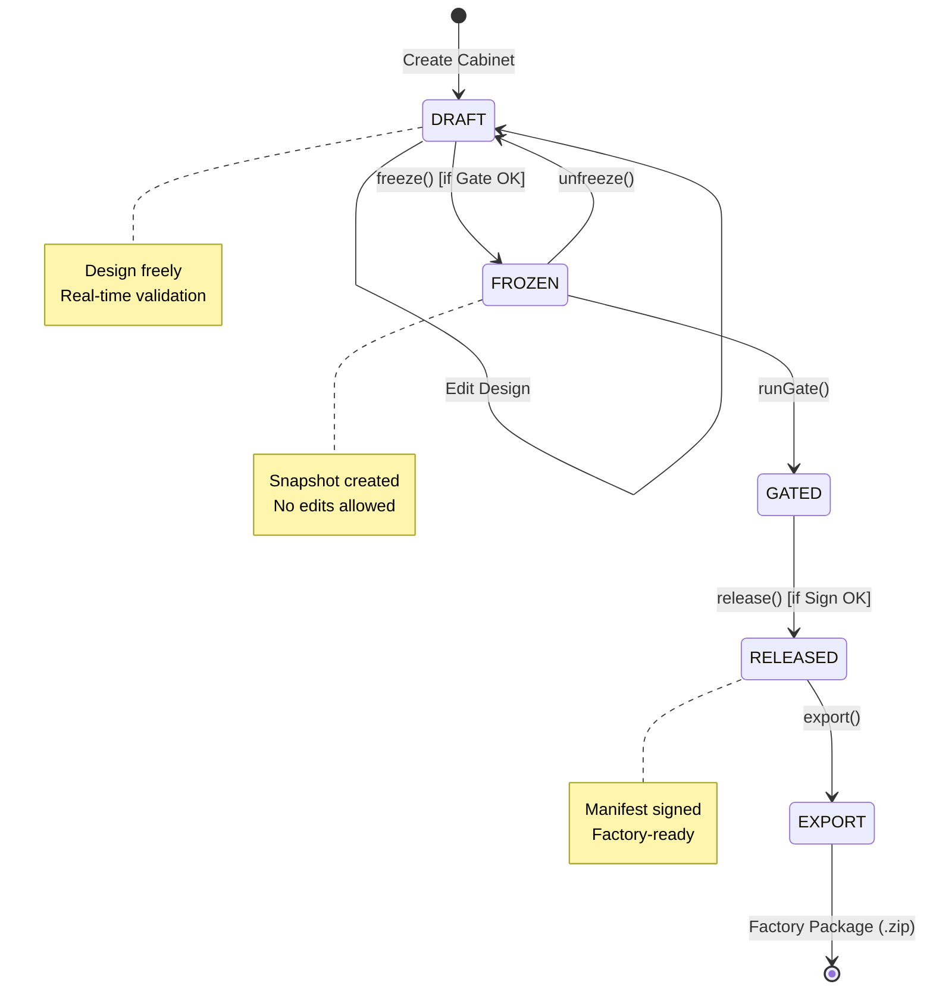
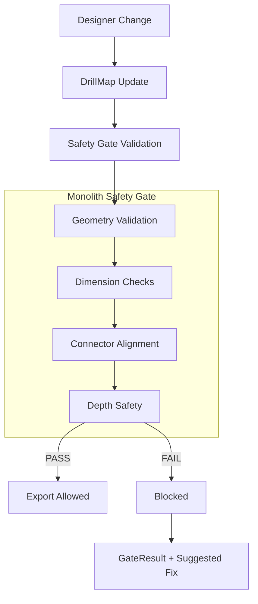

# 🏗️ MONOLITH Master Blueprint — North Star Specification

> **Document Version**: 1.0  
> **Last Updated**: 2026-02-03  
> **Classification**: INTERNAL  

---

## 🎯 Vision & North Star

### The Core Philosophy

> **"Design is Free — Manufacturing is Deterministic"**

MONOLITH (Intelligent Industrial Manufacturing Operations System) คือระบบออกแบบและผลิตตู้ครัว/เฟอร์นิเจอร์แบบ Parametric ที่เชื่อมต่อระหว่าง:

- **Creative Freedom** — นักออกแบบสร้างสรรค์ได้อย่างอิสระ
- **Manufacturing Certainty** — ทุก Job ที่ถึงโรงงานต้อง Verified และ Traceable
- **Zero-Trust Architecture** — Factory verify ได้แบบ Offline โดยไม่ต้องพึ่ง Server

### Target Users



---

## 🏛️ System Architecture

### High-Level Overview

```
┌─────────────────────────────────────────────────────────────────────────────┐
│                              MONOLITH MONOREPO                              │
├─────────────────────────────────────────────────────────────────────────────┤
│                                                                             │
│   ┌─────────────────────────────────────────────────────────────────────┐  │
│   │                     🖥️ FRONTEND (React + Three.js)                  │  │
│   │  ┌──────────┐  ┌──────────────┐  ┌────────────────────────────────┐ │  │
│   │  │ Designer │  │ 3D Viewport  │  │ Parametric Contract Panel     │ │  │
│   │  │ Intent   │  │ (R3F Canvas) │  │ (Dimensions, Export, Gate)    │ │  │
│   │  │ Panel    │  │              │  │                               │ │  │
│   │  └──────────┘  └──────────────┘  └────────────────────────────────┘ │  │
│   └─────────────────────────────────────────────────────────────────────┘  │
│                                      │                                      │
│                                      ▼                                      │
│   ┌─────────────────────────────────────────────────────────────────────┐  │
│   │              📦 CORE ENGINE (TypeScript, Browser-First)             │  │
│   │  ┌────────────┐ ┌─────────────┐ ┌──────────────┐ ┌───────────────┐  │  │
│   │  │  Cabinet   │ │ Manufacturing│ │    Gate      │ │    Export     │  │  │
│   │  │  Store     │ │ Calculator  │ │   System     │ │   Pipeline    │  │  │
│   │  └────────────┘ └─────────────┘ └──────────────┘ └───────────────┘  │  │
│   │               │               │               │                      │  │
│   │  ┌────────────┐ ┌─────────────┐ ┌──────────────┐ ┌───────────────┐  │  │
│   │  │ Materials  │ │  Drill Map  │ │ Trust Chain  │ │   Release     │  │  │
│   │  │  Catalog   │ │  Builder    │ │  & Manifest  │ │   Workflow    │  │  │
│   │  └────────────┘ └─────────────┘ └──────────────┘ └───────────────┘  │  │
│   └─────────────────────────────────────────────────────────────────────┘  │
│                                      │                                      │
│                                      ▼                                      │
│   ┌─────────────────────────────────────────────────────────────────────┐  │
│   │                    🔧 BACKEND SERVICES                               │  │
│   │  ┌──────────────┐  ┌───────────────┐  ┌────────────────────────┐   │  │
│   │  │   Server     │  │ Kernel PyOCC  │  │    Signer Service      │   │  │
│   │  │  (Express)   │  │ (Python/OCC)  │  │  (Ed25519 via AWS KMS) │   │  │
│   │  └──────────────┘  └───────────────┘  └────────────────────────┘   │  │
│   └─────────────────────────────────────────────────────────────────────┘  │
│                                                                             │
└─────────────────────────────────────────────────────────────────────────────┘
```

### Three-Layer Architecture

| Layer | Purpose | Files/Folders |
|-------|---------|---------------|
| **Visual Layer** | 3D Rendering (Magic, NOT Manufacturing Truth) | `src/components/canvas/`, R3F components |
| **UI Layer** | User Interactions, Forms, Modals | `src/components/ui/`, `src/components/layout/` |
| **Truth Layer** | Manufacturing Data, Calculations, Export | `src/core/`, `src/gate/` |

> ⚠️ **Critical Rule**: Visual Layer ไม่เกี่ยวกับ Manufacturing Truth — ข้อมูลการผลิตมาจาก Truth Layer เท่านั้น

---

## 🗂️ Directory Structure

```
iimos-workspace/
├── 📁 src/                    # Main Frontend Source
│   ├── App.tsx               # Root Component
│   ├── main.tsx              # Entry Point
│   ├── 📁 core/               # ⭐ TRUTH LAYER
│   │   ├── store/            # Zustand Stores
│   │   ├── manufacturing/    # Drill Maps, G-code, DXF
│   │   ├── export/           # Factory Package Export
│   │   ├── gate/             # Validation Rules
│   │   ├── materials/        # Material Catalog
│   │   ├── trust/            # Trust Chain & Crypto
│   │   └── engines/          # Calculators
│   ├── 📁 components/         # UI Components
│   │   ├── canvas/           # 3D Components (Cabinet3D, etc.)
│   │   ├── layout/           # App Layout
│   │   └── ui/               # UI Widgets
│   ├── 📁 gate/               # Manufacturing Validation
│   │   ├── rules/            # Validation Rules
│   │   └── compute/          # Gate Calculations
│   ├── 📁 factory/            # Factory Mode App
│   ├── 📁 release/            # Release Workflow
│   └── 📁 export/             # Export Utilities
│
├── 📁 server/                 # Backend Express Server
│   └── src/
│       ├── api/              # REST Endpoints
│       ├── export/           # Server-side Export
│       ├── manufacturing/    # CNC Post-processors
│       └── crypto/           # Signing Service
│
├── 📁 services/               # Microservices
│   ├── kernel-pyocc/         # Python Kernel (OpenCascade)
│   └── signer/               # Ed25519 Signing Service
│
├── 📁 packages/               # Shared Libraries
│   └── stablejson/           # Stable JSON Serialization
│
├── 📁 specs/                  # Specifications
│   ├── main/                 # spec.md, plan.md, tasks.md
│   └── technical/            # Technical Specs
│
├── 📁 docs/                   # Documentation
│   ├── DEVELOPER_GUIDE.md
│   ├── SAFETY_GATE.md
│   └── USER_MANUAL.md
│
├── 📁 trust/                  # Trust & Verification
│   ├── Monolith-Trust-Pack-v1.md
│   └── verifier/             # Offline Verification Tools
│
├── 📁 e2e/                    # Playwright E2E Tests
└── 📁 tools/                  # Build Tools & Scripts
```

---

## 🔄 Core Workflows

### 1. Design → Manufacturing Workflow



### 2. Gate Validation System



### 3. Trust Chain & Export Pipeline

```
┌─────────────────────────────────────────────────────────────────────┐
│                         EXPORT PIPELINE                              │
│                                                                      │
│  ┌──────────────┐    ┌──────────────┐    ┌──────────────────────┐  │
│  │ Factory      │───▶│ Plan Package │───▶│ Builders             │  │
│  │ Profile      │    │              │    │ - DXF Sheets         │  │
│  │ (KDT/HOMAG)  │    │              │    │ - CSV Cut List       │  │
│  └──────────────┘    └──────────────┘    │ - JSON Report        │  │
│                                           └──────────┬───────────┘  │
│                                                       │              │
│                          ┌────────────────────────────▼────────────┐│
│                          │      Artifact Store (IndexedDB)         ││
│                          └────────────────────────────┬────────────┘│
│                                                       │              │
│                          ┌────────────────────────────▼────────────┐│
│                          │    ExportRecord + ManifestChain         ││
│                          │    (SHA256 Hash + Ed25519 Signature)    ││
│                          └─────────────────────────────────────────┘│
└─────────────────────────────────────────────────────────────────────┘
```

---

## 📊 Data Models

### Cabinet Structure

```typescript
interface Cabinet {
  id: string;
  name: string;
  category: 'BASE' | 'WALL' | 'TALL' | 'DRAWER' | 'CORNER';
  
  dimensions: {
    width: number;       // mm (200-1200)
    height: number;      // mm (300-2400)
    depth: number;       // mm (300-1000)
    toeKickHeight: number;
  };
  
  structure: {
    topJoint: 'INSET' | 'OVERLAY';
    bottomJoint: 'INSET' | 'OVERLAY';
    hasBackPanel: boolean;
    backPanelInset: number;
    shelfCount: number;
    dividerCount: number;
  };
  
  panels: CabinetPanel[];
  compartments: Compartment[];
  materials: MaterialConfig;
}
```

### Material System (3-Layer Stack)

```
┌─────────────────────────────────────────────────────────┐
│                    MATERIAL STACK                        │
├─────────────────────────────────────────────────────────┤
│  ┌─────────────────────────────────────────────────┐    │
│  │ Surface Face A (HPL/Melamine/Veneer) 0.3-3.0mm  │    │
│  └─────────────────────────────────────────────────┘    │
│  ┌─────────────────────────────────────────────────┐    │
│  │ Glue Layer                               0.1mm  │    │
│  └─────────────────────────────────────────────────┘    │
│  ┌─────────────────────────────────────────────────┐    │
│  │ Core (Particle Board/MDF/HMR)          16-18mm  │    │
│  └─────────────────────────────────────────────────┘    │
│  ┌─────────────────────────────────────────────────┐    │
│  │ Glue Layer                               0.1mm  │    │
│  └─────────────────────────────────────────────────┘    │
│  ┌─────────────────────────────────────────────────┐    │
│  │ Surface Face B (HPL/Melamine/Veneer) 0.3-3.0mm  │    │
│  └─────────────────────────────────────────────────┘    │
│                                                          │
│  + Edge Banding (PVC/ABS) 0.5-2.0mm per side            │
└─────────────────────────────────────────────────────────┘
```

### Manufacturing Calculations

```typescript
// Real Thickness Formula
T_real = T_core + T_surfaceA + T_surfaceB + (2 × T_glue)

// Cut Size Formula  
CutSize = FinishSize − (EdgeThickness₁ + EdgeThickness₂) + PreMill

// Constants
GLUE_THICKNESS: 0.1mm
PRE_MILLING: 0.5mm per edged side
GROOVE_DEPTH: 8-10mm
BACK_PANEL_VOID: 19-20mm
SAFETY_GAP: 1-2mm
```

---

## 🔐 Security & Trust

### Cryptographic Guarantees

| Guarantee | How |
|-----------|-----|
| **Packet Integrity** | SHA-256 content hash |
| **Authorization** | Ed25519 signature |
| **Audit Trail** | Merkle Tree with signed root |
| **Key Governance** | Dual-control (2-man rule) |

### Key Management

```
┌─────────────────────────────────────────────────────────────┐
│                    KEY LIFECYCLE                             │
│                                                              │
│   ACTIVE ─────────────────────────────────────▶ RETIRED     │
│      │                                              │        │
│      │ (incident)                                   │        │
│      ▼                                              │        │
│   COMPROMISED ─────────────────────────────────────▶│        │
│      │                                              │        │
│      │ (disaster)                                   │        │
│      ▼                                              │        │
│   REVOKED ◀──────────────────────────────────────────┘       │
│                                                              │
└─────────────────────────────────────────────────────────────┘
```

### Factory Verification

```bash
# Offline verification - no internet required
monolith-verify verify packet.zip --keys production.pubkeys.v1.json

# Result: PASS → Execute on CNC
# Result: FAIL → Do NOT execute, contact supplier
```

---

## 🛠️ Technology Stack

### Frontend

| Technology | Version | Purpose |
|------------|---------|---------|
| React | 18.2 | UI Framework |
| TypeScript | 5.2 | Type Safety |
| Vite | 5.0 | Build Tool |
| Three.js | 0.159 | 3D Engine |
| @react-three/fiber | 8.15 | React 3D Bindings |
| Zustand | 4.4 | State Management |
| Tailwind CSS | 3.3 | Styling |
| Framer Motion | 12.23 | Animations |

### Backend Services

| Service | Technology | Purpose |
|---------|------------|---------|
| Server | Express/TypeScript | REST API, File Serving |
| Kernel PyOCC | Python/OpenCascade | CAD Operations |
| Signer | Node.js + AWS KMS | Ed25519 Signing |

### Testing

| Tool | Purpose |
|------|---------|
| Vitest | Unit Tests |
| Playwright | E2E Tests |
| fast-check | Property-based Testing |

---

## 📐 Key Subsystems

### 1. Cabinet Store (`useCabinetStore`)
- **Size**: ~2000 lines
- **Pattern**: Zustand + Immer
- **Purpose**: Cabinet geometry, panels, materials

### 2. Gate System (`src/gate/`)
- **Rules**: 15+ validation rules
- **Categories**: Dimensional, Structural, Material, Machine, Safety
- **Severity**: PASS, WARN, FAIL

### 3. DrillMap System (`src/core/manufacturing/drillMap/`)
- **Purpose**: CNC drilling data
- **Coordinate**: Y-up (Three.js standard)
- **Connectors**: Minifix, Cam Lock, Shelf Pins

### 4. Export Pipeline (`src/core/export/`)
- **Profiles**: DEFAULT, KDT, HOMAG, BIESSE
- **Outputs**: DXF (R12), CSV Cut List, JSON Report
- **Determinism**: Same Input → Same Output

### 5. Trust Chain (`src/core/trust/`)
- **Manifest**: Immutable chain of design changes
- **Signing**: Ed25519 via AWS KMS
- **Audit**: Merkle tree with daily snapshots

---

## 🎮 Runtime Modes

| Mode | Purpose | Validation |
|------|---------|------------|
| **DESIGNER** | Free design, full editing | Flexible, warnings allowed |
| **FACTORY** | Read-only, execute packets | Strict, policy required |

---

## 📋 Gate Rules Summary

| Code | Category | Condition | Severity |
|------|----------|-----------|----------|
| DIM-001 | Dimensional | width < 200mm | FAIL |
| DIM-002 | Dimensional | width > 1200mm | WARN |
| STR-001 | Structural | panelCount = 0 | FAIL |
| STR-002 | Structural | cutSize ≤ 0 | FAIL |
| MAT-001 | Material | coreMaterial = null | FAIL |
| MAC-001 | Machine | panel > machine.maxDim | FAIL |
| MONO-MINIFIX-* | Connector | Minifix alignment rules | ERROR |

---

## 🚀 Development Commands

```bash
# Development
npm run dev              # Start Vite dev server

# Testing
npm run test             # Vitest watch mode
npm run test:run         # Run all tests once
npm run test:gate        # Gate validation tests

# E2E
npm run e2e              # Playwright tests
npm run e2e:ui           # Playwright UI mode

# Build
npm run build            # Production build
npm run typecheck:all    # TypeScript check

# Verification
npm run verify           # Tests + Typecheck + E2E Smoke
```

---

## 📚 Key Documentation Links

| Document | Path | Purpose |
|----------|------|---------|
| Developer Guide | [docs/DEVELOPER_GUIDE.md](file:///c:/Projects/iimos-workspace/docs/DEVELOPER_GUIDE.md) | Technical onboarding |
| Safety Gate | [docs/SAFETY_GATE.md](file:///c:/Projects/iimos-workspace/docs/SAFETY_GATE.md) | Gate system details |
| Main Spec | [specs/main/spec.md](file:///c:/Projects/iimos-workspace/specs/main/spec.md) | Functional requirements |
| Implementation Plan | [specs/main/plan.md](file:///c:/Projects/iimos-workspace/specs/main/plan.md) | Architecture & components |
| Trust Pack | [trust/Monolith-Trust-Pack-v1.md](file:///c:/Projects/iimos-workspace/trust/Monolith-Trust-Pack-v1.md) | Security & compliance |
| Export Pipeline | [specs/technical/trust-chain-export-pipeline.md](file:///c:/Projects/iimos-workspace/specs/technical/trust-chain-export-pipeline.md) | Export system spec |

---

## 🎯 Success Metrics

| Metric | Target |
|--------|--------|
| 3D Rendering | 60 FPS on modern hardware |
| State Updates | < 100ms |
| Validation | < 500ms for typical cabinet |
| Test Coverage | ≥ 80% core logic |
| Gate Accuracy | 100% manufacturable if PASS |

---

## 📝 Document History

| Version | Date | Changes |
|---------|------|---------|
| 1.0 | 2026-02-03 | Initial Master Blueprint |

---

*© 2026 MONOLITH Project. All rights reserved.*
