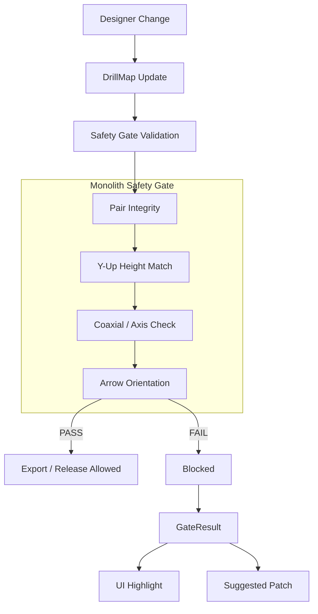

# Monolith Safety Gate System

> **Manufacturing-Safe Validation for Built-in Furniture**
> (Architecture · Geometry · Rules)

---

## 1. What is the Safety Gate?

The Safety Gate is the **last line of defense** between design and manufacturing.

It validates that:

- geometry is correct
- connectors align physically
- drill data is deterministic
- auto-fixes are safe

---

## 2. Contract: Input / Output

```typescript
// INPUT
drillMap: {
  panels: Array<{
    panelId: string;
    points: DrillMapPoint[];
  }>;
}

// OUTPUT
GateResult: {
  gate: string;           // e.g., 'hardware.connector.minifix'
  status: 'PASS' | 'FAIL';
  summary: { totalErrors, totalWarnings, pairsChecked };
  findings: GateFinding[];
}

// PATCH CONTRACT
// - Index found    → deterministic path (e.g., /panels/0/points/3/position/1)
// - Index missing  → patch = [] (error still raised)
// - Duplicate ID   → warning logged, first occurrence used
```

---

## 3. Error Code Quick Reference

| Code | Meaning | Typical Fix |
|------|---------|-------------|
| `MONO_MINIFIX_MISSING_PAIRED_HOLE_ID` | Cam has no pairedHoleId | Regenerate pairing |
| `MONO_MINIFIX_PAIRED_HOLE_NOT_FOUND` | pairedHoleId doesn't resolve | Fix ID reference |
| `MONO_MINIFIX_Y_MISMATCH` | Height mismatch (Y-up) | Patch `position/1` |
| `MONO_MINIFIX_NOT_COAXIAL` | Radial offset > tolerance | Adjust bolt position |
| `MONO_MINIFIX_CAM_AXIS_NOT_NORMAL` | Cam axis not perpendicular | Check panel orientation |
| `MONO_MINIFIX_BOLT_AXIS_NOT_POINTING` | Bolt not pointing at cam | Adjust bolt axis |
| `MONO_MINIFIX_ARROW_NOT_FACING_BOLT` | Cam arrow wrong direction | Rotate cam |
| `MONO_MINIFIX_CLEARANCE_VIOLATION` | Parts too close | Increase spacing |

---

## 4. Safety Gate Flow



---

## 5. DrillMap Structure

```typescript
interface DrillMap {
  panels: Array<{
    panelId: string;
    points: DrillMapPoint[];
  }>;
}

interface DrillMapPoint {
  id: string;
  position: [number, number, number];  // Y-up coordinate
  normal: [number, number, number];
  componentType: 'HOUSING' | 'BOLT';
  purpose: 'MINIFIX' | 'CAM_LOCK' | 'SHELF_PIN';
  pairedHoleId?: string;  // Deterministic pairing
  // ... other fields
}
```

---

## 6. Coordinate System (CRITICAL)

Monolith uses **Y-up** coordinate system (R3F/Three.js standard):

```
      Y (up/height)
      │
      │
      │
      └──────── X
     /
    /
   Z
```

| Axis | Index | Meaning |
|------|-------|---------|
| X | 0 | Horizontal (width) |
| Y | 1 | Vertical (height) |
| Z | 2 | Horizontal (depth) |

```typescript
export const AXIS = {
  X: 0,
  Y: 1,  // Height (vertical) in Y-up system
  Z: 2,
} as const;
```

> Z-up assumptions are invalid in Monolith.

---

## 7. Minifix Rules

### Filter Logic (Standard)

```typescript
// Cam (Housing)
p.componentType === 'HOUSING' &&
(p.purpose === 'MINIFIX' || p.purpose === 'CAM_LOCK')

// Bolt
p.componentType === 'BOLT' &&
(p.purpose === 'MINIFIX' || p.purpose === 'CAM_LOCK')
```

### Constraint Rules

| Rule ID | Name | Severity | Tolerance |
|---------|------|----------|-----------|
| `MONO-MINIFIX-PAIR-001` | Cam must have pairedHoleId | ERROR | - |
| `MONO-MINIFIX-PAIR-002` | pairedHoleId must resolve | ERROR | - |
| `MONO-MINIFIX-AXIS-001` | Cam axis normal to panel | ERROR | 1.0° |
| `MONO-MINIFIX-AXIS-002` | Bolt axis points toward cam | ERROR | 3.0° |
| `MONO-MINIFIX-COAX-001` | Ball center coaxial with cam | ERROR | 0.20mm |
| `MONO-MINIFIX-Y-001` | Ball Y equals cam pocket Y | ERROR | 0.20mm |

---

## 8. Index Resolver Layer

### Why it exists

Nested DrillMap → deterministic patch paths.

### Index structure

```typescript
Map<pointId, { panelIdx, pointIdx, panelId }>
```

### Behavior Contract

| Condition | Result |
|-----------|--------|
| Index found | Deterministic patch path |
| Index missing | Error raised, `patch = []` |
| Duplicate ID | Warning logged, first occurrence used |

### Location

```
src/gate/rules/connectors/drillMapIndex.ts
```

---

## 9. Geometry Calculations

### Cam Pocket Center

```typescript
// Cam drill point Y = 100
// Cam normal = [0, -1, 0] (drills down)
// Cam depth = 12.5mm

const camPocketCenterY = camDrillY + (normal[1] * camDepth / 2);
// = 100 + (-1 * 6.25) = 93.75
```

### Ball Head Center

```typescript
// Bolt drill point Y = position[1]
// Bolt normal = [-1, 0, 0] (horizontal, no Y component)
// Ball offset = 9.5mm

const ballCenterY = boltDrillY + (normal[1] * ballOffset);
// For horizontal bolt: ballCenterY = boltDrillY (no Y component)
```

### Y-Match Validation

```typescript
const deltaY = Math.abs(ballCenterY - camPocketCenterY);
const pass = deltaY <= MINIFIX_TOLERANCES.Y_MISMATCH_MM; // 0.20mm
```

---

## 10. GateResult Structure

```typescript
interface GateResult {
  gate: 'hardware.connector.minifix';
  status: 'PASS' | 'FAIL';
  summary: {
    totalErrors: number;
    totalWarnings: number;
    pairsChecked: number;
  };
  findings: GateFinding[];
}

interface GateFinding {
  severity: 'ERROR' | 'WARNING' | 'INFO';
  code: MinifixConstraintCode;
  message: string;
  entityIds: string[];
  measured?: {
    delta_y_mm?: number;
    radial_offset_mm?: number;
  };
  tolerance?: {
    max_mm?: number;
  };
  suggestedFix?: {
    strategy: string;
    patch: JsonPatch[];
  };
}

interface JsonPatch {
  op: 'replace' | 'add' | 'remove';
  path: string;
  value: any;
}
```

---

## 11. Test Categories

| Test Type | Purpose | File |
|-----------|---------|------|
| Unit | Rule correctness | `validateMinifixGate.spec.ts` |
| Snapshot | Contract stability | `validateMinifixGate.snapshot.spec.ts` |
| Property-based | Edge cases | `validateMinifixGate.property.spec.ts` |
| Multi-pair | Real factory scenarios | `validateMinifixGate.multipair.spec.ts` |

---

## 12. Adding a New Connector

1. Create new rule file under `src/gate/rules/`
2. Define deterministic pairing
3. Implement index resolver if needed
4. Add all 4 test levels
5. Update this document
6. CI must pass

---

## 13. Gate Enforcement Points

| Point | When | Action on Fail |
|-------|------|----------------|
| `DESIGNER_LIVE_DRC` | Real-time in UI | Show warning |
| `EXPORT_PACKET` | Before export | Block export |
| `RELEASE` | Before release | Block release |
| `FACTORY_PACKET_BUILD` | Factory build | Reject packet |

---

## Final Principle

> **If it passes the Safety Gate,
> it must be manufacturable.**

Anything less is a bug.

---

## References

- [CONTRIBUTING.md](../CONTRIBUTING.md) - Development workflow
- [minifixConstraintTypes.ts](../src/gate/rules/connectors/minifixConstraintTypes.ts) - Constraint definitions
- [validateMinifixConnector.ts](../src/gate/rules/connectors/validateMinifixConnector.ts) - Implementation
- [drillMapIndex.ts](../src/gate/rules/connectors/drillMapIndex.ts) - Index resolver
